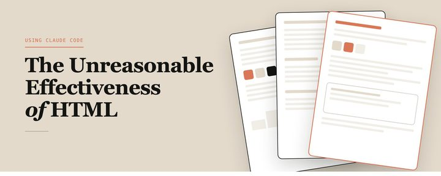

# WeChat Article Skills

830 viral writing and cover styles for WeChat Official Account articles.

This is a skill pack for turning source material into a publish-ready WeChat workflow: choose a style, rewrite the article, generate a cover, format the article, and upload it to the Official Account draft box. It includes a YouMind-derived style studio with 830 article/cover style cards, loaded progressively so an agent can recommend a few strong directions without reading the whole library.

## See It

Representative cover systems from the style library:

<table>
  <tr>
    <td width="33%" valign="top"><br><b>Dan Koe Coaching</b><br><sub>清单型爆款教程 · 黑白 editorial</sub></td>
    <td width="33%" valign="top"><br><b>Claude Guide</b><br><sub>步骤型深度指南 · 现代公众号题图</sub></td>
    <td width="33%" valign="top"><br><b>Product Brief</b><br><sub>清单型爆款教程 · 浅底信息图</sub></td>
  </tr>
  <tr>
    <td width="33%" valign="top"><br><b>Dark Allegory</b><br><sub>职业选择 · 暗色电影感</sub></td>
    <td width="33%" valign="top"><br><b>Claude Code</b><br><sub>技术实操拆解 · 产品幻灯片</sub></td>
    <td width="33%" valign="top"><br><b>Market Poster</b><br><sub>观点型解释分析 · 高饱和海报</sub></td>
  </tr>
</table>

Open the full browseable gallery: [`skills/wechat-style-studio/references/style-gallery.md`](skills/wechat-style-studio/references/style-gallery.md).

## What It Does

- Recommends 3-5 suitable YouMind styles from 830 references by topic, article class, cover class, and engagement metrics.
- Lets you say “文章用 Dan Koe 那种风格，封面用黑白寓言风” or “我想选这种风格”.
- Splits each selected reference into an article skill and a cover skill, so writing and image direction can be mixed.
- Runs the whole WeChat production path: rewrite, cover prompt/generation, layout, and draft-box upload.
- Uses progressive disclosure: read `style-index.json`, then load only the selected style card.

## Style Library

The style studio contains:

- 830 style cards in [`references/styles/`](skills/wechat-style-studio/references/styles/).
- 6 article classes: 清单型爆款教程, 爆款解释型文章, 步骤型深度指南, 观点型解释分析, 技术实操拆解, 叙事型长文.
- 6 cover classes: 黑白/低饱和 editorial, 浅底信息图, 暗色电影感, 高饱和海报, 现代公众号题图, 细节拼贴/界面/图表.
- Compact index: [`style-index.json`](skills/wechat-style-studio/references/style-index.json).
- Quick shortlist: [`representative-styles.md`](skills/wechat-style-studio/references/representative-styles.md).

## Install

Claude Code plugin marketplace:

```bash
/plugin marketplace add ziyetsui/wechat-article-skills
/plugin install wechat-article-skills@wechat-article-skills
```

Codex plugin marketplace:

```bash
codex plugin marketplace add ziyetsui/wechat-article-skills
codex plugin add wechat-article-skills@wechat-article-skills
```

Generic agents that read `~/.agents/skills`:

```bash
npx skills add ziyetsui/wechat-article-skills -a '*' -g -y
```

Manual install:

```bash
cp -R skills/wechat-* ~/.agents/skills/
```

After installing, start a new agent session so the new skills are discovered.

## Use

Pick a style first:

```text
@公众号风格工作室
我想写一篇关于 AI agent 如何改变个人工作流的公众号文章。
先推荐 5 个数据高、适合技术创作者的 YouMind 风格。
```

Run the full workflow:

```text
@公众号流水线
素材：<paste notes, draft, transcript, or outline>
文章用 Dan Koe 那种强教练式清单风。
封面用黑白或低饱和 editorial 风格。
```

Mix article and cover directions:

```text
文章用 Claude Code 教程风，封面用高饱和科技广告视觉。
帮我改写成公众号文章，并生成封面。
```

Use the default personal WeChat style:

```text
@公众号改写
把这份素材改成一篇强判断、有个人体感的公众号文章。
```

## Included Skills

- `wechat-style-studio`: choose, recommend, and mix 830 YouMind article/cover styles.
- `wechat-rewrite`: rewrite materials into a high-conviction Chinese public-account article.
- `wechat-cover-image`: generate WeChat cover prompts/images with APiYi GPT Image 2.
- `wechat-layout`: format the rewritten article into WeChat-ready HTML/TXT.
- `wechat-publish-draft`: upload formatted content to the WeChat Official Account draft box.
- `wechat-article-pipeline`: orchestrate style selection, rewrite, cover, layout, and draft-box upload.

## Configuration

Do not commit real API keys or WeChat credentials.

Cover generation:

```bash
export APIYI_API_KEY="..."
# or
export YI_API_KEY="..."
```

Draft-box upload:

```bash
export WECHAT_APPID="..."
export WECHAT_APPSECRET="..."
```

Use [`skills/wechat-publish-draft/scripts/.env.example`](skills/wechat-publish-draft/scripts/.env.example) as a template only.

## Architecture

The style library is intentionally split into a compact index and full cards:

```text
skills/wechat-style-studio/
  SKILL.md
  references/style-index.json          # read first
  references/representative-styles.md  # quick shortlist
  references/style-gallery.md          # GitHub gallery
  references/styles/*.md               # 830 selected cards
  assets/covers/                       # lightweight gallery thumbnails
```

The marketplace plugin package lives in `plugins/wechat-article-skills/` and mirrors the root `skills/` directory. After changing root skills, run:

```bash
python3 scripts/sync_plugin_package.py
```

Regenerate the YouMind style studio from the extracted source folder:

```bash
python3 scripts/build_style_library.py \
  --source-root "/path/to/2026-06-15-youmind-x-viral-articles-all" \
  --repo-root .
python3 scripts/sync_plugin_package.py
```

## Safety

The upload skill creates backend drafts only. It must not publish publicly, mass-send, call freepublish APIs, or click a public publish button.
