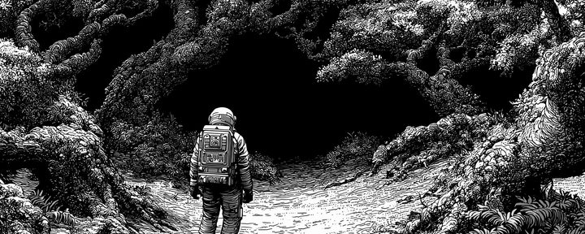
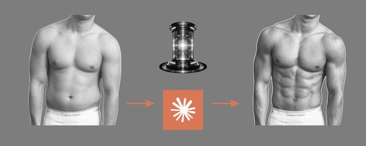
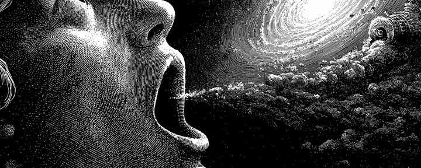
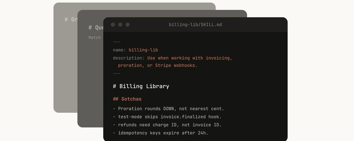
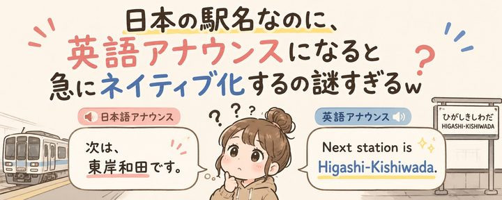
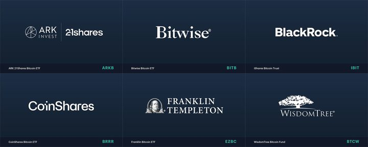
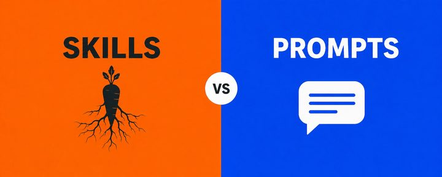
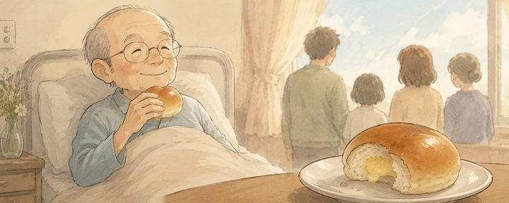

# YouMind Style Gallery

A browseable directory for 830 YouMind-derived WeChat article and cover style cards.

## Top Data Styles

<table>
<tr>
<td width="33%" valign="top"> <b>如何用 1 天时间彻底重塑你的人生</b> 清单型爆款教程 · 黑白或低饱和 editorial 插画/照片 DAN KOE</td>
<td width="33%" valign="top"> <b>X 启动其 20 年历史上规模最宏大的广告平台重建计划</b> 清单型爆款教程 · 浅底极简信息图/产品幻灯片 Business</td>
<td width="33%" valign="top"> <b>如果你兴趣广泛，请别浪费未来 2-3 年的时间</b> 清单型爆款教程 · 暗色高反差电影感/寓言式封面 DAN KOE</td>
</tr>
<tr>
<td width="33%" valign="top"> <b>将 Claude 打造成终极私人教练（完整指南）</b> 步骤型深度指南 · 克制的现代公众号题图 Hawks</td>
<td width="33%" valign="top"> <b>现在推出新的美国比特币 ETF 是否为时已晚？</b> 观点型解释分析 · 高饱和海报/科技广告视觉 CF Benchmarks</td>
<td width="33%" valign="top"> <b>如何进行有深度的表达</b> 步骤型深度指南 · 暗色高反差电影感/寓言式封面 DAN KOE</td>
</tr>
<tr>
<td width="33%" valign="top"> <b>松子 Deluxe 关于“真正善良的人绝不会做的事”的见解，直击人心</b> 爆款解释型文章 · 暗色高反差电影感/寓言式封面 タク(Takuma Ozeki)</td>
<td width="33%" valign="top"> <b>使用 Claude Code：HTML 的超凡效能</b> 技术实操拆解 · 浅底极简信息图/产品幻灯片 Thariq</td>
<td width="33%" valign="top"> <b>构建 Claude Code 的经验教训：我们如何使用技能</b> 步骤型深度指南 · 黑白或低饱和 editorial 插画/照片 Thariq</td>
</tr>
<tr>
<td width="33%" valign="top"> <b>我最后想吃一个奶油面包</b> 清单型爆款教程 · 克制的现代公众号题图 ももなっち🍑@petinfome</td>
<td width="33%" valign="top"> <b>不仅仅是“你会下地狱”：细木数子统治电视界的真正原因</b> 爆款解释型文章 · 细节密集的拼贴/界面/图表视觉 レイラ66</td>
<td width="33%" valign="top"> <b>娱乐类 YouTuber 为何纷纷退圈：来自前创作者的深度洞察</b> 观点型解释分析 · 克制的现代公众号题图 かっつー（平野勝也）@kattu0403</td>
</tr>
</table>

## Cover Systems

### 黑白或低饱和 editorial 插画/照片

<table>
<tr>
<td width="33%" valign="top"> <b>如何用 1 天时间彻底重塑你的人生</b> 清单型爆款教程</td>
<td width="33%" valign="top"> <b>构建 Claude Code 的经验教训：我们如何使用技能</b> 步骤型深度指南</td>
<td width="33%" valign="top"> <b>为什么日本车站广播中的地名突然变成了地道的英语发音</b> 观点型解释分析</td>
</tr>
</table>

### 浅底极简信息图/产品幻灯片

<table>
<tr>
<td width="33%" valign="top"> <b>X 启动其 20 年历史上规模最宏大的广告平台重建计划</b> 清单型爆款教程</td>
<td width="33%" valign="top"> <b>使用 Claude Code：HTML 的超凡效能</b> 技术实操拆解</td>
<td width="33%" valign="top"> <b>你知道吗？动物神秘行为背后的惊人含义</b> 爆款解释型文章</td>
</tr>
</table>

### 暗色高反差电影感/寓言式封面

<table>
<tr>
<td width="33%" valign="top"> <b>如果你兴趣广泛，请别浪费未来 2-3 年的时间</b> 清单型爆款教程</td>
<td width="33%" valign="top"> <b>如何进行有深度的表达</b> 步骤型深度指南</td>
<td width="33%" valign="top"> <b>松子 Deluxe 关于“真正善良的人绝不会做的事”的见解，直击人心</b> 爆款解释型文章</td>
</tr>
</table>

### 高饱和海报/科技广告视觉

<table>
<tr>
<td width="33%" valign="top"> <b>现在推出新的美国比特币 ETF 是否为时已晚？</b> 观点型解释分析</td>
<td width="33%" valign="top"> <b>前 FBI 人质谈判专家揭秘：影响他人的心理技巧</b> 清单型爆款教程</td>
<td width="33%" valign="top"> <b>深度解析：技能 (Skills) 与提示词 (Prompts) 的本质区别</b> 清单型爆款教程</td>
</tr>
</table>

### 克制的现代公众号题图

<table>
<tr>
<td width="33%" valign="top"> <b>将 Claude 打造成终极私人教练（完整指南）</b> 步骤型深度指南</td>
<td width="33%" valign="top"> <b>我最后想吃一个奶油面包</b> 清单型爆款教程</td>
<td width="33%" valign="top"> <b>娱乐类 YouTuber 为何纷纷退圈：来自前创作者的深度洞察</b> 观点型解释分析</td>
</tr>
</table>

### 细节密集的拼贴/界面/图表视觉

<table>
<tr>
<td width="33%" valign="top"> <b>不仅仅是“你会下地狱”：细木数子统治电视界的真正原因</b> 爆款解释型文章</td>
<td width="33%" valign="top"> <b>对“一次性个性”职场的恐惧：从 Ano-chan 争议中得到的启示</b> 清单型爆款教程</td>
<td width="33%" valign="top"> <b>千万不要嫁的男人：从男性视角识别情感虐待者</b> 爆款解释型文章</td>
</tr>
</table>

## All Styles

| Rank | Style | Author | Article | Cover | Metrics |
|---:|---|---|---|---|---|
| 1 | [如何用 1 天时间彻底重塑你的人生](styles/0001-fix-your-life-one-day.md) | DAN KOE | 清单型爆款教程 | 黑白或低饱和 editorial 插画/照片 | 185246431 views / 769220 bookmarks |
| 2 | [如果你兴趣广泛，请别浪费未来 2-3 年的时间](styles/0002-multiple-interests-career-guide.md) | DAN KOE | 清单型爆款教程 | 暗色高反差电影感/寓言式封面 | 15197381 views / 86225 bookmarks |
| 3 | [如何进行有深度的表达](styles/0003-how-to-articulate-yourself-intelligently.md) | DAN KOE | 步骤型深度指南 | 暗色高反差电影感/寓言式封面 | 9342786 views / 65912 bookmarks |
| 4 | [将 Claude 打造成终极私人教练（完整指南）](styles/0004-claude-ai-personal-trainer-guide.md) | Hawks | 步骤型深度指南 | 克制的现代公众号题图 | 12861961 views / 54153 bookmarks |
| 5 | [构建 Claude Code 的经验教训：我们如何使用技能](styles/0005-claude-code-skills-guide.md) | Thariq | 步骤型深度指南 | 黑白或低饱和 editorial 插画/照片 | 6868047 views / 44043 bookmarks |
| 6 | [构建 Claude Code 的经验教训：像 Agent 一样思考](styles/0006-claude-code-agent-design-lessons.md) | Thariq | 技术实操拆解 | 浅底极简信息图/产品幻灯片 | 3975634 views / 28585 bookmarks |
| 7 | [使用 Claude Code：HTML 的超凡效能](styles/0007-claude-code-html-effectiveness.md) | Thariq | 技术实操拆解 | 浅底极简信息图/产品幻灯片 | 10121445 views / 28311 bookmarks |
| 8 | [前 FBI 人质谈判专家揭秘：影响他人的心理技巧](styles/0008-fbi-negotiation-psychology-influence-tips.md) | 五代@godai_ceo | 清单型爆款教程 | 高饱和海报/科技广告视觉 | 7060749 views / 25924 bookmarks |
| 9 | [从层级制到智能化](styles/0009-ai-driven-organizational-intelligence.md) | jack | 爆款解释型文章 | 浅底极简信息图/产品幻灯片 | 6026227 views / 24313 bookmarks |
| 10 | [我利用 Claude Code 为客户创造了 300 万美元的收益](styles/0010-claude-code-ai-script-revenue.md) | Mitchell | 清单型爆款教程 | 浅底极简信息图/产品幻灯片 | 5513030 views / 24134 bookmarks |
| 11 | [Karpathy 的 4 条 CLAUDE.md 规则将 Claude 的错误率从 41% 降至 11%。在测试 30 个代码库后，我又增加了 8 条](styles/0011-karpathy-claude-md-coding-rules.md) | Mnimiy | 清单型爆款教程 | 浅底极简信息图/产品幻灯片 | 3947696 views / 23079 bookmarks |
| 12 | [为每项任务打造专属工具：Claude Code 中的动态工作流](styles/0012-dynamic-workflows-claude-code.md) | Thariq | 技术实操拆解 | 浅底极简信息图/产品幻灯片 | 2770998 views / 22529 bookmarks |
| 13 | [面向学术研究者的 Claude Code 入门指南](styles/0013-claude-code-academic-research-guide.md) | Mushtaq Bilal, PhD | 步骤型深度指南 | 浅底极简信息图/产品幻灯片 | 4367864 views / 18342 bookmarks |
| 14 | [使用 Claude Code：会话管理与 1M 上下文](styles/0014-claude-code-session-context-management.md) | Thariq | 技术实操拆解 | 浅底极简信息图/产品幻灯片 | 2380921 views / 15969 bookmarks |
| 15 | [Hermes Agent 大师课](styles/0015-hermes-agent-masterclass-guide.md) | Akshay 🚀@akshay_pachaar | 步骤型深度指南 | 高饱和海报/科技广告视觉 | 2663934 views / 15688 bookmarks |
| 16 | [什么是 Loop？Peter Steinberger 对话 Boris Cherny](styles/0016-wtf-is-ai-coding-loop.md) | Matt Van Horn | 爆款解释型文章 | 克制的现代公众号题图 | 3447463 views / 15134 bookmarks |
| 17 | [如何构建一个每天自动进化的 Obsidian 知识库，无需手动维护](styles/0017-build-automated-obsidian-ai-vault.md) | CyrilXBT | 清单型爆款教程 | 浅底极简信息图/产品幻灯片 | 3282980 views / 14738 bookmarks |
| 18 | [构建 Claude Code 的经验教训：Prompt Caching 是关键](styles/0018-claude-code-prompt-caching-lessons.md) | Thariq | 技术实操拆解 | 浅底极简信息图/产品幻灯片 | 2332309 views / 14462 bookmarks |
| 19 | [如何变得极具创造力，甚至让人感到“违规”](styles/0019-how-to-become-insanely-creative.md) | DAN KOE | 步骤型深度指南 | 暗色高反差电影感/寓言式封面 | 2003518 views / 12962 bookmarks |
| 20 | [Naval Ravikant：Apple 已死，SaaS 紧随其后，你只剩下 18 个月的时间](styles/0020-naval-apple-saas-ai-moats.md) | Mustufa Khan | 清单型爆款教程 | 暗色高反差电影感/寓言式封面 | 2391429 views / 12946 bookmarks |
| 21 | [如何投资 AI（在淘金热中获利）](styles/0021-how-to-invest-in-ai.md) | AI Edge | 步骤型深度指南 | 细节密集的拼贴/界面/图表视觉 | 1927597 views / 11673 bookmarks |
| 22 | [Nano Banana Pro 完整指南：专业资产制作的 10 个技巧](styles/0022-nano-banana-pro-asset-production-guide.md) | Google AI Studio | 清单型爆款教程 | 暗色高反差电影感/寓言式封面 | 1155965 views / 11478 bookmarks |
| 23 | [如何构建并销售每月盈利 1 万美元的 AI 自动化业务（完整课程）](styles/0023-build-sell-ai-automations-course.md) | Khairallah AL-Awady | 清单型爆款教程 | 黑白或低饱和 editorial 插画/照片 | 3933982 views / 11438 bookmarks |
| 24 | [2026 年你必须了解的 20 个 AI 概念](styles/0024-20-ai-concepts-for-2026.md) | Rahul | 清单型爆款教程 | 浅底极简信息图/产品幻灯片 | 6337020 views / 11195 bookmarks |
| 25 | [Meta-Meta-Prompting：让 AI Agents 发挥效能的秘诀](styles/0025-meta-meta-prompting-ai-agents.md) | Garry Tan@garrytan | 爆款解释型文章 | 高饱和海报/科技广告视觉 | 1375809 views / 11040 bookmarks |
| 26 | [7 个让你在 2026 年实现财富自由的 AI 技能](styles/0026-7-ai-skills-wealth-2026.md) | AI Edge | 清单型爆款教程 | 细节密集的拼贴/界面/图表视觉 | 1771824 views / 10919 bookmarks |
| 27 | [每年仅需 1 美元！在线申请香港手机号全攻略——限时优惠，手慢无](styles/0027-hong-kong-mobile-number-club-sim.md) | 鱼总聊AI | 清单型爆款教程 | 浅底极简信息图/产品幻灯片 | 2485476 views / 10887 bookmarks |
| 28 | [Gemini Embedding 2：我们首个原生多模态嵌入模型](styles/0028-gemini-embedding-2-multimodal-model.md) | Google AI Studio | 清单型爆款教程 | 克制的现代公众号题图 | 4630872 views / 9298 bookmarks |
| 29 | [每位 ADK 开发者都应掌握的 5 种 Agent 技能设计模式](styles/0029-5-agent-skill-design-patterns-adk.md) | Google Cloud Tech | 清单型爆款教程 | 克制的现代公众号题图 | 1796963 views / 9243 bookmarks |
| 30 | [2026 年 129 位顶级中文 X 博主终极合集：涵盖 AI、出海、创业等领域](styles/0030-top-chinese-x-bloggers-2026.md) | 鱼总聊AI | 清单型爆款教程 | 黑白或低饱和 editorial 插画/照片 | 1274645 views / 9083 bookmarks |
| 31 | [隆重推出 Google AI Studio 中全新的全栈 vibe coding 体验](styles/0031-google-ai-studio-vibe-coding.md) | Google AI Studio | 爆款解释型文章 | 暗色高反差电影感/寓言式封面 | 8464758 views / 9048 bookmarks |
| 32 | [我所知道的所有 Claude Code 技巧（2026 年 3 月）](styles/0032-claude-code-hacks-2026-workflow.md) | Matt Van Horn | 清单型爆款教程 | 高饱和海报/科技广告视觉 | 916785 views / 8620 bookmarks |
| 33 | [如何真正信任 Claude 的建议（使用 Karpathy 的 LLM Council 方法）](styles/0033-claude-llm-council-karpathy-method.md) | Ole Lehmann | 步骤型深度指南 | 暗色高反差电影感/寓言式封面 | 1599051 views / 8557 bookmarks |
| 34 | [永久性底层阶级即将到来，以下是你的脱困指南](styles/0034-escape-permanent-ai-underclass.md) | Alex Finn | 步骤型深度指南 | 暗色高反差电影感/寓言式封面 | 748868 views / 8348 bookmarks |
| 35 | [千万不要嫁的男人：从男性视角识别情感虐待者](styles/0035-spot-emotionally-abusive-men-marriage.md) | レンレン | 爆款解释型文章 | 细节密集的拼贴/界面/图表视觉 | 6855093 views / 8286 bookmarks |
| 36 | [我构建了一个 Hermes Agent，通过剪辑页面实现月入 1 万美元（全流程指南）](styles/0036-hermes-agent-clipping-automation-guide.md) | Vadim@VadimStrizheus | 清单型爆款教程 | 暗色高反差电影感/寓言式封面 | 2428122 views / 8027 bookmarks |
| 37 | [每年仅需 10 元人民币！荷兰 Vodafone eSIM 完整指南：无需 KYC 的终极国际号码](styles/0037-dutch-vodafone-esim-no-kyc-guide.md) | 鱼总聊AI | 清单型爆款教程 | 黑白或低饱和 editorial 插画/照片 | 1840960 views / 7906 bookmarks |
| 38 | [从零开始构建“AI 外脑”：Claude Code 与 Obsidian 实战指南](styles/0038-ai-external-brain-claude-obsidian.md) | Claude Code Studio | 步骤型深度指南 | 浅底极简信息图/产品幻灯片 | 1598613 views / 7668 bookmarks |
| 39 | [人生是一场心理博弈，教你如何胜出](styles/0039-win-the-life-mind-game.md) | DAN KOE | 步骤型深度指南 | 黑白或低饱和 editorial 插画/照片 | 545223 views / 7664 bookmarks |
| 40 | [深度解析 Karpathy 的“第二大脑”（以及如何零代码构建属于你的系统）](styles/0040-karpathy-ai-second-brain-guide.md) | Corey Ganim | 步骤型深度指南 | 暗色高反差电影感/寓言式封面 | 1741541 views / 7651 bookmarks |
| 41 | [Obsidian 新手完全指南：构建你的本地知识库](styles/0041-obsidian-beginner-tutorial-knowledge-base.md) | 黄小木@ai_xiaomu | 步骤型深度指南 | 克制的现代公众号题图 | 1372521 views / 7644 bookmarks |
| 42 | [如何构建 AI Agent 团队以替代你的前 3 名员工（完整课程）](styles/0042-build-ai-agent-team-hires.md) | Khairallah AL-Awady | 清单型爆款教程 | 黑白或低饱和 editorial 插画/照片 | 2503692 views / 7606 bookmarks |
| 43 | [Nijisanji Fes 2026 特别舞台：活动当日指南](styles/0043-nijisanji-fes-2026-stage-guide.md) | にじさんじ公式🌈🕒 | 清单型爆款教程 | 浅底极简信息图/产品幻灯片 | 1623691 views / 7472 bookmarks |
| 44 | [2026 年 X 创作者收益完整指南：从零到收款的分步教程](styles/0044-x-creator-revenue-guide-2026.md) | 鱼总聊AI | 清单型爆款教程 | 黑白或低饱和 editorial 插画/照片 | 1536745 views / 7469 bookmarks |
| 45 | [如何用 28 天重塑你的生活](styles/0045-fix-life-28-day-blueprint.md) | rayane 𓃮 | 清单型爆款教程 | 暗色高反差电影感/寓言式封面 | 2062207 views / 7351 bookmarks |
| 46 | [如何利用 Claude Code 构建“软件工厂”，让你在睡梦中也能交付功能](styles/0046-claude-code-software-factory-agents.md) | Rahul | 步骤型深度指南 | 黑白或低饱和 editorial 插画/照片 | 2799281 views / 7287 bookmarks |
| 47 | [Karpathy 的 CLAUDE.md 在 GitHub 上斩获 8.2 万颗星，位列榜首。但大多数开发者仍未阅读过它。](styles/0047-karpathy-claude-md-coding-guide.md) | Dep@0xDepressionn | 清单型爆款教程 | 克制的现代公众号题图 | 2037684 views / 7268 bookmarks |
| 48 | [Karpathy 的“第二大脑”：如何构建它](styles/0048-karpathy-second-brain-build-guide.md) | God of Prompt | 步骤型深度指南 | 暗色高反差电影感/寓言式封面 | 519450 views / 6721 bookmarks |
| 49 | [开源一个 PPT 技能：将 10 年设计经验浓缩进一个工具](styles/0049-open-source-magazine-ppt-skill.md) | 歸藏(guizang.ai) | 清单型爆款教程 | 克制的现代公众号题图 | 1523553 views / 6648 bookmarks |
| 50 | [Claude 新手入门指南](styles/0050-claude-ai-beginner-guide.md) | arc.@arceyul | 步骤型深度指南 | 高饱和海报/科技广告视觉 | 1564681 views / 6584 bookmarks |
| 51 | [第一性原理思维：如何洞察他人所忽视的本质](styles/0051-first-principles-thinking-mental-models.md) | Jaynit | 步骤型深度指南 | 浅底极简信息图/产品幻灯片 | 1445510 views / 6454 bookmarks |
| 52 | [他把过期专利喂给 Claude：蓝图成本 0 美元，制造仅需 1.80 美元，在 Amazon 上售价 11.99 美元。](styles/0052-expired-patents-ai-amazon-blueprint.md) | Gipp 🦅 | 清单型爆款教程 | 克制的现代公众号题图 | 3355104 views / 6328 bookmarks |
| 53 | [你未来的 5 年将是你过去 5 年的翻版](styles/0053-break-five-year-loop.md) | Darshak Rana ⚡️ | 清单型爆款教程 | 细节密集的拼贴/界面/图表视觉 | 1230777 views / 6277 bookmarks |
| 54 | [AI Agent 学习、构建与避坑指南 (2026 年)](styles/0054-ai-agents-2026-strategy-guide.md) | Rohit | 清单型爆款教程 | 克制的现代公众号题图 | 2499687 views / 6257 bookmarks |
| 55 | [通过冷邮件获取工作的指南](styles/0055-cold-email-job-guide.md) | Ben Lang | 步骤型深度指南 | 黑白或低饱和 editorial 插画/照片 | 621532 views / 6223 bookmarks |
| 56 | [20 个 Claude 提示词，让你的 20 美元订阅费化身为私人助理、编辑、教练和分析师](styles/0056-20-claude-prompts-personal-assistant.md) | Anatoli Kopadze | 清单型爆款教程 | 浅底极简信息图/产品幻灯片 | 2335513 views / 6106 bookmarks |
| 57 | [两周的全力投入：我开源了最全面的 Codex 实战指南](styles/0057-codex-practical-guide-open-source.md) | 苍何 | 步骤型深度指南 | 浅底极简信息图/产品幻灯片 | 773653 views / 5911 bookmarks |
| 58 | [防止 Claude Code 泄露密钥的 .env 配置指南（含完整配置）](styles/0058-claude-code-env-security-config.md) | darkzodchi | 步骤型深度指南 | 浅底极简信息图/产品幻灯片 | 1702425 views / 5872 bookmarks |
| 59 | [如何充分利用 Codex：来自官方团队的深度见解](styles/0059-maximizing-codex-official-guide.md) | 宝玉 | 步骤型深度指南 | 克制的现代公众号题图 | 756251 views / 5805 bookmarks |
| 60 | [Hasumi，住手吧。](styles/0060-hasumi-stop-making-theater-popular.md) | 福谷圭祐（匿名劇壇）@fuku_tokumei | 爆款解释型文章 | 克制的现代公众号题图 | 7823368 views / 5697 bookmarks |
| 61 | [Claude Code 30 条终极技巧：来自创始人 Boris Cherny 的深度分享](styles/0061-claude-code-boris-cherny-tips.md) | Claude Code Studio | 清单型爆款教程 | 暗色高反差电影感/寓言式封面 | 1848759 views / 5696 bookmarks |
| 62 | [世界模型的功能分类法](styles/0062-functional-taxonomy-world-models.md) | Fei-Fei Li | 爆款解释型文章 | 细节密集的拼贴/界面/图表视觉 | 787071 views / 5651 bookmarks |
| 63 | [完整指南：我如何利用 AI 实现月入 10,000 美元，零成本且每天仅需 2 小时](styles/0063-ai-ugc-affiliate-marketing-guide.md) | Linus@Ecom_Linus | 清单型爆款教程 | 黑白或低饱和 editorial 插画/照片 | 1735658 views / 5574 bookmarks |
| 64 | [如何整理你的 Obsidian 知识库，让你随时都能找到所需内容（完整课程）](styles/0064-organize-obsidian-vault-retrieval-system.md) | CyrilXBT@cyrilXBT | 步骤型深度指南 | 浅底极简信息图/产品幻灯片 | 7027679 views / 5552 bookmarks |
| 65 | [这个每周仪式能重塑你的大脑，助你实现宏伟目标](styles/0065-weekly-ritual-to-crush-goals.md) | Rian Doris@RianSweetDoris | 清单型爆款教程 | 暗色高反差电影感/寓言式封面 | 1034652 views / 5546 bookmarks |
| 66 | [如何利用马尔可夫链赢得每一笔交易 + [量化框架]](styles/0066-markov-chains-quant-trading-framework.md) | Alex@de1lymoon | 步骤型深度指南 | 克制的现代公众号题图 | 1110688 views / 2462 bookmarks |
| 67 | [我恳求你多写写文章](styles/0067-write-essays-to-save-thinking.md) | DAN KOE | 爆款解释型文章 | 暗色高反差电影感/寓言式封面 | 674465 views / 5502 bookmarks |
| 68 | [如何成为一名 Hermes Agent 操作员](styles/0068-hermes-agent-operator-setup-guide.md) | Shann³@shannholmberg | 步骤型深度指南 | 暗色高反差电影感/寓言式封面 | 830439 views / 5453 bookmarks |
| 69 | [某电商平台如何通过 ChatGPT 排名第一，每月从 Google 搜索中“截获” 40 万美元收入](styles/0069-chatgpt-aeo-ecommerce-ranking-strategy.md) | Nate.Google | 清单型爆款教程 | 黑白或低饱和 editorial 插画/照片 | 635038 views / 5365 bookmarks |
| 70 | [如果我身无分文，想在夏天前赚到 1 万美元，我会这样做](styles/0070-make-10000-with-ai-ugc.md) | Linus | 清单型爆款教程 | 黑白或低饱和 editorial 插画/照片 | 1756477 views / 5282 bookmarks |
| 71 | [零开卡费，零月租：免费获取德国 Vodafone eSIM 的终极指南](styles/0071-free-german-vodafone-esim-guide.md) | 鱼总聊AI | 步骤型深度指南 | 黑白或低饱和 editorial 插画/照片 | 1597854 views / 5171 bookmarks |
| 72 | [67 个必备 Claude 技能：释放 100% 潜力并构建你的 AI 开发团队](styles/0072-67-essential-claude-skills-guide.md) | Claude Code Studio | 清单型爆款教程 | 浅底极简信息图/产品幻灯片 | 1336160 views / 5110 bookmarks |
| 73 | [前线部署工程师 (Forward Deployed Engineering) 入门指南](styles/0073-forward-deployed-engineering-ai-career.md) | vas | 步骤型深度指南 | 克制的现代公众号题图 | 680858 views / 5098 bookmarks |
| 74 | [当知识变得廉价，洞察力即是一切：杰文斯悖论在托拉学习中的应用](styles/0074-jevons-paradox-torah-ai-insight.md) | Zohar Atkins@ZoharAtkins | 爆款解释型文章 | 高饱和海报/科技广告视觉 | 1241829 views / 5088 bookmarks |
| 75 | [Kimi K2.6：全面解析中国 AI 领域的黑马，从 A 到 Z 的深度指南](styles/0075-kimi-k2-6-coding-guide.md) | Kirill@kirillk_web3 | 清单型爆款教程 | 克制的现代公众号题图 | 2644311 views / 5010 bookmarks |
| 76 | [Nano Banana Pro 开发者全方位教程](styles/0076-nano-banana-pro-developer-tutorial.md) | Google AI Studio | 步骤型深度指南 | 高饱和海报/科技广告视觉 | 728416 views / 4989 bookmarks |
| 77 | [如何构建你自己的 Agent 框架？](styles/0077-build-your-own-agent-harness.md) | Mike Piccolo@mfpiccolo | 步骤型深度指南 | 细节密集的拼贴/界面/图表视觉 | 338756 views / 4898 bookmarks |
| 78 | [如何真正防止你的 Agents 重复犯错](styles/0078-how-to-stop-ai-agent-mistakes.md) | Garry Tan | 步骤型深度指南 | 高饱和海报/科技广告视觉 | 931419 views / 4869 bookmarks |
| 79 | [使用 Gemini 3.1 Flash Live 构建实时对话式 Agent](styles/0079-gemini-3-1-flash-live-agents.md) | Google AI Studio | 清单型爆款教程 | 克制的现代公众号题图 | 2660997 views / 4807 bookmarks |
| 80 | [OpenAI Codex 新手入门指南](styles/0080-openai-codex-gpt55-beginners-guide.md) | Codex Studio | 步骤型深度指南 | 黑白或低饱和 editorial 插画/照片 | 2490750 views / 4790 bookmarks |
| 81 | [在“黄砖路”上避开死亡陷阱](styles/0081-avoiding-death-yellow-brick-road.md) | Joe Schmidt IV@joeschmidtiv | 爆款解释型文章 | 高饱和海报/科技广告视觉 | 1153044 views / 4667 bookmarks |
| 82 | [如何使用 Codex 在 1 小时内进入一个新行业（完整版）](styles/0082-master-new-industries-with-codex.md) | Aron厚玉 | 清单型爆款教程 | 浅底极简信息图/产品幻灯片 | 355554 views / 4599 bookmarks |
| 83 | [我花费了 1,999 美元，却在一年内节省了超过 21,000 美元](styles/0083-nvidia-dgx-spark-savings-guide.md) | Insomnia | 清单型爆款教程 | 克制的现代公众号题图 | 228705 views / 61 bookmarks |
| 84 | [世界杯 5 周后开幕，看 Claude 如何将足球内容转化为每月 2 万美元的收入](styles/0084-claude-world-cup-soccer-clipping.md) | zero | 清单型爆款教程 | 黑白或低饱和 editorial 插画/照片 | 1092096 views / 4491 bookmarks |
| 85 | [顶级谈话高手常用的 6 个心理学技巧](styles/0085-6-techniques-for-better-conversations.md) | シアニン｜言語化コンサル@antoshia2n | 清单型爆款教程 | 黑白或低饱和 editorial 插画/照片 | 2790998 views / 4471 bookmarks |
| 86 | [2026 年强化学习面试题精选](styles/0086-rl-interview-questions-2026.md) | Xiuyu Li | 清单型爆款教程 | 浅底极简信息图/产品幻灯片 | 284758 views / 4462 bookmarks |
| 87 | [终极指南：Claude + Premiere Pro + YouTube = 每月 3.7 万美元](styles/0087-claude-premiere-pro-youtube-automation.md) | Ridark | 清单型爆款教程 | 暗色高反差电影感/寓言式封面 | 2478640 views / 4320 bookmarks |
| 88 | [如何在 5 分钟内将 Claude 的性能提升 200 倍，并将其进化为全自动 AI Agent](styles/0088-claude-prompt-engineering-performance-boost.md) | ガガロット | 清单型爆款教程 | 黑白或低饱和 editorial 插画/照片 | 2810821 views / 4313 bookmarks |
| 89 | [多肽入门指南：热门多肽的作用解析（及获取渠道）](styles/0089-peptides-101-guide-health-longevity.md) | Max Marchione@maxmarchione | 清单型爆款教程 | 高饱和海报/科技广告视觉 | 716916 views / 4280 bookmarks |
| 90 | [如何使用 Claude 构建你的第一个 AI Agents 团队（完整课程）](styles/0090-build-ai-agent-team-claude.md) | Khairallah AL-Awady | 清单型爆款教程 | 黑白或低饱和 editorial 插画/照片 | 1773581 views / 4242 bookmarks |
| 91 | [关于 LLM 训练你所不知道的事：原理、路径与新实践](styles/0091-llm-training-principles-and-practices.md) | Tw93 | 爆款解释型文章 | 高饱和海报/科技广告视觉 | 632483 views / 4143 bookmarks |
| 92 | [构建永不遗忘的 Agent](styles/0092-build-ai-agents-persistent-memory.md) | Akshay 🚀 | 爆款解释型文章 | 黑白或低饱和 editorial 插画/照片 | 624688 views / 4083 bookmarks |
| 93 | [如何充分发挥 Codex 的潜力](styles/0093-maximizing-codex-ai-agent-workflows.md) | jason | 步骤型深度指南 | 克制的现代公众号题图 | 334088 views / 4051 bookmarks |
| 94 | [如何构建一支 4 个 Agent 的团队，让你在睡觉时也能交付功能（内含详细设置）](styles/0094-build-4-agent-ai-team.md) | darkzodchi | 清单型爆款教程 | 浅底极简信息图/产品幻灯片 | 1590212 views / 3999 bookmarks |
| 95 | [每家公司的首个 AI 战略都应是构建“技能”库](styles/0095-ai-strategy-skill-library.md) | Hiten Shah | 清单型爆款教程 | 高饱和海报/科技广告视觉 | 603017 views / 3946 bookmarks |
| 96 | [致 Claude Code 用户：立即检查！非技术人员必备的 8 个安全步骤（附真实案例）](styles/0096-claude-code-security-guide-non-engineers.md) | Claude Code研究所|スパルタClaude Code塾 | 清单型爆款教程 | 浅底极简信息图/产品幻灯片 | 983423 views / 3916 bookmarks |
| 97 | [如何打造一支不会辞职、无需休息且从不“玩失踪”的 AI 团队](styles/0097-build-reliable-ai-agent-teams.md) | darkzodchi | 步骤型深度指南 | 浅底极简信息图/产品幻灯片 | 776037 views / 3899 bookmarks |
| 98 | [清晰且高效表达的 7 个实用技巧](styles/0098-7-tips-for-clear-speaking.md) | もとやま@ysk_motoyama | 清单型爆款教程 | 黑白或低饱和 editorial 插画/照片 | 1165724 views / 3818 bookmarks |
| 99 | [如何精通 Claude Code 中的动态工作流：Anthropic 工程师实际使用的 6 种模式与 14 个步骤](styles/0099-master-claude-code-dynamic-workflows.md) | Codez | 清单型爆款教程 | 浅底极简信息图/产品幻灯片 | 1532438 views / 3806 bookmarks |
| 100 | [完美 Openclaw 设置的剖析](styles/0100-perfect-openclaw-setup-guide.md) | Corey Ganim | 步骤型深度指南 | 浅底极简信息图/产品幻灯片 | 427809 views / 3777 bookmarks |
| 101 | [10 个没人告诉过你的 Claude Code Agent，建议立即构建。](styles/0101-10-claude-code-agents-guide.md) | darkzodchi@zodchiii | 清单型爆款教程 | 浅底极简信息图/产品幻灯片 | 1163930 views / 3763 bookmarks |
| 102 | [20 个大多数开发者都不知道的 Claude 技能](styles/0102-20-claude-ai-skills-guide.md) | Rahul@sairahul1 | 清单型爆款教程 | 黑白或低饱和 editorial 插画/照片 | 1178467 views / 3754 bookmarks |
| 103 | [Codex App 实战指南：提升生产力与盈利的秘诀](styles/0103-codex-app-productivity-automation-guide.md) | 逸尘@gengdaJ | 步骤型深度指南 | 黑白或低饱和 editorial 插画/照片 | 575125 views / 3732 bookmarks |
| 104 | [生成式 UI 是前端开发的新趋势](styles/0104-generative-ui-frontend-architecture-patterns.md) | Shubham Saboo | 清单型爆款教程 | 浅底极简信息图/产品幻灯片 | 1147228 views / 3720 bookmarks |
| 105 | [我把 David Ogilvy 的写作准则喂给了 Claude，打造了一位传奇 AI 写作教练](styles/0105-david-ogilvy-ai-writing-coach.md) | Dickie Bush 🚢 | 爆款解释型文章 | 高饱和海报/科技广告视觉 | 173694 views / 3708 bookmarks |
| 106 | [关于“奋斗苦力” (Grindslop)](styles/0106-on-grindslop-startup-culture-critique.md) | Will Manidis@WillManidis | 爆款解释型文章 | 高饱和海报/科技广告视觉 | 1191292 views / 3698 bookmarks |
| 107 | [美股泡沫监测 Prompt：利用 ChatGPT 实现市场分析自动化](styles/0107-chatgpt-us-stock-bubble-prompt.md) | 华尔街没有名字 | 观点型解释分析 | 浅底极简信息图/产品幻灯片 | 779737 views / 3686 bookmarks |
| 108 | [年薪 65 万美元的量化职业蓝图（Quant 路线图）](styles/0108-blueprint-650k-quant-career-roadmap.md) | Roan | 清单型爆款教程 | 暗色高反差电影感/寓言式封面 | 1812061 views / 3625 bookmarks |
| 109 | [松子 Deluxe 关于“真正善良的人绝不会做的事”的见解，直击人心](styles/0109-matsuko-deluxe-true-kindness-signs.md) | タク(Takuma Ozeki) | 爆款解释型文章 | 暗色高反差电影感/寓言式封面 | 13708375 views / 3571 bookmarks |
| 110 | [上手 Hermes Agent 后值得尝试的 10 件事](styles/0110-hermes-agent-setup-guide-tips.md) | 岚叔 | 清单型爆款教程 | 暗色高反差电影感/寓言式封面 | 365085 views / 3569 bookmarks |
| 111 | [AI 重塑：将枯燥的要点转化为专业 Slides [分步指南]](styles/0111-ai-remake-professional-slides.md) | うちた | 步骤型深度指南 | 黑白或低饱和 editorial 插画/照片 | 1100812 views / 3558 bookmarks |
| 112 | [【已保存版本】Nano Banana 2 角度规格提示词全集](styles/0112-nano-banana-2-angle-prompts.md) | みどり🐲Midori Tatsuta | 清单型爆款教程 | 高饱和海报/科技广告视觉 | 547206 views / 3557 bookmarks |
| 113 | [如何真正玩转 Claude：40 个大多数用户从未触及的功能](styles/0113-setup-claude-40-hidden-features.md) | Khairallah AL-Awady | 清单型爆款教程 | 黑白或低饱和 editorial 插画/照片 | 1818278 views / 3541 bookmarks |
| 114 | [9 个 Claude Cowork 提示词模板，让我仅需 47 分钟的有效监督即可完成 8 小时的工作量。](styles/0114-claude-cowork-productivity-prompts.md) | Mnimiy@Mnilax | 清单型爆款教程 | 浅底极简信息图/产品幻灯片 | 809799 views / 3536 bookmarks |
| 115 | [这些 GitHub 仓库助你体面地赚钱](styles/0115-github-repos-for-making-money.md) | Sac | 技术实操拆解 | 高饱和海报/科技广告视觉 | 639035 views / 3531 bookmarks |
| 116 | [25 个适用于 Claude、ChatGPT 和 Gemini 的生产力技能](styles/0116-25-ai-productivity-skills.md) | Nico@nicos_ai | 清单型爆款教程 | 浅底极简信息图/产品幻灯片 | 1204035 views / 3448 bookmarks |
| 117 | [个人公司手册 004：Oracle 永久免费 VPS - 4 核 24G 内存配置指南](styles/0117-free-oracle-vps-setup-guide.md) | mousepotato | 清单型爆款教程 | 暗色高反差电影感/寓言式封面 | 647894 views / 3437 bookmarks |
| 118 | [如何构建你的第一个价值 1 万美元以上的 AI Agent（完整课程）](styles/0118-build-profitable-ai-agents-guide.md) | Khairallah AL-Awady | 清单型爆款教程 | 黑白或低饱和 editorial 插画/照片 | 1375997 views / 3434 bookmarks |
| 119 | [如何真正用好 Claude：解锁其全部潜力的 18 个步骤](styles/0119-mastering-claude-ai-18-steps.md) | Anatoli Kopadze@AnatoliKopadze | 清单型爆款教程 | 浅底极简信息图/产品幻灯片 | 1409223 views / 3429 bookmarks |
| 120 | [Claude 的这些强大功能，大多数人都不知道](styles/0120-claude-hidden-features-guide.md) | Anatoli Kopadze | 步骤型深度指南 | 浅底极简信息图/产品幻灯片 | 1863421 views / 3392 bookmarks |
| 121 | [我将 Claude 变成了我的私人 CFO（分步指南）](styles/0121-claude-personal-cfo-guide.md) | Miles Deutscher@milesdeutscher | 步骤型深度指南 | 暗色高反差电影感/寓言式封面 | 1076208 views / 3373 bookmarks |
| 122 | [十分钟上手指南：开启 Claude Code 之旅](styles/0122-claude-code-beginner-guide.md) | Mr Panda | 步骤型深度指南 | 浅底极简信息图/产品幻灯片 | 844340 views / 3324 bookmarks |
| 123 | [Shopify 2.3 万名工程师背后的 Claude Code 设置（可直接复制的精确配置）](styles/0123-shopify-claude-code-ai-config.md) | darkzodchi@zodchiii | 清单型爆款教程 | 浅底极简信息图/产品幻灯片 | 775564 views / 3311 bookmarks |
| 124 | [我调研了整个 Claude 技能生态系统 —— 这些才是真正值得关注的 [附完整 GitHub 链接]](styles/0124-claude-skills-ecosystem-github-links.md) | Mr. Buzzoni@polydao | 清单型爆款教程 | 浅底极简信息图/产品幻灯片 | 957971 views / 3280 bookmarks |
| 125 | [掌握这些技能，让 Claude Code 抓取整个互联网](styles/0125-claude-code-web-scraping-skills.md) | Echo ./ | 清单型爆款教程 | 黑白或低饱和 editorial 插画/照片 | 123735 views / 3275 bookmarks |
| 126 | [如何成为 2026 年的 AI 工程师（无需计算机科学学位）](styles/0126-become-ai-engineer-2026-roadmap.md) | Rahul | 清单型爆款教程 | 黑白或低饱和 editorial 插画/照片 | 1069604 views / 3264 bookmarks |
| 127 | [90% 的人不知道：Anthropic 内部使用的 Claude Code 最佳实践完整指南](styles/0127-claude-code-internal-best-practices.md) | Claude Code Studio | 清单型爆款教程 | 浅底极简信息图/产品幻灯片 | 2028054 views / 3240 bookmarks |
| 128 | [Harness Engineering：2026 年每位 AI 工程师都需要掌握的知识](styles/0128-harness-engineering-ai-agent-guide.md) | Rahul | 清单型爆款教程 | 黑白或低饱和 editorial 插画/照片 | 1112581 views / 3231 bookmarks |
| 129 | [比特币的四大意识形态](styles/0129-four-ideologies-of-bitcoin.md) | Michael Saylor | 爆款解释型文章 | 暗色高反差电影感/寓言式封面 | 1535294 views / 3188 bookmarks |
| 130 | [Agentic AI 经济入门指南](styles/0130-primer-agentic-ai-economy.md) | Chamath Palihapitiya@chamath | 步骤型深度指南 | 克制的现代公众号题图 | 206566 views / 3080 bookmarks |
| 131 | [我是如何独自经营一家 AI 代理公司的（零员工，月经常性收入 4 万美元）](styles/0131-solo-ai-agency-40k-mrr.md) | Ronin | 清单型爆款教程 | 高饱和海报/科技广告视觉 | 205019 views / 3079 bookmarks |
| 132 | [如何构建一个 Obsidian 仪表盘，让你一眼掌握今日所有重要事项](styles/0132-obsidian-dashboard-productivity-guide.md) | CyrilXBT@cyrilXBT | 清单型爆款教程 | 浅底极简信息图/产品幻灯片 | 392932 views / 3046 bookmarks |
| 133 | [Codex + HyperFrames 正在接管视频剪辑行业](styles/0133-codex-hyperframes-ai-video-editing.md) | Sac | 技术实操拆解 | 暗色高反差电影感/寓言式封面 | 783590 views / 3044 bookmarks |
| 134 | [固定利率 3.21% 对比浮动利率 1%：为了所谓的“保险”支付巨大的利息差值得吗？](styles/0134-fixed-vs-variable-mortgage-rates-japan.md) | たかゆき＠🏠マイホームお金の相談窓口@myhomefp | 清单型爆款教程 | 黑白或低饱和 editorial 插画/照片 | 3259794 views / 3036 bookmarks |
| 135 | [大多数用户不知道的 Claude Projects 进阶设置指南](styles/0135-setup-claude-projects-blueprint.md) | Khairallah AL-Awady | 步骤型深度指南 | 黑白或低饱和 editorial 插画/照片 | 1451760 views / 2969 bookmarks |
| 136 | [案例研究：利用 Codex 实现视频二次创作项目](styles/0136-codex-video-creation-workflow-guide.md) | 博客｜AI通关笔记 | 步骤型深度指南 | 暗色高反差电影感/寓言式封面 | 536513 views / 2940 bookmarks |
| 137 | [面向学术研究人员的 Claude Code 102 进阶指南](styles/0137-claude-code-102-academic-researchers.md) | Mushtaq Bilal, PhD@MushtaqBilalPhD | 清单型爆款教程 | 浅底极简信息图/产品幻灯片 | 499937 views / 2934 bookmarks |
| 138 | [如何构建一个 Claude 研究 Agent：每天早上自动阅读互联网，5 分钟为你生成简报](styles/0138-build-claude-morning-research-agent.md) | CyrilXBT@cyrilXBT | 清单型爆款教程 | 浅底极简信息图/产品幻灯片 | 296569 views / 2926 bookmarks |
| 139 | [我逆向工程了 329 个 GPT-Image 2 提示词模板，并将其全部开源！](styles/0139-gpt-image-2-prompt-templates.md) | 苍何 | 清单型爆款教程 | 暗色高反差电影感/寓言式封面 | 437305 views / 2910 bookmarks |
| 140 | [如何将 Obsidian 打造成永不崩溃的个人操作系统](styles/0140-obsidian-personal-operating-system-guide.md) | CyrilXBT@cyrilXBT | 清单型爆款教程 | 浅底极简信息图/产品幻灯片 | 784023 views / 2899 bookmarks |
| 141 | [德国 O2 eSIM 终极指南：0 欧元开通，每年仅需 0.02 欧元维护费](styles/0141-german-o2-esim-application-guide.md) | 鱼总聊AI | 清单型爆款教程 | 黑白或低饱和 editorial 插画/照片 | 980495 views / 2879 bookmarks |
| 142 | [DeepSeek 的 10 万亿美元宏大战略](styles/0142-deepseek-10-trillion-grand-strategy.md) | GDP@bookwormengr | 清单型爆款教程 | 克制的现代公众号题图 | 935645 views / 2858 bookmarks |
| 143 | [如何修复 AI 垃圾内容（使用 Hermes）](styles/0143-fix-ai-slop-hermes-evals.md) | Machina | 步骤型深度指南 | 高饱和海报/科技广告视觉 | 376688 views / 2830 bookmarks |
| 144 | [OpenClaw 初学者完整学习路径：用户友好指南](styles/0144-openclaw-beginner-learning-path-guide.md) | 鱼总聊AI | 步骤型深度指南 | 浅底极简信息图/产品幻灯片 | 572627 views / 2817 bookmarks |
| 145 | [如何使用 Claude Cowork 实现全流程自动化（完整教程）](styles/0145-automate-workflow-claude-cowork-guide.md) | Khairallah AL-Awady | 步骤型深度指南 | 黑白或低饱和 editorial 插画/照片 | 1157679 views / 2813 bookmarks |
| 146 | [我是如何比别人更早发现价值 10 万美元的 App 创意（零成本方法）](styles/0146-find-100k-app-ideas-method.md) | Simone Canc | 清单型爆款教程 | 浅底极简信息图/产品幻灯片 | 370381 views / 2786 bookmarks |
| 147 | [Claude Code：新手完全指南（使用国内模型）](styles/0147-claude-code-beginner-tutorial-domestic-models.md) | 黄小木 | 步骤型深度指南 | 克制的现代公众号题图 | 523381 views / 2766 bookmarks |
| 148 | [Codex：终极无痛入门指南](styles/0148-codex-ai-agent-setup-guide.md) | Russell | 步骤型深度指南 | 浅底极简信息图/产品幻灯片 | 672800 views / 2760 bookmarks |
| 149 | [如何成为“AI-Native”企业](styles/0149-how-to-become-ai-native.md) | GREG ISENBERG@gregisenberg | 步骤型深度指南 | 细节密集的拼贴/界面/图表视觉 | 253072 views / 2751 bookmarks |
| 150 | [终极指南：从零开始使用 Claude Code 和 Obsidian 构建你的第二大脑](styles/0150-claude-code-obsidian-second-brain.md) | 東大ClaudeCode研究所 | 步骤型深度指南 | 黑白或低饱和 editorial 插画/照片 | 424829 views / 2744 bookmarks |
| 151 | [API 中转站：比贩毒更暴利](styles/0151-api-relay-station-profit-scams.md) | 黄小木 | 技术实操拆解 | 克制的现代公众号题图 | 667831 views / 2733 bookmarks |
| 152 | [通往平庸的快车道](styles/0152-fast-lane-to-mediocrity.md) | Aditya Agarwal@adityaag | 爆款解释型文章 | 高饱和海报/科技广告视觉 | 410330 views / 2732 bookmarks |
| 153 | [如何构建 Claude Cowork 插件并创建你自己的 AI 员工（完整课程）](styles/0153-build-claude-cowork-ai-employee.md) | Khairallah AL-Awady | 步骤型深度指南 | 浅底极简信息图/产品幻灯片 | 1359333 views / 2726 bookmarks |
| 154 | [30 个提升 Claude 效率的最佳 MCP Servers（完整链接清单）](styles/0154-30-best-claude-mcp-servers.md) | Claude Code Studio | 清单型爆款教程 | 黑白或低饱和 editorial 插画/照片 | 954456 views / 2721 bookmarks |
| 155 | [如何构建一套 Obsidian 系统，让你记下的每一条笔记都能真正派上用场](styles/0155-obsidian-system-note-synthesis-guide.md) | CyrilXBT@cyrilXBT | 清单型爆款教程 | 高饱和海报/科技广告视觉 | 847075 views / 2714 bookmarks |
| 156 | [开源一个技能：彻底解决小红书与微信的配图难题](styles/0156-social-media-card-design-skill.md) | 歸藏(guizang.ai)@op7418 | 清单型爆款教程 | 黑白或低饱和 editorial 插画/照片 | 464109 views / 2700 bookmarks |
| 157 | [如何构建真正协同工作的 AI Agents 团队（完整课程）](styles/0157-build-multi-agent-ai-teams.md) | Khairallah AL-Awady@eng_khairallah1 | 步骤型深度指南 | 黑白或低饱和 editorial 插画/照片 | 882783 views / 2698 bookmarks |
| 158 | [如何构建一个在你睡觉时也能自动运行整个业务的 Obsidian 知识库 - (完整课程)](styles/0158-obsidian-business-automation-system-guide.md) | CyrilXBT@cyrilXBT | 清单型爆款教程 | 黑白或低饱和 editorial 插画/照片 | 426866 views / 2693 bookmarks |
| 159 | [【Claude Code 已成过去】如何用 1 小时精通 Codex，达到专业级应用水平](styles/0159-master-codex-automation-guide.md) | Codex研究ラボ | 清单型爆款教程 | 暗色高反差电影感/寓言式封面 | 2413302 views / 2688 bookmarks |
| 160 | [一位残障艺术家直言：“残障艺术产业已经腐烂了”](styles/0160-disability-art-exploitation-japan-welfare.md) | 川田祐一｜障害者の雇用・生活を支援する障害当事者@kawada_yuichi | 爆款解释型文章 | 黑白或低饱和 editorial 插画/照片 | 1107508 views / 2685 bookmarks |
| 161 | [重磅更新：我 10 年的设计经验，全都浓缩进这些 PPT 技能里了](styles/0161-ppt-skills-update-swiss-design.md) | 歸藏(guizang.ai)@op7418 | 清单型爆款教程 | 克制的现代公众号题图 | 368327 views / 2664 bookmarks |
| 162 | [这就是最近让我彻夜难眠的事……（AI Agents、OpenClaw 等）](styles/0162-ai-agents-future-business-predictions.md) | GREG ISENBERG | 爆款解释型文章 | 高饱和海报/科技广告视觉 | 476658 views / 2651 bookmarks |
| 163 | [了解行业板块，规避常见投资陷阱](styles/0163-us-stock-market-sector-guide.md) | Summer 在交易@Summer_trading | 步骤型深度指南 | 黑白或低饱和 editorial 插画/照片 | 478778 views / 2639 bookmarks |
| 164 | [为什么女性永远无法获得“幸福”](styles/0164-why-women-never-be-happy.md) | Rollo Tomassi | 观点型解释分析 | 克制的现代公众号题图 | 620391 views / 2632 bookmarks |
| 165 | [SpaceX 将于 7 天后 IPO。我把 S1 文件喂给了 Claude，看看它在 300 页文档中发现了什么。](styles/0165-spacex-ipo-s1-claude-analysis.md) | Dami-Defi | 清单型爆款教程 | 浅底极简信息图/产品幻灯片 | 6108402 views / 2608 bookmarks |
| 166 | [如果我想在 2026 年通过 AI 致富，我会这样做](styles/0166-get-rich-with-ai-2026.md) | AI Edge@aiedge_ | 清单型爆款教程 | 暗色高反差电影感/寓言式封面 | 411044 views / 2605 bookmarks |
| 167 | [ITIN 综合指南：凭借 9 位数税号解锁 ChatGPT、美国信用卡、Stripe 及美股投资](styles/0167-itin-guide-us-financial-access.md) | Koda@wadezone | 清单型爆款教程 | 黑白或低饱和 editorial 插画/照片 | 542348 views / 2591 bookmarks |
| 168 | [18 个改变一切的 Claude 设置。14 个隐藏在 3 层菜单下，4 个文档中未提及。](styles/0168-18-hidden-claude-settings-guide.md) | Mnimiy@Mnilax | 清单型爆款教程 | 浅底极简信息图/产品幻灯片 | 628730 views / 2590 bookmarks |
| 169 | [如何构建 2026 年多 Agent 编程技术栈（完整课程）](styles/0169-multi-agent-coding-stack-2026.md) | Khairallah AL-Awady | 清单型爆款教程 | 黑白或低饱和 editorial 插画/照片 | 772269 views / 2588 bookmarks |
| 170 | [精通 Gemini Omni：终极视频提示词指南](styles/0170-gemini-omni-video-prompting-guide.md) | Google AI | 步骤型深度指南 | 高饱和海报/科技广告视觉 | 2513339 views / 2577 bookmarks |
| 171 | [如何使用 Claude 技能实现工作流自动化（完整课程）](styles/0171-master-claude-skills-automation-guide.md) | Khairallah AL-Awady@eng_khairallah1 | 步骤型深度指南 | 黑白或低饱和 editorial 插画/照片 | 1300382 views / 2576 bookmarks |
| 172 | [为什么在 AI 时代你必须掌握 Markdown：10 分钟快速指南](styles/0172-master-markdown-ai-era-guide.md) | Mr Panda | 清单型爆款教程 | 暗色高反差电影感/寓言式封面 | 400904 views / 2571 bookmarks |
| 173 | [如何利用 Hermes Agent 构建月均 400 万播放量的切片账号（分步指南）](styles/0173-build-automated-clipping-page-guide.md) | Vadim@VadimStrizheus | 清单型爆款教程 | 暗色高反差电影感/寓言式封面 | 1120079 views / 2562 bookmarks |
| 174 | [通过域名实现免费代理：流畅观看 4K YouTube 视频](styles/0174-free-cloudflare-proxy-4k-youtube.md) | 渡边君@JiaweiShen2568 | 爆款解释型文章 | 克制的现代公众号题图 | 219807 views / 2525 bookmarks |
| 175 | [关于我在创建“Hitotoki”时优先考虑事项的笔记](styles/0175-hitotoki-diary-app-design-principles.md) | あそ / aso@aso_aaaaa | 爆款解释型文章 | 黑白或低饱和 editorial 插画/照片 | 320674 views / 2511 bookmarks |
| 176 | [如何构建一个在你睡觉时也能寻找客户的 AI Agent](styles/0176-ai-agent-client-acquisition-workflow.md) | Rahul@sairahul1 | 清单型爆款教程 | 浅底极简信息图/产品幻灯片 | 7527291 views / 2495 bookmarks |
| 177 | [使用 Claude Code 技能教 AI 掌握你的工作流程：完整指南](styles/0177-claude-code-skills-complete-guide.md) | 東大ClaudeCode研究所 | 步骤型深度指南 | 黑白或低饱和 editorial 插画/照片 | 584816 views / 2476 bookmarks |
| 178 | [从零开始的 Claude Code 生活：新手指南](styles/0178-claude-code-beginner-guide-automation.md) | 東大ClaudeCode研究所@ClaudeCode_UT | 步骤型深度指南 | 黑白或低饱和 editorial 插画/照片 | 1041890 views / 2473 bookmarks |
| 179 | [如何利用马尔可夫链赢得每一笔交易 + [量化框架]](styles/0179-markov-chains-quant-trading-framework.md) | Alex@de1lymoon | 步骤型深度指南 | 克制的现代公众号题图 | 1110688 views / 2462 bookmarks |
| 180 | [反馈循环：助力 Claude Code 以更少的人工干预完成复杂任务](styles/0180-claude-code-feedback-loops-autonomy.md) | Delba | 技术实操拆解 | 浅底极简信息图/产品幻灯片 | 186547 views / 2450 bookmarks |
| 181 | [从 0 到 1 打造微信公众号全指南（含 SOP 与提示词）](styles/0181-wechat-official-account-startup-guide.md) | 蜗牛King 👑 | 清单型爆款教程 | 细节密集的拼贴/界面/图表视觉 | 383351 views / 2449 bookmarks |
| 182 | [全球营销人员如何使用 Claude Code：完整案例研究合集](styles/0182-claude-code-marketing-case-studies.md) | あやみ｜マーケティング | 步骤型深度指南 | 黑白或低饱和 editorial 插画/照片 | 339756 views / 2434 bookmarks |
| 183 | [/goal 终极指南](styles/0183-guide-to-goal-ai-primitive.md) | Shubham Saboo | 步骤型深度指南 | 浅底极简信息图/产品幻灯片 | 203171 views / 2432 bookmarks |
| 184 | [30 分钟掌握 97% 的 Codex 功能：完整教程](styles/0184-master-codex-ai-features-tutorial.md) | huangserva | 清单型爆款教程 | 暗色高反差电影感/寓言式封面 | 535717 views / 2422 bookmarks |
| 185 | [喜剧演员森山减重 20kg 的 3 个核心方法，精准且有效](styles/0185-moriyama-20kg-weight-loss-methods.md) | たくみ@15kg痩せたダイエットコーチ｜CHE.R.RY@sasurautakumi | 清单型爆款教程 | 黑白或低饱和 editorial 插画/照片 | 7184136 views / 2418 bookmarks |
| 186 | [/goal 使用指南](styles/0186-guide-to-codex-goal-mode.md) | dominik kundel | 步骤型深度指南 | 高饱和海报/科技广告视觉 | 284100 views / 2407 bookmarks |
| 187 | [为什么几乎没人能正确设置 Rakuten Pay？深度解析背后的理论](styles/0187-maximize-rakuten-pay-rewards-guide.md) | OTAKE＠ポイントだけで生活する男@POIKATSU_OTAKE | 步骤型深度指南 | 高饱和海报/科技广告视觉 | 550401 views / 2406 bookmarks |
| 188 | [10 首“多巴胺小孩”绝对会讨厌的歌](styles/0188-songs-dopamine-brats-will-hate.md) | 音楽少年@ongaku_shonen | 清单型爆款教程 | 暗色高反差电影感/寓言式封面 | 2022301 views / 2384 bookmarks |
| 189 | [三个练习助你将射精阈值从 2 分钟延长至 20 分钟](styles/0189-three-exercises-for-sexual-stamina.md) | 小牧 SG 🇸🇬@xiaomusg | 清单型爆款教程 | 克制的现代公众号题图 | 1003700 views / 2384 bookmarks |
| 190 | [Claude 账号 4 年防封终极指南：静态住宅 IP + 指纹浏览器 + 高质量支付卡](styles/0190-claude-anti-ban-guide-residential-ip.md) | 鱼总聊AI | 清单型爆款教程 | 高饱和海报/科技广告视觉 | 262751 views / 2382 bookmarks |
| 191 | [如何利用 Paperclip 构建一家 AI Agent 公司](styles/0191-build-ai-agent-company-paperclip.md) | The Startup Ideas Podcast (SIP) 🧃 | 步骤型深度指南 | 黑白或低饱和 editorial 插画/照片 | 288249 views / 2376 bookmarks |
| 192 | [个人每日长文创作：我的 AI 系统如何实现平均 12 万次阅读量](styles/0192-ai-content-system-120k-views.md) | 百年 AI×出海 | 清单型爆款教程 | 克制的现代公众号题图 | 275389 views / 2374 bookmarks |
| 193 | [将书籍转化为 AI 技能并实现盈利：一份循序渐进的开源指南](styles/0193-turn-book-into-ai-skill-guide.md) | AYi | 步骤型深度指南 | 浅底极简信息图/产品幻灯片 | 607078 views / 2366 bookmarks |
| 194 | [如何搭建 Obsidian + Claude 作为我的第二大脑](styles/0194-obsidian-claude-second-brain-setup.md) | rari | 步骤型深度指南 | 浅底极简信息图/产品幻灯片 | 1850491 views / 2363 bookmarks |
| 195 | [如何用 7 天时间将 Claude 培养成全职 AI 员工（完整课程）](styles/0195-claude-ai-employee-7-day-course.md) | Khairallah AL-Awady@eng_khairallah1 | 清单型爆款教程 | 黑白或低饱和 editorial 插画/照片 | 577926 views / 2325 bookmarks |
| 196 | [95% 的人使用 Claude Code 时都忽略了这个文件，看看你错过了什么](styles/0196-mastering-claude-code-config-file.md) | Jouhatsu | AI Influence Operator@Jouhatsu_ai | 清单型爆款教程 | 浅底极简信息图/产品幻灯片 | 851133 views / 2318 bookmarks |
| 197 | [50 条通俗易懂的要点与案例：中国个人境外投资新规解读](styles/0197-china-overseas-investment-new-rules.md) | 碳基龙 | 清单型爆款教程 | 黑白或低饱和 editorial 插画/照片 | 602393 views / 2315 bookmarks |
| 198 | [如何将你的移动应用扩展至月入 5 万美元以上（完整指南）](styles/0198-scale-mobile-app-50k-guide.md) | Rork@rork | 清单型爆款教程 | 细节密集的拼贴/界面/图表视觉 | 247493 views / 2298 bookmarks |
| 199 | [10 个 Hermes Agent 使用技巧，让我的聊天 Agent 变身 24/7 全天候自动化系统](styles/0199-10-hermes-agent-automation-hacks.md) | YanXbt | 清单型爆款教程 | 暗色高反差电影感/寓言式封面 | 217289 views / 2284 bookmarks |
| 200 | [实用教程：无需手机号注册 Google 账号（2026 年亲测有效）](styles/0200-register-google-account-no-phone.md) | Jason@EvanWritesX | 清单型爆款教程 | 黑白或低饱和 editorial 插画/照片 | 716391 views / 2264 bookmarks |
| 201 | [Claude Code 与 Codex 对比：选择合适 AI Agent 的终极指南](styles/0201-claude-code-vs-codex-guide.md) | ベク@beku_AI | 步骤型深度指南 | 浅底极简信息图/产品幻灯片 | 734381 views / 2262 bookmarks |
| 202 | [关于多肽，你需要了解的一切](styles/0202-ultimate-guide-to-peptides-explained.md) | Michael Morelli@morellifit | 步骤型深度指南 | 黑白或低饱和 editorial 插画/照片 | 545722 views / 2243 bookmarks |
| 203 | [30 个大多数用户不知道的 Obsidian 工作流、插件和设置](styles/0203-obsidian-claude-ai-workflows-plugins.md) | Khairallah AL-Awady | 清单型爆款教程 | 黑白或低饱和 editorial 插画/照片 | 1206759 views / 2224 bookmarks |
| 204 | [中学生也能看懂的 "Claude Code" 全面教程](styles/0204-claude-code-middle-school-lesson.md) | KAWAI@kawai_design | 步骤型深度指南 | 暗色高反差电影感/寓言式封面 | 393045 views / 2217 bookmarks |
| 205 | [别再为你的 Agent 打造“富士康工厂”了](styles/0205-stop-building-foxconn-agent-factories.md) | Garry Tan | 爆款解释型文章 | 暗色高反差电影感/寓言式封面 | 499939 views / 2189 bookmarks |
| 206 | [如何掌握上下文工程并构建真正懂你的 AI 系统（完整课程）](styles/0206-mastering-context-engineering-ai-guide.md) | Khairallah AL-Awady@eng_khairallah1 | 步骤型深度指南 | 黑白或低饱和 editorial 插画/照片 | 733516 views / 2185 bookmarks |
| 207 | [我是如何使用 Cursor 的](styles/0207-how-i-use-cursor-pstack.md) | lauren@poteto | 步骤型深度指南 | 高饱和海报/科技广告视觉 | 250747 views / 2180 bookmarks |
| 208 | [AI 算命：价值数十亿美元的商业机遇（附提示词 + 系统方案）](styles/0208-ai-fortune-telling-bazi-system.md) | 百年 AI×出海 | 爆款解释型文章 | 高饱和海报/科技广告视觉 | 226026 views / 2177 bookmarks |
| 209 | [为你的 AI Agents 必须安装的 6 个核心技能](styles/0209-essential-ai-agent-skills-guide.md) | 数字生命卡兹克 | 清单型爆款教程 | 高饱和海报/科技广告视觉 | 248728 views / 2169 bookmarks |
| 210 | [解决 Codex Desktop 重连 5 次问题的简单技巧](styles/0210-fix-codex-desktop-reconnect-loop.md) | 前端哥Liam | 清单型爆款教程 | 浅底极简信息图/产品幻灯片 | 499678 views / 2167 bookmarks |
| 211 | [汇丰香港开户指南：通过自助服务机 15 分钟快速办卡](styles/0211-hsbc-hk-account-opening-guide.md) | Jacky 观察笔记@JackyNotes | 清单型爆款教程 | 高饱和海报/科技广告视觉 | 2015488 views / 2165 bookmarks |
| 212 | [如何解决 ChatGPT 手机号二次验证问题](styles/0212-chatgpt-phone-verification-bypass-guide.md) | Tiger | 步骤型深度指南 | 高饱和海报/科技广告视觉 | 209460 views / 2117 bookmarks |
| 213 | [想要高端咨询风格的视觉效果？直接复制这些麦肯锡风格的提示词](styles/0213-mckinsey-style-ai-visual-prompts.md) | Adrian Punk | 清单型爆款教程 | 浅底极简信息图/产品幻灯片 | 281080 views / 2106 bookmarks |
| 214 | [2026 年指南：无损书籍扫描与 NotebookLM 工作流，助你精通阅读](styles/0214-non-destructive-book-scanning-notebooklm.md) | まるさん | AI時代の仕事術をマンガで楽しく@malcchi | 清单型爆款教程 | 黑白或低饱和 editorial 插画/照片 | 548245 views / 2103 bookmarks |
| 215 | [使用 Hermes、Obsidian 和 LLM Wiki 构建本地知识库](styles/0215-build-local-ai-knowledge-base.md) | Roland.W@rwayne | 爆款解释型文章 | 黑白或低饱和 editorial 插画/照片 | 314161 views / 2086 bookmarks |
| 216 | [2026 年最佳 AI 工具揭晓：免费、新手友好、即开即用的 Claude 技能，效果惊人！](styles/0216-opencode-free-claude-skills-guide.md) | 向阳乔木 | 清单型爆款教程 | 高饱和海报/科技广告视觉 | 487427 views / 2080 bookmarks |
| 217 | [构建云端 Agent 基础设施：差异所在及我们的经验教训](styles/0217-cloud-agent-infrastructure-architecture-lessons.md) | Peter Pang | 技术实操拆解 | 克制的现代公众号题图 | 311126 views / 2069 bookmarks |
| 218 | [中年危机：从“他人期待”转向“自我实现”的成长阵痛](styles/0218-midlife-crisis-growing-pains-self-discovery.md) | レンレン | 爆款解释型文章 | 细节密集的拼贴/界面/图表视觉 | 2698521 views / 2065 bookmarks |
| 219 | [如何用 1 天时间彻底重塑你的人生](styles/0219-fix-your-life-one-day.md) | DAN KOE | 清单型爆款教程 | 黑白或低饱和 editorial 插画/照片 | 185246431 views / 769220 bookmarks |
| 220 | [Frank 分析美股回调点位：AI 的真正风险是什么？资金正从软件和 Marvell 流向 Nokia 和 SpaceX](styles/0220-ai-risk-us-stock-correction.md) | 168X | 观点型解释分析 | 暗色高反差电影感/寓言式封面 | 892717 views / 2046 bookmarks |
| 221 | [如何零代码构建你的第一个 AI Agent（完整课程）](styles/0221-build-ai-agents-no-code-course.md) | Khairallah AL-Awady@eng_khairallah1 | 清单型爆款教程 | 黑白或低饱和 editorial 插画/照片 | 964437 views / 2037 bookmarks |
| 222 | [如何使用 Claude Cowork 实现全天候自动化（完整课程）](styles/0222-claude-cowork-automation-guide.md) | Khairallah AL-Awady | 步骤型深度指南 | 黑白或低饱和 editorial 插画/照片 | 1102135 views / 2034 bookmarks |
| 223 | [一人公司手册 003：如何从中国申请美国银行卡](styles/0223-open-us-bank-card-china.md) | mousepotato@iluciddreaming | 清单型爆款教程 | 暗色高反差电影感/寓言式封面 | 373860 views / 2029 bookmarks |
| 224 | [娱乐类 YouTuber 为何纷纷退圈：来自前创作者的深度洞察](styles/0224-why-entertainment-youtubers-are-retiring.md) | かっつー（平野勝也）@kattu0403 | 观点型解释分析 | 克制的现代公众号题图 | 9570601 views / 2029 bookmarks |
| 225 | [Claude Opus 4.8 设置指南：如何以最低成本实现最高质量（内含精确配置）](styles/0225-claude-opus-4-8-setup-guide.md) | darkzodchi | 清单型爆款教程 | 浅底极简信息图/产品幻灯片 | 1055400 views / 2026 bookmarks |
| 226 | [LLM 推理引擎与本地 AI 硬件（2026 版）](styles/0226-llm-inference-engines-hardware-2026.md) | Ahmad@TheAhmadOsman | 清单型爆款教程 | 黑白或低饱和 editorial 插画/照片 | 390709 views / 2025 bookmarks |
| 227 | [Claude Code + NotebookLM + Obsidian：让你越用越聪明的超级研究利器](styles/0227-claude-notebooklm-obsidian-research-workflow.md) | monokern | 技术实操拆解 | 高饱和海报/科技广告视觉 | 362554 views / 2002 bookmarks |
| 228 | [Reddit 赚钱指南：如何在英文社区赚取美元](styles/0228-reddit-money-making-guide-usd.md) | Christal.Z@better_christal | 步骤型深度指南 | 暗色高反差电影感/寓言式封面 | 311253 views / 1968 bookmarks |
| 229 | [同时运行 40 多款 AI 工具是种什么样的体验](styles/0229-40-ai-tools-productivity-workflow.md) | 百年 AI×出海 | 清单型爆款教程 | 高饱和海报/科技广告视觉 | 288906 views / 1950 bookmarks |
| 230 | [请别再假装自己是 ABG 了](styles/0230-stop-pretending-to-be-abg.md) | tiff | 爆款解释型文章 | 克制的现代公众号题图 | 2297294 views / 1948 bookmarks |
| 231 | [“切片” 内容即将席卷科技媒体](styles/0231-clipping-strategy-tech-media-marketing.md) | Subah Wadhwani@subahwadhwani | 观点型解释分析 | 细节密集的拼贴/界面/图表视觉 | 803533 views / 1944 bookmarks |
| 232 | [2026 年文本提示词设计指南（第一部分）](styles/0232-2026-text-prompt-design-guide.md) | Adrian Punk | 清单型爆款教程 | 细节密集的拼贴/界面/图表视觉 | 410279 views / 1929 bookmarks |
| 233 | [Kimi K2.6 取代了我的整个开发团队：我是如何独自打造一家月入 8 万美元代理公司的](styles/0233-kimi-k26-solo-agency-guide.md) | Noisy@noisyb0y1 | 清单型爆款教程 | 暗色高反差电影感/寓言式封面 | 3822290 views / 1925 bookmarks |
| 234 | [我如何将每月 200 美元的 AI 开销降至 3 美元：一台 Mac Mini 的力量](styles/0234-mac-mini-m4-local-ai-savings.md) | starmex | 清单型爆款教程 | 克制的现代公众号题图 | 2582726 views / 1920 bookmarks |
| 235 | [我把 X 平台上每天 4 小时的选题工作完全外包给了 AI：命中率从 15% 飙升至 60% 以上，完整 Prompt 与工作流开源！](styles/0235-ai-topic-hunting-workflow-automation.md) | AYi@AYi_AInotes | 清单型爆款教程 | 浅底极简信息图/产品幻灯片 | 403909 views / 1900 bookmarks |
| 236 | [如何利用英超联赛实现流量变现](styles/0236-premier-league-app-marketing-strategy.md) | jacob@jacobgrowth | 步骤型深度指南 | 暗色高反差电影感/寓言式封面 | 914249 views / 1860 bookmarks |
| 237 | [从零到 AI 工程师：学习路线图](styles/0237-zero-to-ai-engineer-roadmap.md) | self.dll@seelffff | 步骤型深度指南 | 克制的现代公众号题图 | 563993 views / 1859 bookmarks |
| 238 | [为什么“测试行为”极其糟糕：深度解析](styles/0238-why-testing-behavior-is-bad.md) | 九月 | 观点型解释分析 | 黑白或低饱和 editorial 插画/照片 | 735261 views / 1859 bookmarks |
| 239 | [如何将 AI 编程成本降低 80%（完整指南）](styles/0239-cut-ai-coding-bill-80-percent.md) | Ronin@DeRonin_ | 清单型爆款教程 | 高饱和海报/科技广告视觉 | 626284 views / 1855 bookmarks |
| 240 | [为什么我卖掉了我的 ETH](styles/0240-why-i-sold-my-eth.md) | David Hoffman@TrustlessState | 观点型解释分析 | 暗色高反差电影感/寓言式封面 | 1746233 views / 1852 bookmarks |
| 241 | [全球专家都在用的 40 个高级 AI 提示词：完整指南（可重复使用并转售）](styles/0241-40-advanced-ai-prompts-guide.md) | mana｜株式会社MakeAI CEO@MakeAI_CEO | 清单型爆款教程 | 黑白或低饱和 editorial 插画/照片 | 291235 views / 1843 bookmarks |
| 242 | [利用 AI 营销实现盈利](styles/0242-ai-marketing-distribution-strategies.md) | The Startup Ideas Podcast (SIP) 🧃 | 爆款解释型文章 | 克制的现代公众号题图 | 344176 views / 1833 bookmarks |
| 243 | [【必读】Codex 对比 Claude Code：经过数百小时测试后的终极角色分工](styles/0243-codex-vs-claude-code-guide.md) | Codex Studio | 步骤型深度指南 | 克制的现代公众号题图 | 1296526 views / 1827 bookmarks |
| 244 | [如何将 Claude Code 设置为我的投资研究分析师](styles/0244-claude-code-investment-research-guide.md) | leopardracer | 步骤型深度指南 | 浅底极简信息图/产品幻灯片 | 616240 views / 1825 bookmarks |
| 245 | [深度拆解美股最强散户 Serenity 的投资策略](styles/0245-serenity-perilla-leaf-investment-strategy.md) | nini@nini_incrypto_ | 观点型解释分析 | 浅底极简信息图/产品幻灯片 | 342537 views / 1823 bookmarks |
| 246 | [为什么“好孩子”思维会让你与成功失之交臂](styles/0246-why-good-child-mentality-fails.md) | めがね@megane__fire | 观点型解释分析 | 浅底极简信息图/产品幻灯片 | 9032740 views / 1821 bookmarks |
| 247 | [“AI 导致失业”完全是无稽之谈](styles/0247-ai-job-apocalypse-fantasy.md) | David George | 爆款解释型文章 | 细节密集的拼贴/界面/图表视觉 | 1232451 views / 1821 bookmarks |
| 248 | [2026 年主流大模型越狱提示词工程技术指南](styles/0248-llm-jailbreak-prompt-engineering-guide.md) | AI最严厉的父亲 | 清单型爆款教程 | 暗色高反差电影感/寓言式封面 | 300749 views / 1813 bookmarks |
| 249 | [维系亲密关系的 16 个秘诀：重新审视婚姻生活的实用指南](styles/0249-16-ways-long-lasting-marriage-tips.md) | わら子@warakochan_Tw | 清单型爆款教程 | 浅底极简信息图/产品幻灯片 | 1667157 views / 1812 bookmarks |
| 250 | [LLMs 101：实用指南（2026 版）](styles/0250-llm-101-practical-guide-2026.md) | Ahmad@TheAhmadOsman | 清单型爆款教程 | 黑白或低饱和 editorial 插画/照片 | 249325 views / 1797 bookmarks |
| 251 | [海外资产十年：2026 年中国境外投资法规终极指南](styles/0251-china-2026-overseas-investment-regulations.md) | 碳基龙 | 清单型爆款教程 | 黑白或低饱和 editorial 插画/照片 | 332933 views / 1736 bookmarks |
| 252 | [VOXI 英国手机卡：每年仅需 3 元人民币，Giffgaff 的最佳替代方案](styles/0252-voxi-uk-mobile-card-guide.md) | 鱼总聊AI | 清单型爆款教程 | 黑白或低饱和 editorial 插画/照片 | 342291 views / 1736 bookmarks |
| 253 | [什么是 AI-Ready 数据基础设施？一份综合指南](styles/0253-ai-ready-data-infrastructure-guide.md) | minicoohei.eth | 步骤型深度指南 | 黑白或低饱和 editorial 插画/照片 | 421083 views / 1734 bookmarks |
| 254 | [关于职业中期的（不）满足感](styles/0254-mid-career-dissatisfaction-tech-envy.md) | Shreyas Doshi@shreyas | 爆款解释型文章 | 克制的现代公众号题图 | 377853 views / 1719 bookmarks |
| 255 | [如何用 12 个步骤为你的 Claude Agent 赋予记忆：从初始设置到自我进化](styles/0255-claude-agent-memory-guide.md) | Codez@0xCodez | 清单型爆款教程 | 黑白或低饱和 editorial 插画/照片 | 703375 views / 1718 bookmarks |
| 256 | [孩子们在“贴纸交换”中寻求的东西，与家长们想的不一样](styles/0256-sticker-swapping-child-communication-trends.md) | ほんたん@h0ntan | 爆款解释型文章 | 黑白或低饱和 editorial 插画/照片 | 8242542 views / 1698 bookmarks |
| 257 | [Claude Code 桌面应用初始设置指南](styles/0257-claude-code-desktop-setup-guide.md) | 今野健介｜Claude×EC専門家@dansyu_callenge | 步骤型深度指南 | 黑白或低饱和 editorial 插画/照片 | 464066 views / 1677 bookmarks |
| 258 | [别再使用 Google Docs、Chrome 和 Gmail 了](styles/0258-stop-using-google-privacy-guide.md) | The Smart Ape 🔥@the_smart_ape | 步骤型深度指南 | 浅底极简信息图/产品幻灯片 | 1504807 views / 1666 bookmarks |
| 259 | [Claude Code 动态工作流：为每个任务定制专属执行方案](styles/0259-claude-code-dynamic-workflows-guide.md) | 实践哥MinLi | 清单型爆款教程 | 黑白或低饱和 editorial 插画/照片 | 204934 views / 716 bookmarks |
| 260 | [为什么程序员钟爱 Codex，而“氛围编程者”离不开 Claude：深度解析](styles/0260-codex-vs-claude-vibe-coding.md) | Berryxia.AI | 观点型解释分析 | 浅底极简信息图/产品幻灯片 | 507056 views / 1656 bookmarks |
| 261 | [使用 GPT-Image-2 创建纹理贴图的指南](styles/0261-gpt-image-2-texture-map-guide.md) | ビームマンＰ ver40 | 清单型爆款教程 | 暗色高反差电影感/寓言式封面 | 122447 views / 1653 bookmarks |
| 262 | [如何在 15 分钟内构建你的第一个 Claude Code Subagent（内含精确模板）](styles/0262-build-claude-code-subagents-templates.md) | rody | 清单型爆款教程 | 黑白或低饱和 editorial 插画/照片 | 1058588 views / 1651 bookmarks |
| 263 | [40 岁女性面临的无声且尴尬的失落：“我不再被视为一个女人”](styles/0263-women-40s-invisibility-aging-loss.md) | おりょん | 清单型爆款教程 | 浅底极简信息图/产品幻灯片 | 2999154 views / 1631 bookmarks |
| 264 | [2026 年指南：如何在境内获取、激活并长期持有英国 giffgaff SIM 卡](styles/0264-giffgaff-uk-sim-china-2026.md) | 金尘马@jinchenma_ai | 清单型爆款教程 | 暗色高反差电影感/寓言式封面 | 1926433 views / 1625 bookmarks |
| 265 | [构建之道，以及其他](styles/0265-whatnot-product-management-culture.md) | Tom Verrilli@tdrobbo | 爆款解释型文章 | 高饱和海报/科技广告视觉 | 437777 views / 1622 bookmarks |
| 266 | [一句话翻译任意视频：开源我使用了半年的视频翻译工具](styles/0266-open-source-video-translation-tool.md) | 小互 | 爆款解释型文章 | 浅底极简信息图/产品幻灯片 | 203087 views / 1620 bookmarks |
| 267 | [我的飞轮系统：从零到千万的财富增长之路——现金流、核心资产与 Alpha](styles/0267-zero-to-ten-million-flywheel.md) | Sean子琦@Seanzhao1105 | 爆款解释型文章 | 克制的现代公众号题图 | 1468304 views / 1620 bookmarks |
| 268 | [我构建了一套由 5 款 AI 工具组成的系统，每款工具各司其职。以下是完整构建方案。](styles/0268-five-tool-ai-workflow-stack.md) | Dami-Defi@DamiDefi | 清单型爆款教程 | 浅底极简信息图/产品幻灯片 | 319692 views / 1615 bookmarks |
| 269 | [“Carp Girls” 的消失不仅仅是因为球队表现不佳](styles/0269-hiroshima-carp-attendance-business-analysis.md) | 鈴木貴博｜陰キャの経営者 | 观点型解释分析 | 高饱和海报/科技广告视觉 | 4873825 views / 1608 bookmarks |
| 270 | [如何制作看起来“真实”的 AI UGC 视频（完整工作流）](styles/0270-ai-ugc-video-workflow-guide.md) | Stijn Feijen@spwfeijen | 步骤型深度指南 | 细节密集的拼贴/界面/图表视觉 | 265082 views / 1590 bookmarks |
| 271 | [40 个大多数用户不知道的 Claude 隐藏功能、设置与快捷键](styles/0271-40-hidden-claude-features-shortcuts.md) | Khairallah AL-Awady | 清单型爆款教程 | 黑白或低饱和 editorial 插画/照片 | 1003869 views / 1580 bookmarks |
| 272 | [AI Agent 记忆的最优解：深入解析 MemOS](styles/0272-memos-agent-memory-reflect2evolve.md) | Yanhua | 爆款解释型文章 | 浅底极简信息图/产品幻灯片 | 123312 views / 1573 bookmarks |
| 273 | [AI Agent 的复杂度棘轮效应：为什么 90% 的测试覆盖率至关重要](styles/0273-ai-agent-complexity-ratchet-testing.md) | Garry Tan | 清单型爆款教程 | 暗色高反差电影感/寓言式封面 | 237240 views / 1571 bookmarks |
| 274 | [揭秘 Polymarket 获利 100 万美元的机器人背后的 28 款工具](styles/0274-polymarket-million-dollar-bot-stack.md) | gus | 清单型爆款教程 | 浅底极简信息图/产品幻灯片 | 3071316 views / 1571 bookmarks |
| 275 | [5 个 Agent 内容流水线：替代价值 30 万美元的创意团队](styles/0275-five-agent-ai-content-pipeline.md) | Rahul@sairahul1 | 清单型爆款教程 | 黑白或低饱和 editorial 插画/照片 | 574150 views / 1570 bookmarks |
| 276 | [Agent Harness 中的记忆状态](styles/0276-state-of-agent-harness-memory.md) | mem0 | 爆款解释型文章 | 克制的现代公众号题图 | 193934 views / 1559 bookmarks |
| 277 | [12 款顶级 Claude MCP（完整设置指南）](styles/0277-top-12-claude-mcp-guide.md) | AI Edge | 清单型爆款教程 | 浅底极简信息图/产品幻灯片 | 367536 views / 1551 bookmarks |
| 278 | [如何在 14 个步骤内让 Claude 自动运行：/loop、Routines 以及完整的自动化技术栈。](styles/0278-claude-autopilot-automation-stack.md) | Codez | 清单型爆款教程 | 黑白或低饱和 editorial 插画/照片 | 634721 views / 1547 bookmarks |
| 279 | [Claude 多 Agent 系统：从零到独立运行 4 个 Agent 团队的完整指南](styles/0279-claude-multi-agent-system-guide.md) | CyrilXBT@cyrilXBT | 清单型爆款教程 | 克制的现代公众号题图 | 203093 views / 1539 bookmarks |
| 280 | [如何真正配置 Claude：大多数人忽略的 25 个步骤](styles/0280-setup-claude-25-steps-guide.md) | Khairallah AL-Awady | 清单型爆款教程 | 浅底极简信息图/产品幻灯片 | 1034032 views / 1531 bookmarks |
| 281 | [别再给 Claude Code 安装插件了 —— 终极指南](styles/0281-claude-code-plugin-alternatives-guide.md) | regent0x@regent0x_ | 步骤型深度指南 | 高饱和海报/科技广告视觉 | 711074 views / 1520 bookmarks |
| 282 | [别再卷模型了：2026 年 AI Agent 成功的关键在于 Harness](styles/0282-ai-agent-harness-engineering-2026.md) | huangserva | 清单型爆款教程 | 浅底极简信息图/产品幻灯片 | 281449 views / 1515 bookmarks |
| 283 | [10 个 Gemini 提示词，助你实现新年目标](styles/0283-gemini-prompts-new-year-resolutions.md) | Google | 清单型爆款教程 | 黑白或低饱和 editorial 插画/照片 | 332877 views / 1515 bookmarks |
| 284 | [50 个大多数用户不知道的 Claude 插件与 MCP 集成](styles/0284-50-claude-plugins-mcp-integrations.md) | Khairallah AL-Awady | 清单型爆款教程 | 黑白或低饱和 editorial 插画/照片 | 1750406 views / 1510 bookmarks |
| 285 | [我们是如何构建企业级“大脑”的（以及你也可以如何构建）](styles/0285-build-single-company-brain-ai.md) | ericosiu@ericosiu | 步骤型深度指南 | 暗色高反差电影感/寓言式封面 | 288514 views / 1508 bookmarks |
| 286 | [Hermes Agent 大师课：从零到全自动 Agent 运行的完整课程](styles/0286-hermes-agent-autonomous-masterclass.md) | CyrilXBT | 步骤型深度指南 | 暗色高反差电影感/寓言式封面 | 316687 views / 1496 bookmarks |
| 287 | [面向学术研究人员的 Codex 101 指南](styles/0287-codex-tutorial-academic-research.md) | Mushtaq Bilal, PhD@MushtaqBilalPhD | 清单型爆款教程 | 克制的现代公众号题图 | 360866 views / 1474 bookmarks |
| 288 | [在编写任何代码之前，每位开发者都必须掌握的 10 个 AI 概念](styles/0288-10-essential-ai-engineering-concepts.md) | Rahul | 清单型爆款教程 | 黑白或低饱和 editorial 插画/照片 | 551972 views / 1463 bookmarks |
| 289 | [如何利用 AI 在 2026 年开启一人企业](styles/0289-one-person-ai-business-2026.md) | leopardracer@leopardracer | 清单型爆款教程 | 暗色高反差电影感/寓言式封面 | 629363 views / 1457 bookmarks |
| 290 | [Agent 技能完全入门指南：构建你的第一个技能](styles/0290-guide-to-anthropic-agent-skills.md) | 黄小木@ai_xiaomu | 清单型爆款教程 | 克制的现代公众号题图 | 251792 views / 1453 bookmarks |
| 291 | [你一直以来都用错了 Claude。CLAUDE.md 能解决所有问题，操作指南如下 👇](styles/0291-claude-md-setup-guide-instructions.md) | Mayank Agarwal 💡@TheAIWorld22 | 步骤型深度指南 | 浅底极简信息图/产品幻灯片 | 2784485 views / 1443 bookmarks |
| 292 | [“Louvre Cat” AI 视频：深入解析爆款创作全过程](styles/0292-louvre-cat-ai-video-creation.md) | 数字生命卡兹克 | 爆款解释型文章 | 高饱和海报/科技广告视觉 | 318737 views / 1438 bookmarks |
| 293 | [我将 SEO 外包给了 Claude Code：一份 180 天的实测记录](styles/0293-claude-code-seo-180-day-record.md) | SEOタイガー | AIでWeb集客する虎🐯 | 清单型爆款教程 | 克制的现代公众号题图 | 341996 views / 1434 bookmarks |
| 294 | [每位交易员都应构建的首个 AI 工作流（完整指南）](styles/0294-ai-trading-workflow-guide.md) | Morin@TraderMorin | 清单型爆款教程 | 黑白或低饱和 editorial 插画/照片 | 407170 views / 1434 bookmarks |
| 295 | [这位开发者的仓库将 Claude 变成了个人 AI 操作系统，每天节省 2-3 小时](styles/0295-claude-personal-ai-infrastructure-os.md) | Noisy@noisyb0y1 | 清单型爆款教程 | 克制的现代公众号题图 | 1077923 views / 1433 bookmarks |
| 296 | [如何构建一支在你睡觉时也能自动运营业务的 AI Agent 团队 —— 完整实操指南](styles/0296-build-ai-agent-business-playbook.md) | Rahul@sairahul1 | 步骤型深度指南 | 黑白或低饱和 editorial 插画/照片 | 491175 views / 1430 bookmarks |
| 297 | [深度解析：技能 (Skills) 与提示词 (Prompts) 的本质区别](styles/0297-claude-ai-skills-vs-prompts.md) | Chesny | 清单型爆款教程 | 高饱和海报/科技广告视觉 | 5688486 views / 1428 bookmarks |
| 298 | [我爬取了全网的 Codex 技能：最佳安装推荐、安装方法及资源库一站式指南！](styles/0298-best-codex-skills-guide.md) | AYi | 步骤型深度指南 | 浅底极简信息图/产品幻灯片 | 184498 views / 1426 bookmarks |
| 299 | [将 Codex 连接至 DeepSeek Chat API：CC Switch 本地路由指南](styles/0299-codex-deepseek-cc-switch-guide.md) | Jason Young@Jason_Young1231 | 步骤型深度指南 | 浅底极简信息图/产品幻灯片 | 512469 views / 1418 bookmarks |
| 300 | [ChatGPT 订阅与 Codex 访问省钱新手指南](styles/0300-chatgpt-plus-turkey-subscription-guide.md) | 蔡文彬CyberBin@Xuhuicai888 | 步骤型深度指南 | 暗色高反差电影感/寓言式封面 | 765535 views / 1418 bookmarks |
| 301 | [如何构建一个在每笔交易中不断进化的 Obsidian 交易日志](styles/0301-obsidian-ai-trading-journal-guide.md) | CyrilXBT@cyrilXBT | 清单型爆款教程 | 黑白或低饱和 editorial 插画/照片 | 337270 views / 1416 bookmarks |
| 302 | [30 个即刻可用的系统提示词，让 Claude 成为全能专家](styles/0302-30-claude-expert-system-prompts.md) | Khairallah AL-Awady | 清单型爆款教程 | 黑白或低饱和 editorial 插画/照片 | 714656 views / 1410 bookmarks |
| 303 | [提示词工程是一项技能。这 25 个提示词让你效率提升 10 倍。](styles/0303-25-claude-prompts-skill-leverage.md) | Defileo🔮@defileo | 清单型爆款教程 | 浅底极简信息图/产品幻灯片 | 337427 views / 1392 bookmarks |
| 304 | [随意式育儿的隐患：我们的言语如何塑造孩子的价值观](styles/0304-parenting-words-shaping-child-values.md) | narutoshi@narutoshi2iy2 | 步骤型深度指南 | 浅底极简信息图/产品幻灯片 | 2889305 views / 1389 bookmarks |
| 305 | [HERMES AGENT：完整指南。从零开始打造自我进化的 AI 员工](styles/0305-hermes-agent-complete-guide-ai.md) | YanXbt@IBuzovskyi | 步骤型深度指南 | 克制的现代公众号题图 | 259214 views / 1382 bookmarks |
| 306 | [投入 10 亿美元，支持构建新经济的创业者](styles/0306-haun-ventures-billion-dollar-fund.md) | Katie Haun | 清单型爆款教程 | 浅底极简信息图/产品幻灯片 | 720101 views / 1359 bookmarks |
| 307 | [育儿过程中必须记住的一件核心要事](styles/0307-essential-parenting-secure-base-tip.md) | ほんたん | 爆款解释型文章 | 浅底极简信息图/产品幻灯片 | 2484315 views / 1339 bookmarks |
| 308 | [如何免费将 Codex 每日 Token 从 2.45 亿降至 2800 万（且保持速度不变）](styles/0308-cut-ai-token-costs-guide.md) | Tim Jayas | 清单型爆款教程 | 黑白或低饱和 editorial 插画/照片 | 172472 views / 1332 bookmarks |
| 309 | [别再让每个 Agent 都“各行其是”了](styles/0309-stop-giving-agents-own-skulls.md) | Pejman Pour-Moezzi@pejmanjohn | 清单型爆款教程 | 浅底极简信息图/产品幻灯片 | 330217 views / 1319 bookmarks |
| 310 | [YC 作为见证者](styles/0310-yc-as-enlightened-witness.md) | Garry Tan@garrytan | 爆款解释型文章 | 克制的现代公众号题图 | 451821 views / 1313 bookmarks |
| 311 | [实现 67% 的 Token 缩减：Claude Code 的“升级”策略](styles/0311-claude-code-token-saving-strategy.md) | Claude Code Studio | 清单型爆款教程 | 黑白或低饱和 editorial 插画/照片 | 365646 views / 1307 bookmarks |
| 312 | [印度的推理需求是导致经常账户赤字的定时炸弹](styles/0312-india-ai-inference-economic-risk.md) | pH@pHequals7 | 观点型解释分析 | 暗色高反差电影感/寓言式封面 | 478108 views / 1304 bookmarks |
| 313 | [我花了 3 小时配置了这个 AI，此后每月为我带来 10,000 美元的收入](styles/0313-ai-passive-income-automation-guide.md) | Linus@Ecom_Linus | 清单型爆款教程 | 黑白或低饱和 editorial 插画/照片 | 309143 views / 1301 bookmarks |
| 314 | [传奇 AI 供应链侦探 Serenity：她的投资策略终极指南](styles/0314-serenity-ai-semiconductor-investment-strategy.md) | 0xkevin (🖤 , 💙)@0xKevin00 | 步骤型深度指南 | 浅底极简信息图/产品幻灯片 | 241520 views / 1297 bookmarks |
| 315 | [一位精疲力竭的员工从 Kazlaser 身上学到的事：如何不透支自己地工作](styles/0315-kazlaser-work-life-balance-tips.md) | うし部長@ushi_butyo | 清单型爆款教程 | 高饱和海报/科技广告视觉 | 4189765 views / 1286 bookmarks |
| 316 | [究竟什么是软件工厂（Software Factory）？](styles/0316-what-is-a-software-factory.md) | Alex Lieberman | 爆款解释型文章 | 黑白或低饱和 editorial 插画/照片 | 229337 views / 1274 bookmarks |
| 317 | [本周顶级 AI 论文精选](styles/0317-top-ai-papers-of-week.md) | DAIR.AI | 爆款解释型文章 | 浅底极简信息图/产品幻灯片 | 143434 views / 1265 bookmarks |
| 318 | [如何利用 AI 构建月入 1 万美元的被动收入机器](styles/0318-ai-passive-income-tool-sites.md) | Rahul | 清单型爆款教程 | 黑白或低饱和 editorial 插画/照片 | 736782 views / 1262 bookmarks |
| 319 | [如何将 Obsidian 与 Hermes Agent 整合为一个能思考、有记忆且能驱动你生活的系统](styles/0319-obsidian-hermes-agent-automation-system.md) | CyrilXBT | 清单型爆款教程 | 黑白或低饱和 editorial 插画/照片 | 274336 views / 1262 bookmarks |
| 320 | [如何从零开始构建自己的 LLM：揭秘 GPT 和 Claude 背后的 5 个核心阶段](styles/0320-build-llm-from-scratch-pipeline.md) | Codez@0xCodez | 清单型爆款教程 | 浅底极简信息图/产品幻灯片 | 630515 views / 1258 bookmarks |
| 321 | [20 个让你躺着也能赚钱的 Claude Opus 4.8 工作流](styles/0321-claude-opus-4-8-money-workflows.md) | Rahul@sairahul1 | 清单型爆款教程 | 黑白或低饱和 editorial 插画/照片 | 633985 views / 1256 bookmarks |
| 322 | [我是如何将 Claude 变成我的个人助理的](styles/0322-build-personal-os-claude-code.md) | Miles Deutscher@milesdeutscher | 清单型爆款教程 | 高饱和海报/科技广告视觉 | 344716 views / 1255 bookmarks |
| 323 | [单篇阅读量破 10 万：揭秘微信高收益赛道，日入 2500 元的流量密码](styles/0323-wechat-viral-family-niche-guide.md) | 蜗牛King 👑 | 清单型爆款教程 | 细节密集的拼贴/界面/图表视觉 | 345649 views / 1255 bookmarks |
| 324 | [我们的应用年入 72 万美元，通过这套 Agentic AI UGC 系统每周获得 800 万次观看。](styles/0324-automated-ai-ugc-growth-system.md) | Ernesto Lopez | 清单型爆款教程 | 高饱和海报/科技广告视觉 | 196676 views / 1252 bookmarks |
| 325 | [如果你想将工作委派给 AI，请先从整理 Google Calendar 开始](styles/0325-google-calendar-ai-business-database.md) | 宮川大介＠AI業務基準界隈_社外CTO | 爆款解释型文章 | 黑白或低饱和 editorial 插画/照片 | 655345 views / 1249 bookmarks |
| 326 | [人人都在安装“Lobster”，但接下来会发生什么？](styles/0326-lobster-ai-os-openclaw-trend.md) | Orange AI | 爆款解释型文章 | 高饱和海报/科技广告视觉 | 429858 views / 1244 bookmarks |
| 327 | [为什么在 Claude Code 中应使用 HTML 而非 Markdown：来自 Anthropic 的见解](styles/0327-claude-code-html-vs-markdown.md) | 東大ClaudeCode研究所 | 观点型解释分析 | 黑白或低饱和 editorial 插画/照片 | 464544 views / 1243 bookmarks |
| 328 | [AI Agents：完整课程](styles/0328-ai-agents-complete-course-roadmap.md) | Rahul@sairahul1 | 步骤型深度指南 | 黑白或低饱和 editorial 插画/照片 | 211505 views / 1229 bookmarks |
| 329 | [ECHO：终端 Agent 免费学习世界模型](styles/0329-echo-terminal-agents-world-models.md) | Dimitris Papailiopoulos@DimitrisPapail | 爆款解释型文章 | 高饱和海报/科技广告视觉 | 473589 views / 1229 bookmarks |
| 330 | [[2026 最新] 每一位想将设计工作委托给 AI 的人都应掌握的流程（附即用型模板）](styles/0330-ai-design-workflow-2026-templates.md) | KAWAI | 清单型爆款教程 | 黑白或低饱和 editorial 插画/照片 | 150409 views / 1228 bookmarks |
| 331 | [如何从零开始精通 Claude 提示词工程（完整课程）](styles/0331-master-claude-prompt-engineering-course.md) | Khairallah AL-Awady | 步骤型深度指南 | 黑白或低饱和 editorial 插画/照片 | 776154 views / 1228 bookmarks |
| 332 | [当你开始像对待 VIP 一样对待自己时，生活将会发生改变](styles/0332-treat-yourself-like-a-vip.md) | Aki@mikorino | 爆款解释型文章 | 黑白或低饱和 editorial 插画/照片 | 208341 views / 1224 bookmarks |
| 333 | [Google 官方发布：Nano Banana 2 入门指南：10 分钟从新手到精通（含提示词示例）](styles/0333-google-nano-banana-2-guide.md) | Berryxia.AI | 清单型爆款教程 | 高饱和海报/科技广告视觉 | 207619 views / 1215 bookmarks |
| 334 | [VPS 代理设置教程：新手详细指南](styles/0334-vps-proxy-setup-beginner-guide.md) | naiyue777 | 步骤型深度指南 | 高饱和海报/科技广告视觉 | 223849 views / 1202 bookmarks |
| 335 | [构建一个像你一样在 X 上发帖并精准触达算法的个人 AI Agent](styles/0335-build-personal-x-ai-agent.md) | Shadow Nick@doublenickk | 清单型爆款教程 | 黑白或低饱和 editorial 插画/照片 | 240958 views / 1192 bookmarks |
| 336 | [OpenAI 与 Anthropic 押注 FDE：前置部署工程（Forward Deployed Engineering）是 AI Agent 时代的 PMF 新范式吗？](styles/0336-fde-ai-agent-pmf-paradigm.md) | Kafka@kfk_ai | 爆款解释型文章 | 黑白或低饱和 editorial 插画/照片 | 242458 views / 1191 bookmarks |
| 337 | [从河野玄斗通过日本三大最难考试的学习方法中，我领悟到了“逆向规划”的重要性](styles/0337-gento-kono-study-methods-planning.md) | エド🇮🇳｜大人の勉強@edward_toeic | 爆款解释型文章 | 浅底极简信息图/产品幻灯片 | 489192 views / 1188 bookmarks |
| 338 | [如何让 Claude 轻松模仿你的个人风格](styles/0338-claude-ai-voice-cloning-guide.md) | Ruben Hassid | 清单型爆款教程 | 克制的现代公众号题图 | 904573 views / 1188 bookmarks |
| 339 | [Kimi Agent Swarm：从 A 到 Z 全面解析中国如何低调构建 300 个 Agent 并行系统](styles/0339-kimi-agent-swarm-300-agents-guide.md) | Kirill@kirillk_web3 | 清单型爆款教程 | 高饱和海报/科技广告视觉 | 380096 views / 1186 bookmarks |
| 340 | [最简单的自建节点教程：10 分钟告别网络访问焦虑](styles/0340-simple-self-built-node-tutorial.md) | Sac | 清单型爆款教程 | 黑白或低饱和 editorial 插画/照片 | 295397 views / 1185 bookmarks |
| 341 | [当你超越父母的情感成熟度时，才会意识到他们是有毒的](styles/0341-realizing-toxic-parents-emotional-maturity.md) | レンレン | 爆款解释型文章 | 暗色高反差电影感/寓言式封面 | 643531 views / 1184 bookmarks |
| 342 | [《大奥之花》，作者：八角新](styles/0342-flower-of-the-ooku-mononoke.md) | 『劇場版モノノ怪』公式@『蛇神』大ヒット上映中 | 爆款解释型文章 | 克制的现代公众号题图 | 307828 views / 1180 bookmarks |
| 343 | [如何通过为项目构建 AI 自动化实现盈利（完整课程）](styles/0343-ai-automation-business-full-course.md) | Khairallah AL-Awady@eng_khairallah1 | 步骤型深度指南 | 黑白或低饱和 editorial 插画/照片 | 571845 views / 1172 bookmarks |
| 344 | [AI 泡沫终于要破裂了（以及现在该怎么办）](styles/0344-ai-bubble-bursting-financial-strategy.md) | AI Edge | 观点型解释分析 | 细节密集的拼贴/界面/图表视觉 | 451614 views / 1170 bookmarks |
| 345 | [3 分钟指南：如何统一管理 Codex 和 Claude Code 技能（含提示词）](styles/0345-unify-codex-claude-code-skills.md) | 金尘马 | 清单型爆款教程 | 高饱和海报/科技广告视觉 | 140648 views / 1166 bookmarks |
| 346 | [X 启动其 20 年历史上规模最宏大的广告平台重建计划](styles/0346-x-advertising-platform-ai-rebuild.md) | Business | 清单型爆款教程 | 浅底极简信息图/产品幻灯片 | 32406072 views / 1165 bookmarks |
| 347 | [如何让 Claude Code 在不知情时停止“胡编乱造”（附精确设置方案）](styles/0347-claude-code-stop-hallucinations-setup.md) | rody | 步骤型深度指南 | 黑白或低饱和 editorial 插画/照片 | 345827 views / 1159 bookmarks |
| 348 | [一家“濒临倒闭”的公司如何通过以人为本击败 Amazon](styles/0348-best-buy-people-first-turnaround.md) | はけけん｜GAFA採用担当 | 步骤型深度指南 | 高饱和海报/科技广告视觉 | 542783 views / 1156 bookmarks |
| 349 | [50 个 Claude 提示词，顶替一整个团队 —— 大多数用户都不知道](styles/0349-50-claude-prompts-replace-team.md) | Khairallah AL-Awady | 清单型爆款教程 | 黑白或低饱和 editorial 插画/照片 | 521273 views / 1156 bookmarks |
| 350 | [如何构建 2026 年的 AI Agents（完整课程）](styles/0350-build-production-ai-agents-2026.md) | Avid@Av1dlive | 清单型爆款教程 | 高饱和海报/科技广告视觉 | 695634 views / 1156 bookmarks |
| 351 | [Hermes + Polymarket：如何构建自学习 AI BTC 交易 Agent（从 100 美元到 10,000 美元的实战指南）](styles/0351-hermes-polymarket-ai-trading-guide.md) | 0xRicker@0xRicker | 清单型爆款教程 | 黑白或低饱和 editorial 插画/照片 | 821915 views / 1130 bookmarks |
| 352 | [如何开始角色设计](styles/0352-how-to-start-character-design.md) | KawaiiSensei@ポーズ本発売中📖 | 步骤型深度指南 | 细节密集的拼贴/界面/图表视觉 | 199978 views / 1125 bookmarks |
| 353 | [只需说出来即可](styles/0353-human-value-beyond-ai-capability.md) | Caleb Gross@noperator | 爆款解释型文章 | 细节密集的拼贴/界面/图表视觉 | 285695 views / 1120 bookmarks |
| 354 | [使用 BFF 模式将 Token 移出浏览器](styles/0354-bff-pattern-oauth-token-security.md) | farstep | 技术实操拆解 | 浅底极简信息图/产品幻灯片 | 294520 views / 1119 bookmarks |
| 355 | [2 天，2 亿 Token：dontbesilent 内容资产工程系统现已开源](styles/0355-dontbesilent-content-asset-engineering-system.md) | dontbesilent | 清单型爆款教程 | 浅底极简信息图/产品幻灯片 | 143003 views / 1102 bookmarks |
| 356 | [如何利用 Claude 和 Obsidian 构建 AI 第二大脑（完整课程）](styles/0356-build-ai-second-brain-claude-obsidian.md) | Khairallah AL-Awady@eng_khairallah1 | 步骤型深度指南 | 浅底极简信息图/产品幻灯片 | 598337 views / 1099 bookmarks |
| 357 | [什么是真正的企业级上下文层 (Enterprise Context Layer)](styles/0357-enterprise-context-layer-ai-architecture.md) | Prukalpa ✨ | 技术实操拆解 | 浅底极简信息图/产品幻灯片 | 682259 views / 1098 bookmarks |
| 358 | [这个免费仓库让 Claude Code 性能提升 20 倍，一位 18 岁开发者凭此斩获黑客松冠军](styles/0358-gstack-claude-code-skills-guide.md) | Noisy | 清单型爆款教程 | 浅底极简信息图/产品幻灯片 | 458524 views / 1096 bookmarks |
| 359 | [我将 Claude 连接到 Obsidian 已经 90 天了，我的工作方式发生了这些变化。](styles/0359-claude-obsidian-90-day-integration.md) | CyrilXBT | 清单型爆款教程 | 克制的现代公众号题图 | 265230 views / 1095 bookmarks |
| 360 | [155 美元 vs 15 美元：使用 Codex 一个月后，它取代了我的 Claude Code](styles/0360-codex-vs-claude-code-savings.md) | 百年 AI×出海 | 清单型爆款教程 | 黑白或低饱和 editorial 插画/照片 | 246240 views / 1088 bookmarks |
| 361 | [如何实现生活自动化（分步指南）](styles/0361-how-to-automate-your-life.md) | AI Edge@aiedge_ | 步骤型深度指南 | 黑白或低饱和 editorial 插画/照片 | 223819 views / 1081 bookmarks |
| 362 | [如何使用 Obsidian 构建你的“第二大脑”（免费）](styles/0362-build-second-brain-obsidian-guide.md) | Hamza Khalid | 步骤型深度指南 | 黑白或低饱和 editorial 插画/照片 | 441253 views / 1076 bookmarks |
| 363 | [45 个你可以在这个周末零代码实现的 AI 自动化方案](styles/0363-45-no-code-ai-automations.md) | Khairallah AL-Awady@eng_khairallah1 | 清单型爆款教程 | 黑白或低饱和 editorial 插画/照片 | 373443 views / 1076 bookmarks |
| 364 | [那些温和的人，为何会在某一天突然断联](styles/0364-gentle-people-suddenly-cut-ties.md) | おりょん | 爆款解释型文章 | 浅底极简信息图/产品幻灯片 | 2920914 views / 1070 bookmarks |
| 365 | [学习 OpenClaw 的最佳方式：同步提升技能与粉丝数](styles/0365-learn-openclaw-and-gain-followers.md) | nene | 爆款解释型文章 | 高饱和海报/科技广告视觉 | 264231 views / 1062 bookmarks |
| 366 | [唯有 Salah](styles/0366-only-salah-liverpool-legacy.md) | SimonBrundish@SimonBrundish | 爆款解释型文章 | 高饱和海报/科技广告视觉 | 713141 views / 1060 bookmarks |
| 367 | [OpenClaw 神级技能 Simmer 实测：无需编写一行交易代码，利用 AI 击败预测市场](styles/0367-simmer-ai-prediction-market-trading.md) | AI最严厉的父亲 | 爆款解释型文章 | 高饱和海报/科技广告视觉 | 233578 views / 1059 bookmarks |
| 368 | [AI Agent 如何拥有记忆？从原理到实践的详细指南](styles/0368-ai-agent-memory-systems-guide.md) | 铁锤人@lxfater | 步骤型深度指南 | 黑白或低饱和 editorial 插画/照片 | 388176 views / 1054 bookmarks |
| 369 | [1 台 Mac Mini。1 个 Agent。0 名员工。这就是打造首家 10 亿美元级“一人公司”的方法。](styles/0369-build-billion-dollar-solo-ai-company.md) | West Lord | 清单型爆款教程 | 细节密集的拼贴/界面/图表视觉 | 1030780 views / 1052 bookmarks |
| 370 | [我让 AI (Amadeus) 观察了我 2 个月，我的元认知与自我理解达到了新高度（附方法论）](styles/0370-ai-metacognition-self-understanding-method.md) | せきね(PdM) | アマデウス開発・AI活用の実践知を発信@sekine_1234 | 清单型爆款教程 | 暗色高反差电影感/寓言式封面 | 364274 views / 1030 bookmarks |
| 371 | [如何通过 14 个步骤实现 Claude 自动驾驶：/loop、Routines 以及全自动化技术栈](styles/0371-claude-autopilot-automation-guide.md) | Claude Code研究所|スパルタClaude Code塾 | 清单型爆款教程 | 暗色高反差电影感/寓言式封面 | 131107 views / 1013 bookmarks |
| 372 | [Bernstein 最新深度报告：AI 数据中心连接技术的竞争](styles/0372-bernstein-ai-data-center-connectivity.md) | qinbafrank@qinbafrank | 爆款解释型文章 | 黑白或低饱和 editorial 插画/照片 | 259827 views / 1013 bookmarks |
| 373 | [这 12 个 Claude Code 设置技巧，让 AI 像真正的工程师一样工作](styles/0373-claude-code-setup-engineering-tricks.md) | Nainsi Dwivedi@NainsiDwiv50980 | 清单型爆款教程 | 暗色高反差电影感/寓言式封面 | 1044365 views / 1008 bookmarks |
| 374 | [我打造了一个 AI 动漫工厂，睡觉时也能自动运行](styles/0374-ai-anime-factory-automation-guide.md) | fokki@0x_fokki | 清单型爆款教程 | 暗色高反差电影感/寓言式封面 | 369786 views / 1005 bookmarks |
| 375 | [如何使用 Claude 免费构建你的第一个应用（完整教程）](styles/0375-build-first-app-claude-guide.md) | Khairallah AL-Awady | 清单型爆款教程 | 黑白或低饱和 editorial 插画/照片 | 1280235 views / 1002 bookmarks |
| 376 | [每个人都感到迷茫](styles/0376-navigating-ai-uncertainty-career-advice.md) | Grant Lee@thisisgrantlee | 清单型爆款教程 | 高饱和海报/科技广告视觉 | 217094 views / 1002 bookmarks |
| 377 | [单位距离](styles/0377-openai-unit-distance-math-breakthrough.md) | Sebastien Bubeck | 爆款解释型文章 | 浅底极简信息图/产品幻灯片 | 523619 views / 995 bookmarks |
| 378 | [Hermes Agent 彻底改变了本地 AI：手把手教你如何运行](styles/0378-hermes-agent-local-ai-guide.md) | leopardracer | 步骤型深度指南 | 细节密集的拼贴/界面/图表视觉 | 340985 views / 990 bookmarks |
| 379 | [逆向量化工程：重构对冲基金策略](styles/0379-reverse-quant-hedge-fund-strategies.md) | zostaff@zostaff | 观点型解释分析 | 黑白或低饱和 editorial 插画/照片 | 522846 views / 982 bookmarks |
| 380 | [富士通同时选择 Claude 和 ChatGPT 之日：日本系统集成商（SIer）的 AI 格局如何演变](styles/0380-japan-sier-ai-market-shift.md) | まどさん@madogiwacowork | 步骤型深度指南 | 暗色高反差电影感/寓言式封面 | 443636 views / 980 bookmarks |
| 381 | [必看：Claude Cowork × SEO 全自动化 —— 16,000 人收藏的“AI 工作流设计”教科书](styles/0381-claude-cowork-seo-automation-guide.md) | 東大ClaudeCode研究所 | 清单型爆款教程 | 黑白或低饱和 editorial 插画/照片 | 244387 views / 980 bookmarks |
| 382 | [识别游戏为何不好玩的 5 个信号：来自大师的经验教训](styles/0382-five-signs-game-isnt-fun.md) | うきょう@ゲーム×仕事の設計工房 | 清单型爆款教程 | 黑白或低饱和 editorial 插画/照片 | 175113 views / 978 bookmarks |
| 383 | [W Hero 2026 介绍：假面骑士 Zetz 特别篇 💤](styles/0383-w-hero-2026-kamen-rider-zetz.md) | 映画『仮面ライダーゼッツ』映画『超宇宙刑事ギャバン インフィニティ』@toeiHERO_movie | 清单型爆款教程 | 细节密集的拼贴/界面/图表视觉 | 280607 views / 962 bookmarks |
| 384 | [AI 时代唯一的制胜策略](styles/0384-ai-era-winning-strategy.md) | さとり@satori_sz9 | 观点型解释分析 | 高饱和海报/科技广告视觉 | 365840 views / 957 bookmarks |
| 385 | [“当下”还是“未来”？用数据解析山本祐大交易案](styles/0385-yamamoto-trade-data-analysis.md) | 野球研究所　＠Youtube@SABR_lions | 观点型解释分析 | 黑白或低饱和 editorial 插画/照片 | 2626619 views / 955 bookmarks |
| 386 | [独自掌控 8 个会话！Claude Code 编排完整指南](styles/0386-claude-code-orchestration-guide.md) | tatsuki | 清单型爆款教程 | 浅底极简信息图/产品幻灯片 | 461881 views / 953 bookmarks |
| 387 | [智慧并非天生：职场脱颖而出的思维方法全指南](styles/0387-intelligence-thinking-methods-workplace-success.md) | あんこ | 步骤型深度指南 | 浅底极简信息图/产品幻灯片 | 1134756 views / 952 bookmarks |
| 388 | [25 个大多数用户不知道的 Claude 功能、工作流与使用技巧](styles/0388-claude-projects-power-user-tips.md) | Khairallah AL-Awady | 清单型爆款教程 | 黑白或低饱和 editorial 插画/照片 | 458159 views / 943 bookmarks |
| 389 | [5 月必去的 5 个神社，助你提升运势](styles/0389-5-shrines-may-love-luck.md) | マリリン🌹オネエ占い師 | 清单型爆款教程 | 细节密集的拼贴/界面/图表视觉 | 615296 views / 940 bookmarks |
| 390 | [3 个月内，提示词工程 (Prompt Engineering) 将被淘汰？循环工程 (Loop Engineering) 的崛起](styles/0390-rise-of-loop-engineering-ai.md) | はやっち @ AI Business Lab | 清单型爆款教程 | 浅底极简信息图/产品幻灯片 | 431009 views / 937 bookmarks |
| 391 | [“思维压缩”：极度聪明之人的秘诀](styles/0391-thinking-compression-intelligence-techniques.md) | シアニン｜言語化コンサル | 爆款解释型文章 | 黑白或低饱和 editorial 插画/照片 | 174666 views / 937 bookmarks |
| 392 | [每天仅需 4 分钱！KiteSim 香港手机卡完整申请教程 | 无需实名 + 独享虚拟号码](styles/0392-kitesim-hong-kong-esim-tutorial.md) | 鱼总聊AI | 清单型爆款教程 | 黑白或低饱和 editorial 插画/照片 | 207452 views / 934 bookmarks |
| 393 | [Neocloud 的崛起](styles/0393-neocloud-boom-ai-infrastructure-growth.md) | Jamin Ball@jaminball | 爆款解释型文章 | 克制的现代公众号题图 | 285619 views / 933 bookmarks |
| 394 | [快乐的人已经停止做的几件事](styles/0394-happy-people-stop-doing-these.md) | めがね | 爆款解释型文章 | 黑白或低饱和 editorial 插画/照片 | 3295995 views / 919 bookmarks |
| 395 | [giffgaff eSIM 零成本激活指南：人人适用的保姆级教程](styles/0395-giffgaff-esim-emulator-activation-guide.md) | Koda@wadezone | 步骤型深度指南 | 暗色高反差电影感/寓言式封面 | 373524 views / 916 bookmarks |
| 396 | [我用 Obsidian 知识库替代了每月 500 美元的软件工具栈](styles/0396-obsidian-vault-setup-productivity-stack.md) | CyrilXBT@cyrilXBT | 清单型爆款教程 | 暗色高反差电影感/寓言式封面 | 303483 views / 914 bookmarks |
| 397 | [如何利用 Claude 赚钱：7 种当下行之有效的变现路径](styles/0397-make-money-with-claude-ai.md) | Khairallah AL-Awady | 清单型爆款教程 | 黑白或低饱和 editorial 插画/照片 | 513576 views / 911 bookmarks |
| 398 | [当夫妻关系渐行渐远时，家中首先消失的是什么](styles/0398-silent-signs-of-marriage-ending.md) | じゅり@Juri_Coaching | 爆款解释型文章 | 黑白或低饱和 editorial 插画/照片 | 1315706 views / 909 bookmarks |
| 399 | [如何用 6 个月时间通过 Obsidian 成为“第二大脑”架构师（完整课程）](styles/0399-become-second-brain-architect-obsidian.md) | Khairallah AL-Awady | 清单型爆款教程 | 黑白或低饱和 editorial 插画/照片 | 234444 views / 905 bookmarks |
| 400 | [仅需 Claude 和 20 美元，通过 YouTube、TikTok 和 Instagram 赚取 23,700 美元](styles/0400-ai-social-media-automation-guide.md) | void@sakevoid | 清单型爆款教程 | 暗色高反差电影感/寓言式封面 | 261727 views / 903 bookmarks |
| 401 | [如何利用 AI 打造月入 1 万美元的 B2B 获客机器](styles/0401-automate-b2b-lead-machine-ai.md) | Rahul@sairahul1 | 清单型爆款教程 | 黑白或低饱和 editorial 插画/照片 | 1427932 views / 902 bookmarks |
| 402 | [Claude + Google Maps + Lovable + Higgsfield = 一个周末赚取 4,200 美元（仅需 40 分钟工作量）](styles/0402-ai-sales-stack-weekend-profit.md) | shmidt@shmidtqq | 清单型爆款教程 | 暗色高反差电影感/寓言式封面 | 203337 views / 902 bookmarks |
| 403 | [有限与无限思维](styles/0403-finite-and-infinite-business-mindsets.md) | Alfred Lin@Alfred_Lin | 爆款解释型文章 | 黑白或低饱和 editorial 插画/照片 | 228949 views / 900 bookmarks |
| 404 | [如何使用 Claude Opus 4.8 而不会在单次提示词中耗尽所有 Token](styles/0404-claude-opus-4-8-token-optimization.md) | kaize | 清单型爆款教程 | 克制的现代公众号题图 | 231600 views / 899 bookmarks |
| 405 | [写给努力工作却感到怀才不遇的“IS”型人格指南](styles/0405-is-personality-type-career-tips.md) | 對木 拳 | Ken Tsuiki | 清单型爆款教程 | 浅底极简信息图/产品幻灯片 | 625432 views / 895 bookmarks |
| 406 | [目前纽约和旧金山的工程师薪资水平如何](styles/0406-nyc-sf-engineering-salaries-data.md) | seb | 步骤型深度指南 | 浅底极简信息图/产品幻灯片 | 191767 views / 891 bookmarks |
| 407 | [工作压缩：3 小时法则，提升生产力的超级武器](styles/0407-work-compression-productivity-rule.md) | Rian Doris | 清单型爆款教程 | 暗色高反差电影感/寓言式封面 | 226384 views / 882 bookmarks |
| 408 | [Codex 重大更新：超越代码编写，为白领专业人士提供 62 款应用与 110 项自动化功能](styles/0408-codex-openai-office-automation-update.md) | 小互 | 清单型爆款教程 | 暗色高反差电影感/寓言式封面 | 110977 views / 861 bookmarks |
| 409 | [如何配置 Claude 以实现高效工作](styles/0409-optimize-claude-work-system.md) | rari@0xwhrrari | 步骤型深度指南 | 浅底极简信息图/产品幻灯片 | 493025 views / 850 bookmarks |
| 410 | [如何在 Obsidian 中关联笔记，以及为什么这会带来彻底的改变](styles/0410-obsidian-linking-guide-second-brain.md) | CyrilXBT@cyrilXBT | 步骤型深度指南 | 浅底极简信息图/产品幻灯片 | 285332 views / 843 bookmarks |
| 411 | [如何轻松应对多任务处理](styles/0411-handle-multitasking-effortlessly-productivity-tips.md) | もとやま@ysk_motoyama | 清单型爆款教程 | 黑白或低饱和 editorial 插画/照片 | 580743 views / 841 bookmarks |
| 412 | [如何在 30 分钟内配置好 Obsidian，从此不再丢失任何灵感](styles/0412-obsidian-30-minute-setup-guide.md) | CyrilXBT | 清单型爆款教程 | 黑白或低饱和 editorial 插画/照片 | 223134 views / 835 bookmarks |
| 413 | [计算领域的深层护城河与平台转型 —— 第二部分](styles/0413-nvidia-cuda-ai-platform-moat.md) | Pushkar Ranade@magicsilicon | 爆款解释型文章 | 高饱和海报/科技广告视觉 | 243384 views / 833 bookmarks |
| 414 | [通过移动应用实现月入 1 万美元以上的“懒人”法则（完整指南）](styles/0414-lazy-way-10k-mobile-apps.md) | Aden Libin | 清单型爆款教程 | 克制的现代公众号题图 | 114109 views / 825 bookmarks |
| 415 | [如何使用线性回归构建 Alpha 信号（量化框架）](styles/0415-linear-regression-alpha-signals-quant.md) | Roan | 步骤型深度指南 | 克制的现代公众号题图 | 474836 views / 824 bookmarks |
| 416 | [即使是世界顶尖的教练，也相信有些不可教的人应被“放任自流”](styles/0416-bill-campbell-trillion-dollar-coachable.md) | 安達裕哉 | 爆款解释型文章 | 暗色高反差电影感/寓言式封面 | 216608 views / 822 bookmarks |
| 417 | [如何构建 AI Agent 集群（完整指南）](styles/0417-ai-agent-swarms-complete-guide.md) | Avid | 步骤型深度指南 | 高饱和海报/科技广告视觉 | 132404 views / 817 bookmarks |
| 418 | [如何构建一个在你睡眠时也能管理整个业务的 Claude Agent](styles/0418-build-claude-business-management-agent.md) | CyrilXBT@cyrilXBT | 清单型爆款教程 | 黑白或低饱和 editorial 插画/照片 | 244147 views / 814 bookmarks |
| 419 | [量化交易公司如何利用 AI 赢得每一笔交易（完整路线图）](styles/0419-quant-firms-ai-trading-roadmap.md) | Roan@RohOnChain | 步骤型深度指南 | 暗色高反差电影感/寓言式封面 | 652054 views / 811 bookmarks |
| 420 | [为什么女性会被东出昌大吸引：立吞酒馆里的 40 分钟](styles/0420-masahiro-higashide-standing-bar-attraction.md) | おりょん@yayo_1coaching | 清单型爆款教程 | 细节密集的拼贴/界面/图表视觉 | 2441152 views / 810 bookmarks |
| 421 | [沉默、突变与断联：INFJ 行动指南](styles/0421-infj-personality-action-guide.md) | 對木 拳 | Ken Tsuiki@ken_coach12 | 步骤型深度指南 | 浅底极简信息图/产品幻灯片 | 571647 views / 803 bookmarks |
| 422 | [隆重推出 Gemini 2.5 Computer Use 模型](styles/0422-gemini-2-5-computer-use-model.md) | Google AI Studio | 清单型爆款教程 | 高饱和海报/科技广告视觉 | 556082 views / 788 bookmarks |
| 423 | [从“记录系统”到“智能系统”](styles/0423-system-record-to-intelligence.md) | Steph Zhang@steph_zhang | 爆款解释型文章 | 暗色高反差电影感/寓言式封面 | 463530 views / 787 bookmarks |
| 424 | [一位来自密西西比州的 31 岁女性用 Suno 创作了一首歌，并签下了 300 万美元的唱片合约。Claude 撰文](styles/0424-ai-music-suno-claude-monetization.md) | starmex | 清单型爆款教程 | 高饱和海报/科技广告视觉 | 1149942 views / 786 bookmarks |
| 425 | [如何零基础使用 Claude 构建你的第一个应用（完整课程）](styles/0425-build-app-claude-no-code.md) | Khairallah AL-Awady | 清单型爆款教程 | 黑白或低饱和 editorial 插画/照片 | 396679 views / 785 bookmarks |
| 426 | [成为 Claude 高手的 7 个指南：](styles/0426-master-claude-ai-guides-vibecoding.md) | Ruben Hassid | 清单型爆款教程 | 暗色高反差电影感/寓言式封面 | 308824 views / 785 bookmarks |
| 427 | [Claude 使用限制为何总是快速耗尽？用户必读的深度解析](styles/0427-claude-token-limit-optimization-guide.md) | 감자 | 步骤型深度指南 | 克制的现代公众号题图 | 1103495 views / 785 bookmarks |
| 428 | [2026 年本地 LLM 实战指南：从 Raspberry Pi 到 RTX 5090](styles/0428-local-llm-playbook-2026-guide.md) | leopardracer | 清单型爆款教程 | 高饱和海报/科技广告视觉 | 493887 views / 782 bookmarks |
| 429 | [面向全球用户的 Claude 使用指南](styles/0429-claude-ai-beginners-guide.md) | marcus | 步骤型深度指南 | 克制的现代公众号题图 | 296796 views / 777 bookmarks |
| 430 | [想死是大脑的一种“错误”](styles/0430-brain-freeze-suicide-prevention-tips.md) | 精神科医・樺沢紫苑@kabasawa | 清单型爆款教程 | 浅底极简信息图/产品幻灯片 | 1022500 views / 777 bookmarks |
| 431 | [Claude Opus 4.8 运营月入 16,567 美元的 YouTube 切片频道（完整指南）](styles/0431-claude-opus-youtube-clipping-guide.md) | Vadim | 清单型爆款教程 | 暗色高反差电影感/寓言式封面 | 394498 views / 776 bookmarks |
| 432 | [思维经济学：Multi-Agent 提示词优化详解](styles/0432-economy-of-minds-prompt-optimization.md) | AVB | 爆款解释型文章 | 浅底极简信息图/产品幻灯片 | 113612 views / 764 bookmarks |
| 433 | [如何成为一名 Hermes Agent 操作员](styles/0433-hermes-agent-operator-guide.md) | MIKE | 步骤型深度指南 | 暗色高反差电影感/寓言式封面 | 264672 views / 757 bookmarks |
| 434 | [抑郁症可能根源于你的童年家庭环境](styles/0434-depression-childhood-home-environment-roots.md) | レンレン | 爆款解释型文章 | 高饱和海报/科技广告视觉 | 978301 views / 753 bookmarks |
| 435 | [《英雄联盟》、《VALORANT》及《云顶之弈》创作者合作计划即将开放申请](styles/0435-riot-creator-partner-program-applications.md) | Riot Games | 爆款解释型文章 | 高饱和海报/科技广告视觉 | 1288795 views / 750 bookmarks |
| 436 | [不仅仅是“你会下地狱”：细木数子统治电视界的真正原因](styles/0436-kazuko-hosoki-tv-dominance-reason.md) | レイラ66 | 爆款解释型文章 | 细节密集的拼贴/界面/图表视觉 | 9889534 views / 749 bookmarks |
| 437 | [我为 Opus 4.8 配备了 300 个 Agent，仅用一个下午就构建了一个可用的 SaaS](styles/0437-opus-kimi-agent-swarm-saas.md) | 0xRicker | 清单型爆款教程 | 黑白或低饱和 editorial 插画/照片 | 874407 views / 748 bookmarks |
| 438 | [为什么 TAO 是 AI 领域的比特币](styles/0438-tao-bitcoin-of-ai.md) | WallStreetBets | 观点型解释分析 | 黑白或低饱和 editorial 插画/照片 | 2000499 views / 747 bookmarks |
| 439 | [运气既非天赋也非努力：关键在于你注意到了什么](styles/0439-mastering-the-art-of-luck.md) | めがね | 爆款解释型文章 | 浅底极简信息图/产品幻灯片 | 1463294 views / 742 bookmarks |
| 440 | [Cerebras Systems ($CBRS)：如何评估这家主打“速度”的公司？](styles/0440-cerebras-cbrs-ai-chip-analysis.md) | Angina Pectoris@yeoulabba | 步骤型深度指南 | 高饱和海报/科技广告视觉 | 348232 views / 741 bookmarks |
| 441 | [别再花 20 美元买 Claude 了：让你免费额度翻 10 倍的“隐藏”秘籍！](styles/0441-maximize-claude-free-usage-secrets.md) | منيرة AI@wathefah | 清单型爆款教程 | 高饱和海报/科技广告视觉 | 607723 views / 736 bookmarks |
| 442 | [Codex 在设计领域简直是“降维打击”，这套工作流才是真正的生产力利器。](styles/0442-codex-moonchild-ai-design-workflow.md) | Prajwal Tomar@PrajwalTomar_ | 技术实操拆解 | 暗色高反差电影感/寓言式封面 | 251378 views / 731 bookmarks |
| 443 | [精通 Claude Code：利用“提示词税”策略实现效率最大化](styles/0443-master-claude-code-prompt-tax.md) | 東大ClaudeCode研究所 | 观点型解释分析 | 黑白或低饱和 editorial 插画/照片 | 505290 views / 731 bookmarks |
| 444 | [从 Token 最大化到 Token 管理](styles/0444-from-token-maxing-to-management.md) | 福島良典 | LayerX | 爆款解释型文章 | 黑白或低饱和 editorial 插画/照片 | 293460 views / 726 bookmarks |
| 445 | [关于男性出轨的真相：那并非源于欲望，而是对认可的渴求](styles/0445-why-men-cheat-validation-psychology.md) | レンレン@renren_acx | 观点型解释分析 | 高饱和海报/科技广告视觉 | 606867 views / 724 bookmarks |
| 446 | [人生苦短：为什么你必须专注于真正重要的事情](styles/0446-focus-on-what-truly-matters.md) | ほんたん@h0ntan | 观点型解释分析 | 浅底极简信息图/产品幻灯片 | 533079 views / 723 bookmarks |
| 447 | [Codex 终极武器：技能 —— 让你的 Codex 从入门进阶到专家](styles/0447-mastering-codex-app-skills-guide.md) | Sac | 步骤型深度指南 | 高饱和海报/科技广告视觉 | 300263 views / 721 bookmarks |
| 448 | [所乔治的“整理之道”让我每周少加 5 小时班](styles/0448-george-tokoro-ai-productivity-hack.md) | 太郎｜AI活用で残業ゼロの挫折系管理職@F8Q75WZwaibw | 清单型爆款教程 | 细节密集的拼贴/界面/图表视觉 | 979014 views / 718 bookmarks |
| 449 | [Claude Code 动态工作流：为每个任务定制专属执行方案](styles/0449-claude-code-dynamic-workflows-guide.md) | 实践哥MinLi | 清单型爆款教程 | 浅底极简信息图/产品幻灯片 | 204934 views / 716 bookmarks |
| 450 | [40 个即用型 Claude Code 技能提示词：专业指南](styles/0450-claude-code-skills-40-prompts.md) | 東大ClaudeCode研究所 | 清单型爆款教程 | 浅底极简信息图/产品幻灯片 | 241650 views / 711 bookmarks |
| 451 | [Boris Cherny：继 Claude Code 之后，编程正演变为“管理 Agent”](styles/0451-boris-cherny-claude-code-agents.md) | 宝玉 | 技术实操拆解 | 黑白或低饱和 editorial 插画/照片 | 273716 views / 707 bookmarks |
| 452 | [深度揭秘：如何利用 Claude Code 构建全自动 X 系统并赚取 880 万日元](styles/0452-claude-code-automated-x-system.md) | あるまじろ@armadillo_ai | 清单型爆款教程 | 暗色高反差电影感/寓言式封面 | 354146 views / 706 bookmarks |
| 453 | [X 推出 Creator Connect：AI 驱动的解决方案，实现品牌与创作者的实时匹配](styles/0453-x-creator-connect-ai-matching.md) | Business@XBusiness | 爆款解释型文章 | 克制的现代公众号题图 | 468628 views / 698 bookmarks |
| 454 | [如何设置 Claude Code Routines 以实现工作流自动化（完整课程）](styles/0454-claude-code-routines-automation-guide.md) | Khairallah AL-Awady@eng_khairallah1 | 步骤型深度指南 | 黑白或低饱和 editorial 插画/照片 | 386112 views / 698 bookmarks |
| 455 | [X 新算法 GitHub 代码分析：所谓的“每日 4 条推文”和“30 分钟回复”规则并不存在](styles/0455-x-algorithm-github-code-analysis.md) | 米村歩@日本一残業の少ないIT企業社長@yonemura2006 | 清单型爆款教程 | 黑白或低饱和 editorial 插画/照片 | 483607 views / 694 bookmarks |
| 456 | [中文 AI 社区中信息密度最高的地方，其实不在 Twitter](styles/0456-linuxdo-chinese-ai-technical-forum.md) | 百年 AI×出海 | 爆款解释型文章 | 克制的现代公众号题图 | 447871 views / 685 bookmarks |
| 457 | [作为“永久底层”的一员，如何在旧金山过得风生水起](styles/0457-thrive-san-francisco-tech-lifestyle.md) | Amadeo Pellicce@amapel | 步骤型深度指南 | 细节密集的拼贴/界面/图表视觉 | 345746 views / 682 bookmarks |
| 458 | [Stephen R. Covey 的《高效能人士的 7 个习惯》如何改变了我的人生](styles/0458-7-habits-character-ethic-fire-success.md) | かめふく@kamefukuFIRE | 清单型爆款教程 | 浅底极简信息图/产品幻灯片 | 1208655 views / 681 bookmarks |
| 459 | [为什么“先说结论”这么难：观察与解决方案](styles/0459-mastering-conclusion-first-communication.md) | 安達裕哉@Books_Apps | 观点型解释分析 | 细节密集的拼贴/界面/图表视觉 | 458596 views / 664 bookmarks |
| 460 | [90% 缺乏自驱力的人，总试图独自承担一切](styles/0460-mastering-self-propulsion-for-professionals.md) | 勅使川原 晃司 | 清单型爆款教程 | 克制的现代公众号题图 | 160340 views / 663 bookmarks |
| 461 | [变得无聊的不是涩谷，而是我们](styles/0461-shibuya-boring-city-urban-culture.md) | まちの計量舎 | 爆款解释型文章 | 高饱和海报/科技广告视觉 | 711412 views / 661 bookmarks |
| 462 | [Codex 基础指南：为什么你现在可以停止使用 ChatGPT](styles/0462-codex-app-openai-agent-guide.md) | Sac | 步骤型深度指南 | 暗色高反差电影感/寓言式封面 | 370535 views / 660 bookmarks |
| 463 | [如何 100% 发挥 Claude 的潜力 —— 大多数人只用到了 10%](styles/0463-master-claude-ai-features-guide.md) | Rahul@sairahul1 | 清单型爆款教程 | 黑白或低饱和 editorial 插画/照片 | 327303 views / 656 bookmarks |
| 464 | [Hermes Agent：个人 AI 操作系统](styles/0464-hermes-agent-personal-ai-os.md) | YanXbt | 清单型爆款教程 | 高饱和海报/科技广告视觉 | 142067 views / 653 bookmarks |
| 465 | [小说已死，这一次是真的](styles/0465-the-novel-is-dead-ai.md) | Will Self@wself | 叙事型长文 | 高饱和海报/科技广告视觉 | 280556 views / 649 bookmarks |
| 466 | [如何将 Hermes 打造成投行级金融分析师](styles/0466-hermes-finance-analyst-guide.md) | gemchanger | 步骤型深度指南 | 克制的现代公众号题图 | 867475 views / 646 bookmarks |
| 467 | [顶尖专业人士都在用的 72 个必备 Claude 技能：终极指南](styles/0467-72-essential-claude-skills-guide.md) | 東大ClaudeCode研究所 | 清单型爆款教程 | 黑白或低饱和 editorial 插画/照片 | 224433 views / 639 bookmarks |
| 468 | [反思有毒父母的宿命：生命尽头留下了什么](styles/0468-fate-of-toxic-parents-old-age.md) | レンレン | 爆款解释型文章 | 细节密集的拼贴/界面/图表视觉 | 1479114 views / 639 bookmarks |
| 469 | [我在 MacBook 和 iPhone 17 Pro 上本地运行了 Qwen 3.6，差距正在缩小](styles/0469-run-qwen-locally-macbook-iphone.md) | leopardracer@leopardracer | 清单型爆款教程 | 高饱和海报/科技广告视觉 | 2972611 views / 638 bookmarks |
| 470 | [我想创建可自我进化的 Agent 技能。](styles/0470-microsoft-skillopt-agent-skill-evolution.md) | hoeem | 爆款解释型文章 | 黑白或低饱和 editorial 插画/照片 | 107156 views / 637 bookmarks |
| 471 | [即使利率固定在 3.21% 也应申请房贷：为什么提前还款是一个错误](styles/0471-mortgage-inflation-fixed-rate-strategy.md) | ノア｜株式投資歴16年 | 清单型爆款教程 | 细节密集的拼贴/界面/图表视觉 | 1277526 views / 636 bookmarks |
| 472 | [如何构建时间序列模型以赢得每一笔交易（量化框架）](styles/0472-quant-time-series-trading-framework.md) | Roan@RohOnChain | 步骤型深度指南 | 暗色高反差电影感/寓言式封面 | 228468 views / 635 bookmarks |
| 473 | [中国 AI 的真实差距或许正在拉大：来自前 ByteDance 研究员的深度洞察](styles/0473-china-ai-gap-widening-bytedance.md) | Gorden Sun | 爆款解释型文章 | 黑白或低饱和 editorial 插画/照片 | 217434 views / 625 bookmarks |
| 474 | [30 个大多数用户不知道的 Claude 工作流，让你每周白白浪费数小时](styles/0474-30-claude-workflows-productivity-guide.md) | Khairallah AL-Awady | 清单型爆款教程 | 黑白或低饱和 editorial 插画/照片 | 226048 views / 624 bookmarks |
| 475 | [Hermes Agent 的 276 个应用案例 —— 2026 年社区正在构建什么](styles/0475-hermes-agent-ai-use-cases.md) | Shruti Codes@Shruti_0810 | 清单型爆款教程 | 暗色高反差电影感/寓言式封面 | 501897 views / 617 bookmarks |
| 476 | [Claude 新手使用指南：掌握三大核心界面](styles/0476-claude-interface-usage-guide-beginners.md) | 東大ClaudeCode研究所 | 步骤型深度指南 | 黑白或低饱和 editorial 插画/照片 | 324551 views / 617 bookmarks |
| 477 | [释放 Claude 潜能的终极指南：将 AI 转化为你的深度思考伙伴](styles/0477-claude-ultimate-manual-thinking-partner.md) | 東大ClaudeCode研究所 | 步骤型深度指南 | 黑白或低饱和 editorial 插画/照片 | 379826 views / 614 bookmarks |
| 478 | [你的 AI Agent 来电了，它需要更多内存](styles/0478-ai-memory-bottleneck-hbm-agents.md) | Cern Basher@CernBasher | 爆款解释型文章 | 浅底极简信息图/产品幻灯片 | 299010 views / 610 bookmarks |
| 479 | [Ilya Sutskever：Elon Musk 是“最有能力的 CEO”——持有价值 70 亿美元的 OpenAI 股份](styles/0479-ilya-sutskever-openai-elon-testimony.md) | Gail Alfar@gailalfaratx | 清单型爆款教程 | 细节密集的拼贴/界面/图表视觉 | 275867 views / 606 bookmarks |
| 480 | [越是假装坚强的人，内心往往越脆弱](styles/0480-fragility-of-strong-people-nana-analysis.md) | いいね社長｜破格でWeb業務を丸ごと支援 | 观点型解释分析 | 克制的现代公众号题图 | 2777175 views / 604 bookmarks |
| 481 | [Nemotron 3 Ultra：它是什么以及如何利用它获利](styles/0481-nemotron-3-ultra-money-guide.md) | shmidt | 清单型爆款教程 | 暗色高反差电影感/寓言式封面 | 417742 views / 596 bookmarks |
| 482 | [别对工作抱有玩世不恭的态度](styles/0482-dont-be-cynical-about-work.md) | 吉田将英｜関係性をデザインする@masahide_YSD | 爆款解释型文章 | 克制的现代公众号题图 | 666619 views / 595 bookmarks |
| 483 | [我们募集了 22 亿美元的加密货币基金](styles/0483-a16z-2-billion-crypto-fund.md) | Chris Dixon | 清单型爆款教程 | 高饱和海报/科技广告视觉 | 778965 views / 588 bookmarks |
| 484 | [如何通过一个提示词运行 300 个 AI Agents：大多数人忽略的 10 个工作流](styles/0484-run-300-ai-agents-prompt.md) | Khairallah AL-Awady | 清单型爆款教程 | 黑白或低饱和 editorial 插画/照片 | 426320 views / 581 bookmarks |
| 485 | [通过 CC Switch 解锁 Codex 远程控制与第三方 API 插件功能](styles/0485-cc-switch-codex-third-party-api.md) | Jason Young | 技术实操拆解 | 浅底极简信息图/产品幻灯片 | 108788 views / 580 bookmarks |
| 486 | [$$NOK . $NVDA . 物理 AI . 边缘 AI . 必读内容。](styles/0486-nokia-nvidia-ai-ran-edge.md) | Gaetano@crux_capital_ | 爆款解释型文章 | 浅底极简信息图/产品幻灯片 | 261832 views / 580 bookmarks |
| 487 | [在对孩子吃饭慢感到沮丧之前，请先读读这篇文章](styles/0487-stop-child-slow-eating-frustration.md) | 自己理解思考みやっち@miyachi_Just | 爆款解释型文章 | 浅底极简信息图/产品幻灯片 | 940590 views / 579 bookmarks |
| 488 | [如何改变那些只会说“我不知道”的员工](styles/0488-fix-passive-subordinates-thinking.md) | 30代マネージャーの備忘録。気合いより構造 | 步骤型深度指南 | 暗色高反差电影感/寓言式封面 | 321883 views / 578 bookmarks |
| 489 | [如何用 15 周从 AI 小白进阶为 AI 大神 —— 2026 年你唯一需要的学习路线图](styles/0489-zero-to-ai-hero-roadmap.md) | Rahul | 清单型爆款教程 | 黑白或低饱和 editorial 插画/照片 | 230867 views / 576 bookmarks |
| 490 | [升级版 Gemini 音频模型，带来更强大的语音交互体验](styles/0490-gemini-native-audio-voice-translation.md) | Google AI Studio | 爆款解释型文章 | 克制的现代公众号题图 | 344763 views / 575 bookmarks |
| 491 | [我最看好的投资领域之一：12 种布局方式。](styles/0491-optical-supercycle-ai-investing-guide.md) | Gaetano | 清单型爆款教程 | 高饱和海报/科技广告视觉 | 292783 views / 573 bookmarks |
| 492 | [10 个简单设置，大幅提升 Claude Code 性能](styles/0492-10-claude-code-performance-settings.md) | ベク | 清单型爆款教程 | 黑白或低饱和 editorial 插画/照片 | 198344 views / 573 bookmarks |
| 493 | [终极指南：如何在 3 分钟内为 Codex 添加“无限记忆”](styles/0493-add-infinite-memory-to-codex.md) | Codex Studio | 清单型爆款教程 | 细节密集的拼贴/界面/图表视觉 | 204013 views / 572 bookmarks |
| 494 | [如何免费成为 Claude 高阶用户（完整课程）](styles/0494-claude-power-user-free-course.md) | Khairallah AL-Awady | 步骤型深度指南 | 黑白或低饱和 editorial 插画/照片 | 290267 views / 572 bookmarks |
| 495 | [【震撼】Anthropic 官方的“HTML 优先”思维：Claude Code 的最优解来了！](styles/0495-anthropic-claude-code-html-first.md) | Claude Code Studio | 技术实操拆解 | 黑白或低饱和 editorial 插画/照片 | 362762 views / 570 bookmarks |
| 496 | [2026 年香港银行开户指南：内地居民实用手册](styles/0496-2026-hong-kong-banking-guide.md) | 一只小橘呀@Ellieorange8 | 清单型爆款教程 | 暗色高反差电影感/寓言式封面 | 369364 views / 569 bookmarks |
| 497 | [Hermes Desktop 大师课](styles/0497-hermes-desktop-ai-command-center.md) | cobi | 爆款解释型文章 | 暗色高反差电影感/寓言式封面 | 134376 views / 568 bookmarks |
| 498 | [AI 揭秘沙特股市 (TASI) 中的“鲸鱼”博弈](styles/0498-ai-tasi-stock-market-prompts.md) | منيرة AI@wathefah | 清单型爆款教程 | 克制的现代公众号题图 | 484555 views / 566 bookmarks |
| 499 | [约会软件如何改变你的人性](styles/0499-how-dating-apps-change-you.md) | やうゆ@yauyuism | 步骤型深度指南 | 细节密集的拼贴/界面/图表视觉 | 228566 views / 565 bookmarks |
| 500 | [什么是 Firecracker，为什么所有 Agent 基础设施公司都如此关注它？](styles/0500-firecracker-microvms-ai-agent-infra.md) | Kyle Jeong@kylejeong | 观点型解释分析 | 浅底极简信息图/产品幻灯片 | 252566 views / 564 bookmarks |
| 501 | [职业篮球运动员如何零基础利用 AI 自动分析比赛录像](styles/0501-basketball-player-ai-game-analysis.md) | Evelyn Mawuli 馬瓜エブリン@evelyn_mawuli | 步骤型深度指南 | 暗色高反差电影感/寓言式封面 | 1467676 views / 560 bookmarks |
| 502 | [指南：Claude + Make.com + YouTube Shorts = 每月 30,000 美元以上的自动化收益](styles/0502-automate-youtube-shorts-claude-make.md) | Ridark@ridark_eth | 清单型爆款教程 | 暗色高反差电影感/寓言式封面 | 222938 views / 557 bookmarks |
| 503 | [对“一次性个性”职场的恐惧：从 Ano-chan 争议中得到的启示](styles/0503-ano-chan-disposable-individuality-workplace.md) | レイラ66@layla_biz | 清单型爆款教程 | 细节密集的拼贴/界面/图表视觉 | 8894835 views / 555 bookmarks |
| 504 | [深蹲时脚后跟离地？你正在给下背部造成损伤](styles/0504-ankle-stiffness-lower-back-pain.md) | りり｜1日5分のセルフケアで腰痛改善@seitai_tennis4 | 爆款解释型文章 | 克制的现代公众号题图 | 4703454 views / 550 bookmarks |
| 505 | [成功者与平庸者之间的本质差异](styles/0505-success-mindset-and-action-habits.md) | めがね | 爆款解释型文章 | 黑白或低饱和 editorial 插画/照片 | 3309286 views / 539 bookmarks |
| 506 | [让我的 Claude Code 项目效率提升 10 倍的技能](styles/0506-claude-code-grill-me-skill.md) | Nate Herk | 清单型爆款教程 | 高饱和海报/科技广告视觉 | 113373 views / 538 bookmarks |
| 507 | [向二宫和也学习：内向者如何赢得人心的策略](styles/0507-nino-introvert-communication-strategy.md) | シブヤクミン@shibuyakumin888 | 步骤型深度指南 | 浅底极简信息图/产品幻灯片 | 763258 views / 535 bookmarks |
| 508 | [如何构建 AI Agent 团队：从首个 Agent 到生产级团队的 9 个阶段](styles/0508-build-ai-agent-teams-roadmap.md) | Codez | 清单型爆款教程 | 浅底极简信息图/产品幻灯片 | 119135 views / 532 bookmarks |
| 509 | [为什么老板应该只培养他们“喜欢”的下属](styles/0509-train-only-subordinates-you-like.md) | 安達裕哉@Books_Apps | 观点型解释分析 | 克制的现代公众号题图 | 212367 views / 532 bookmarks |
| 510 | [AI Agents：定义解析与从零构建指南](styles/0510-how-to-build-ai-agents.md) | Anatoli Kopadze | 步骤型深度指南 | 浅底极简信息图/产品幻灯片 | 383869 views / 526 bookmarks |
| 511 | [Kimi K2.6 可运行 300 个并行 Agent，看看它能带来什么成果。](styles/0511-kimi-k26-300-parallel-agents.md) | Sprytix | 清单型爆款教程 | 黑白或低饱和 editorial 插画/照片 | 431518 views / 525 bookmarks |
| 512 | [Agentic Payments 一年回顾：令人不安的真相](styles/0512-agentic-payments-uncomfortable-truth.md) | jessy | 观点型解释分析 | 高饱和海报/科技广告视觉 | 109124 views / 520 bookmarks |
| 513 | [Opus 4.8：价格不变，性能翻倍](styles/0513-opus-4-8-claude-coding-guide.md) | shmidt@shmidtqq | 清单型爆款教程 | 浅底极简信息图/产品幻灯片 | 1225391 views / 516 bookmarks |
| 514 | [反复出现抑郁或适应障碍的人，“不需要在工作中表现完美”](styles/0514-mental-health-workplace-disclosure-strength.md) | 詩旅 紡@tsumugi_utatabi | 爆款解释型文章 | 细节密集的拼贴/界面/图表视觉 | 495398 views / 515 bookmarks |
| 515 | [无限 Kling Motion Control：助你打造爆款视频的最佳用户指南](styles/0515-kling-motion-control-user-guide.md) | Higgsfield AI 🧩 | 步骤型深度指南 | 暗色高反差电影感/寓言式封面 | 428341 views / 508 bookmarks |
| 516 | [Hermes Agent 越用越聪明：如何利用它每月赚取 3,000 美元](styles/0516-hermes-agent-3000-monthly-guide.md) | Gipp 🦅 | 清单型爆款教程 | 浅底极简信息图/产品幻灯片 | 313224 views / 504 bookmarks |
| 517 | [Claude 是绝对的超级设计师](styles/0517-claude-super-designer-ai-coding.md) | Kenn Ejima | 爆款解释型文章 | 暗色高反差电影感/寓言式封面 | 103097 views / 498 bookmarks |
| 518 | [15 个提示词，将我的编程账单从 7,800 美元降至 129 美元](styles/0518-slash-ai-coding-costs-prompts.md) | Dep | 清单型爆款教程 | 高饱和海报/科技广告视觉 | 180204 views / 493 bookmarks |
| 519 | [如何设置 Claude，让你再也不用重复编写提示词（完整课程）](styles/0519-claude-projects-skills-automation-guide.md) | Khairallah AL-Awady | 步骤型深度指南 | 黑白或低饱和 editorial 插画/照片 | 677171 views / 493 bookmarks |
| 520 | [如何撰写职场中的具体化语句](styles/0520-how-to-write-concrete-sentences.md) | もとやま | 步骤型深度指南 | 黑白或低饱和 editorial 插画/照片 | 112420 views / 492 bookmarks |
| 521 | [如何通过一个名为 CLAUDE.md 的文件，让 Claude 从搜索引擎进化为你的第二位员工](styles/0521-claude-md-ai-workflow-guide.md) | Hanako@hanakoxbt | 清单型爆款教程 | 浅底极简信息图/产品幻灯片 | 241767 views / 488 bookmarks |
| 522 | [Higgsfield 成为终极 AI 视频工具：2026 年 6 月重大更新解析](styles/0522-higgsfield-ai-video-creative-os.md) | mana｜株式会社MakeAI CEO | 清单型爆款教程 | 黑白或低饱和 editorial 插画/照片 | 207975 views / 487 bookmarks |
| 523 | [用 100 美元和 Claude 构建全球商业帝国](styles/0523-build-ecommerce-empire-claude-ai.md) | Skaly_Bull@Skaly__Bull | 清单型爆款教程 | 暗色高反差电影感/寓言式封面 | 674441 views / 483 bookmarks |
| 524 | [NF 型人格指南：为什么即使在看似适合的工作中，你依然感到精疲力竭？](styles/0524-nf-personality-career-exhaustion-guide.md) | 對木 拳 | Ken Tsuiki | 步骤型深度指南 | 浅底极简信息图/产品幻灯片 | 674941 views / 483 bookmarks |
| 525 | [TOEIC Speaking Part 3 通用句型：五年级学生如何在一周内获得 AL 高分](styles/0525-toeic-speaking-part-3-sentences.md) | 하이딘@hidynn_ | 清单型爆款教程 | 细节密集的拼贴/界面/图表视觉 | 245956 views / 473 bookmarks |
| 526 | [为什么 $PENGU 会成为下一个 $DOGE](styles/0526-pengu-next-doge-social-currency.md) | WallStreetBets@wallstreetbets | 清单型爆款教程 | 暗色高反差电影感/寓言式封面 | 1112376 views / 465 bookmarks |
| 527 | [我用 Claude 在一下午内搭建了一个网站并以 1 万美元售出。这是我的完整系统。](styles/0527-build-sell-websites-claude-ai.md) | kiosa | 清单型爆款教程 | 细节密集的拼贴/界面/图表视觉 | 234163 views / 457 bookmarks |
| 528 | [你一直以来都用错了 Claude。CLAUDE.md 能解决所有问题，操作指南如下 👇](styles/0528-claude-md-productivity-setup-guide.md) | Mayank Agarwal 💡@TheAIWorld22 | 步骤型深度指南 | 浅底极简信息图/产品幻灯片 | 881465 views / 453 bookmarks |
| 529 | [道德骚扰男性的真实身份：那些未曾被母亲爱过的男人](styles/0529-roots-of-moral-harassment-men.md) | レンレン@renren_acx | 爆款解释型文章 | 细节密集的拼贴/界面/图表视觉 | 219490 views / 452 bookmarks |
| 530 | [Kazlaser 博学背后的 6 个“硬核”且理性的学习技巧](styles/0530-kazlaser-rational-study-techniques-guide.md) | エド🇮🇳｜大人の勉強 | 清单型爆款教程 | 浅底极简信息图/产品幻灯片 | 592528 views / 451 bookmarks |
| 531 | [利用 Gemini Live API 构建更强大的语音 Agent](styles/0531-gemini-live-api-voice-agents.md) | Google AI Studio | 技术实操拆解 | 高饱和海报/科技广告视觉 | 308741 views / 450 bookmarks |
| 532 | [时间单位](styles/0532-units-of-time-legacy-framework.md) | Alfred Lin | 爆款解释型文章 | 克制的现代公众号题图 | 127119 views / 449 bookmarks |
| 533 | [如何打造属于你的 AI 网红军团来推广你的 App](styles/0533-build-ai-influencer-army-marketing.md) | Adrià Martinez | 步骤型深度指南 | 暗色高反差电影感/寓言式封面 | 101428 views / 447 bookmarks |
| 534 | [如果你还没掌握这个技巧，你的 AI 记忆力就“废”了。](styles/0534-ai-prompt-library-productivity-hack.md) | Hamza Khalid | 清单型爆款教程 | 黑白或低饱和 editorial 插画/照片 | 159075 views / 446 bookmarks |
| 535 | [上下文工程正在取代提示词工程，其工作原理如下](styles/0535-context-engineering-replacing-prompt-engineering.md) | Khairallah AL-Awady@eng_khairallah1 | 爆款解释型文章 | 黑白或低饱和 editorial 插画/照片 | 438529 views / 446 bookmarks |
| 536 | [如何精通 Claude Code 中的上下文工程：Anthropic 工程师使用的 5 种模式与 13 个步骤](styles/0536-master-claude-code-context-engineering.md) | darkzodchi | 清单型爆款教程 | 浅底极简信息图/产品幻灯片 | 103792 views / 443 bookmarks |
| 537 | [如何使用 Claude 进行“氛围编程” (Vibe Coding) 构建你的首个产品（完整课程）](styles/0537-vibe-coding-claude-app-course.md) | Khairallah AL-Awady | 清单型爆款教程 | 浅底极简信息图/产品幻灯片 | 255129 views / 443 bookmarks |
| 538 | [Haruto Inoue 不仅仅是“恢复”——他正在重装自己的投球操作系统](styles/0538-haruto-inoue-pitching-os-evolution.md) | yuta sekiguchi@sekiguchi57 | 爆款解释型文章 | 暗色高反差电影感/寓言式封面 | 544508 views / 436 bookmarks |
| 539 | [桥本环奈的心理韧性秘诀：简单却极其强大！](styles/0539-kanna-hashimoto-mental-resilience-tips.md) | ねこケア・メンタル弱者のミカタ@kaigoyametai1 | 清单型爆款教程 | 黑白或低饱和 editorial 插画/照片 | 2598703 views / 429 bookmarks |
| 540 | [一句话，一下午：Codex 如何助我从零构建一款完整游戏](styles/0540-codex-ai-game-development.md) | 歸藏(guizang.ai) | 步骤型深度指南 | 细节密集的拼贴/界面/图表视觉 | 277416 views / 429 bookmarks |
| 541 | [为什么 90% 的 AI 工作流会在 30 天内失效（以及让它们持续运行的 3 条准则）](styles/0541-ai-workflow-survival-rules.md) | Rahul@sairahul1 | 清单型爆款教程 | 黑白或低饱和 editorial 插画/照片 | 275340 views / 427 bookmarks |
| 542 | [明天，GPT-4o 将正式谢幕](styles/0542-funeral-of-gpt-4o.md) | 数字生命卡兹克 | 爆款解释型文章 | 克制的现代公众号题图 | 640045 views / 426 bookmarks |
| 543 | [Andrej Karpathy 称 99% 的 AI 用户忽略了 7 个基础要点，我已为你拆解完毕。](styles/0543-karpathy-ai-workflow-basics-system.md) | SCOTTY BEAM@ScottyBeamIO | 清单型爆款教程 | 黑白或低饱和 editorial 插画/照片 | 325304 views / 425 bookmarks |
| 544 | [99.1% 的全食时刻](styles/0544-99-percent-totality-product-quality.md) | Garry Tan | 清单型爆款教程 | 暗色高反差电影感/寓言式封面 | 153994 views / 423 bookmarks |
| 545 | [使用我的“神级”提示词测试 Gemini 3.5 Flash：Google 宣布 AI 对话时代终结！](styles/0545-gemini-3-5-flash-ai-prompts.md) | AYi@AYi_AInotes | 清单型爆款教程 | 暗色高反差电影感/寓言式封面 | 215548 views / 422 bookmarks |
| 546 | [美股交易时应关注哪些指标](styles/0546-us-stock-trading-valuation-metrics.md) | Dave.𝟎𝐱U | 爆款解释型文章 | 细节密集的拼贴/界面/图表视觉 | 115552 views / 421 bookmarks |
| 547 | [终极指南：将 Claude 与 50 款外部工具集成](styles/0547-claude-50-tool-integration-guide.md) | 東大ClaudeCode研究所 | 清单型爆款教程 | 黑白或低饱和 editorial 插画/照片 | 254838 views / 418 bookmarks |
| 548 | [Claude Code 101：完整指南](styles/0548-claude-code-productivity-guide.md) | Rahul | 清单型爆款教程 | 黑白或低饱和 editorial 插画/照片 | 456115 views / 404 bookmarks |
| 549 | [HTML 品牌：基于输入的成果产出新趋势](styles/0549-html-brand-input-based-outcomes.md) | Emmett@emmettshine | 爆款解释型文章 | 高饱和海报/科技广告视觉 | 437368 views / 401 bookmarks |
| 550 | [深度解析 2026 年阪神虎队阵容优势](styles/0550-2026-hanshin-tigers-lineup-analysis.md) | 関口雄大/元NPB選手・アナリスト@sekiguchi57 | 清单型爆款教程 | 高饱和海报/科技广告视觉 | 245475 views / 400 bookmarks |
| 551 | [向松冈茉优学习 INFJ 的生活方式](styles/0551-infj-growth-lessons-mayu-matsuoka.md) | とらお｜Fラン元ニートの下剋上コーチ@torao_carrier | 爆款解释型文章 | 克制的现代公众号题图 | 678411 views / 400 bookmarks |
| 552 | [独立开发者如何利用 Kimi K2.6 实现月入 2 万美元](styles/0552-make-20k-with-kimi-ai.md) | Noisy | 清单型爆款教程 | 黑白或低饱和 editorial 插画/照片 | 300008 views / 397 bookmarks |
| 553 | [申请申根签证如何避免被坑？这份最佳实践指南请收好 😉](styles/0553-schengen-visa-scam-prevention-guide.md) | Backpacking Daku@outofofficedaku | 步骤型深度指南 | 细节密集的拼贴/界面/图表视觉 | 234797 views / 391 bookmarks |
| 554 | [如何利用 Opus 4.8、GPT 5.5 和 Kimi 2.6 构建软件工厂](styles/0554-build-software-factory-ai-workflow.md) | Rahul | 清单型爆款教程 | 浅底极简信息图/产品幻灯片 | 205942 views / 390 bookmarks |
| 555 | [Jim Simons 的算法如何让你在睡梦中赚钱（量化交易框架详解）](styles/0555-jim-simons-quant-trading-framework.md) | venus | 步骤型深度指南 | 暗色高反差电影感/寓言式封面 | 162857 views / 388 bookmarks |
| 556 | [松子 Deluxe 的“你还记得那时候吗？”揭示了人性的本质](styles/0556-matsuko-deluxe-kindness-human-nature.md) | レイラ66@layla_biz | 爆款解释型文章 | 克制的现代公众号题图 | 1190541 views / 385 bookmarks |
| 557 | [对抗 Joseph 真的全靠运气吗？](styles/0557-identity-v-joseph-strategy-guide.md) | れれい🐾Vtuber | 步骤型深度指南 | 暗色高反差电影感/寓言式封面 | 964382 views / 382 bookmarks |
| 558 | [如何利用 Google Omni + Claude 4.8 Opus + eBay 蓝图实现月入 1 万美元：一份完整的电子商务指南](styles/0558-google-omni-claude-ebay-blueprint.md) | Ridark | 清单型爆款教程 | 细节密集的拼贴/界面/图表视觉 | 307232 views / 381 bookmarks |
| 559 | [为什么 30 岁前拒绝自我投资的人，往往会穷困一生](styles/0559-self-investment-vs-saving-wealth-tips.md) | あんこ@love_ankooo | 清单型爆款教程 | 高饱和海报/科技广告视觉 | 3679719 views / 378 bookmarks |
| 560 | [向大野智学习：内向者如何赢得他人的喜爱](styles/0560-satoshi-ohno-introvert-success-strategy.md) | シブヤクミン | 步骤型深度指南 | 浅底极简信息图/产品幻灯片 | 469518 views / 375 bookmarks |
| 561 | [你努力却无法成功，这并不是你的错](styles/0561-secret-strategy-for-financial-freedom.md) | めがね@megane__fire | 观点型解释分析 | 黑白或低饱和 editorial 插画/照片 | 732172 views / 375 bookmarks |
| 562 | [“全职太太”的共同特质：那些让丈夫想要呵护的女性](styles/0562-traits-of-sheltered-wives.md) | EMU（エム） | 爆款解释型文章 | 浅底极简信息图/产品幻灯片 | 932092 views / 375 bookmarks |
| 563 | [如何利用 Claude 提升你的信用评分](styles/0563-increase-credit-score-with-claude.md) | Kray | 步骤型深度指南 | 暗色高反差电影感/寓言式封面 | 230268 views / 373 bookmarks |
| 564 | [[Oaks] 全场深度分析 [约 20,000 字]](styles/0564-oaks-horse-race-full-analysis.md) | ミンゴ｜元競馬記者@Mingokeiba | 清单型爆款教程 | 高饱和海报/科技广告视觉 | 848846 views / 368 bookmarks |
| 565 | [你的笃定，终将成真！](styles/0565-power-of-certainty-and-faith.md) | دِفء |🌿@z_ou7 | 爆款解释型文章 | 浅底极简信息图/产品幻灯片 | 975980 views / 367 bookmarks |
| 566 | [我希望它能赚取数十亿：关于《A Love Letter to Grandma》的思考](styles/0566-love-letter-to-grandma-analysis.md) | 罗永浩 | 观点型解释分析 | 高饱和海报/科技广告视觉 | 374406 views / 364 bookmarks |
| 567 | [Agent 推理能力基准测试：Gemini 3 Pro 对决 Gemini 2.5 Pro 在《宝可梦水晶》中的表现](styles/0567-gemini-3-pro-pokemon-benchmark.md) | Google AI Studio | 清单型爆款教程 | 克制的现代公众号题图 | 455202 views / 360 bookmarks |
| 568 | [INFJ 之所以会受伤，是因为爱得太深](styles/0568-infj-love-deeply-mbti-struggles.md) | かげろう｜マーケオタク@sky4690296 | 叙事型长文 | 克制的现代公众号题图 | 393405 views / 360 bookmarks |
| 569 | [在 AI 时代，只有将个人哲学转化为“外挂大脑”的人才能胜出](styles/0569-ai-philosophy-external-memory-database.md) | Masaki Toda｜Lipple inc. | 清单型爆款教程 | 高饱和海报/科技广告视觉 | 706144 views / 358 bookmarks |
| 570 | [A16Z 的全球使命](styles/0570-a16z-global-mission-tech-allies.md) | a16z | 爆款解释型文章 | 克制的现代公众号题图 | 445287 views / 358 bookmarks |
| 571 | [免费自托管：如何以 0 美元成本部署你的基础设施](styles/0571-free-self-hosting-infrastructure-guide.md) | Ridark | 清单型爆款教程 | 暗色高反差电影感/寓言式封面 | 155275 views / 355 bookmarks |
| 572 | [在 Claude 上赚取首个 1 万美元的 20 条法则（抢在所有人发现之前）](styles/0572-20-rules-make-10k-claude.md) | winkle.@w1nklerr | 清单型爆款教程 | 浅底极简信息图/产品幻灯片 | 310470 views / 350 bookmarks |
| 573 | [如果 AI 无法读取其中的模式，你的“第二大脑”就毫无用处](styles/0573-ai-ready-obsidian-second-brain.md) | Penguin | 爆款解释型文章 | 浅底极简信息图/产品幻灯片 | 146465 views / 349 bookmarks |
| 574 | [【日本德比】全参赛马匹深度分析【约 20,000 字】](styles/0574-japanese-derby-full-field-analysis.md) | ミンゴ｜元競馬記者@Mingokeiba | 清单型爆款教程 | 高饱和海报/科技广告视觉 | 445808 views / 332 bookmarks |
| 575 | [观看欧冠决赛最省钱的方法](styles/0575-cheapest-way-watch-cl-final.md) | サブスクなび｜W杯日程ツール公開中@subscript_navi | 爆款解释型文章 | 暗色高反差电影感/寓言式封面 | 2153796 views / 331 bookmarks |
| 576 | [终有一天](styles/0576-meaning-of-true-brotherhood.md) | ViralVortex | 爆款解释型文章 | 细节密集的拼贴/界面/图表视觉 | 4977261 views / 331 bookmarks |
| 577 | [Claude Code 更新摘要：2026 年 5 月第三周](styles/0577-claude-code-updates-may-2026.md) | Claude Code Studio@ClaudeCode_love | 清单型爆款教程 | 浅底极简信息图/产品幻灯片 | 365279 views / 329 bookmarks |
| 578 | [Exodus 冻结了我的 0.25 BTC — 自 2023 年起拒绝退款](styles/0578-exodus-wallet-frozen-btc-warning.md) | Ride the Night | 清单型爆款教程 | 暗色高反差电影感/寓言式封面 | 1630738 views / 329 bookmarks |
| 579 | [我五年级的女儿是如何将我教给她的“思维模式”运用到朋友身上的](styles/0579-child-mindset-reframing-parenting-tips.md) | ほんたん | 清单型爆款教程 | 浅底极简信息图/产品幻灯片 | 108032 views / 322 bookmarks |
| 580 | [你不是 Token 不够用，而是浪费了。两者区别在于此。](styles/0580-stop-wasting-llm-tokens-efficiency.md) | Steven (Batman) Batchelor-Manning@S_BatMan | 爆款解释型文章 | 黑白或低饱和 editorial 插画/照片 | 1041619 views / 315 bookmarks |
| 581 | [Agent 经济时代已经到来](styles/0581-agentic-economy-base-ai-agents.md) | Base@base | 爆款解释型文章 | 高饱和海报/科技广告视觉 | 255698 views / 314 bookmarks |
| 582 | [最终入选成员介绍](styles/0582-murash-fc-final-selection-members.md) | MURASH FC/ムラッシュFC【公式】@MurashSports | 爆款解释型文章 | 克制的现代公众号题图 | 323447 views / 314 bookmarks |
| 583 | [2026 年纳斯达克基金购买实战指南：从入门到精通，避开费率陷阱](styles/0583-nasdaq-fund-investment-guide-2026.md) | OneHopeA9 | 清单型爆款教程 | 克制的现代公众号题图 | 104147 views / 306 bookmarks |
| 584 | [你是否会超越 Google？](styles/0584-quantum-breakthrough-beat-google.md) | Sreeram Kannan | 爆款解释型文章 | 高饱和海报/科技广告视觉 | 290806 views / 297 bookmarks |
| 585 | [关于土地投资……](styles/0585-land-investment-risks-turkey-guide.md) | Uğur Arslantaş@Druars | 步骤型深度指南 | 细节密集的拼贴/界面/图表视觉 | 217726 views / 297 bookmarks |
| 586 | [下一个重大机遇……](styles/0586-physical-ai-investment-super-cycle.md) | Gaetano | 清单型爆款教程 | 暗色高反差电影感/寓言式封面 | 100910 views / 294 bookmarks |
| 587 | [写给被情绪左右之人的操作指南](styles/0587-emotional-intelligence-instruction-manual.md) | 對木 拳 | Ken Tsuiki@ken_coach12 | 步骤型深度指南 | 黑白或低饱和 editorial 插画/照片 | 410036 views / 293 bookmarks |
| 588 | [别污染信息的“初次触达”：从《国宝》与《灌篮高手》中学到的启示](styles/0588-movie-marketing-no-advertising-strategy.md) | 小島 雄一郎 | 观点型解释分析 | 黑白或低饱和 editorial 插画/照片 | 125965 views / 292 bookmarks |
| 589 | [11 个我希望 12 个月前就有人告诉我的 Claude 使用心得](styles/0589-claude-expert-productivity-tips.md) | Indu Tripathi@InduTripat82427 | 清单型爆款教程 | 黑白或低饱和 editorial 插画/照片 | 670852 views / 288 bookmarks |
| 590 | [科学并非“由伟人创造的故事”](styles/0590-science-not-a-story.md) | たてはま / CGBeginner @趣味独学映像クリエイター@cgbeginner | 叙事型长文 | 暗色高反差电影感/寓言式封面 | 218606 views / 284 bookmarks |
| 591 | [如何从零构建 LLM 架构：大多数人后悔没早知道的 10 个实用经验](styles/0591-build-llm-architectures-practical-lessons.md) | Tabassum Parveen@Tabbu_ai | 清单型爆款教程 | 浅底极简信息图/产品幻灯片 | 228236 views / 283 bookmarks |
| 592 | [自我评价过高者的 5 个特征](styles/0592-5-traits-high-self-evaluation.md) | もとやま | 清单型爆款教程 | 黑白或低饱和 editorial 插画/照片 | 118400 views / 280 bookmarks |
| 593 | [受网红鼓动买下 50 年房龄的港区公寓，亏损惨重后收到令人震惊的回复：我的真实经历](styles/0593-tokyo-real-estate-influencer-loss.md) | ブリリアント@PageTurner_and | 清单型爆款教程 | 细节密集的拼贴/界面/图表视觉 | 373849 views / 275 bookmarks |
| 594 | [60 个顶级思维模型：人与人之间真正的差距是认知](styles/0594-60-top-mindsets-cognition-gap.md) | GOLD@Honcia13 | 清单型爆款教程 | 高饱和海报/科技广告视觉 | 267398 views / 271 bookmarks |
| 595 | [高效能人士倾向于直接沟通](styles/0595-high-performers-communicate-directly.md) | もとやま@ysk_motoyama | 爆款解释型文章 | 细节密集的拼贴/界面/图表视觉 | 1162053 views / 271 bookmarks |
| 596 | [你还不知道该如何选择纳斯达克 100 指数基金](styles/0596-choosing-nasdaq-100-index-funds.md) | ZC@ZhanweiC | 清单型爆款教程 | 黑白或低饱和 editorial 插画/照片 | 311716 views / 267 bookmarks |
| 597 | [让创意变为现实：Google AI Studio 在 I/O 2026 大会上的亮相](styles/0597-google-ai-studio-io-2026.md) | Google AI Studio | 清单型爆款教程 | 克制的现代公众号题图 | 4020582 views / 265 bookmarks |
| 598 | [如何整理你的 Obsidian 知识库，让你随时找到所需内容（完整课程）](styles/0598-obsidian-vault-organization-guide.md) | Chesny | 步骤型深度指南 | 高饱和海报/科技广告视觉 | 1746190 views / 262 bookmarks |
| 599 | [马斯克对决“骗子”奥特曼：10 亿美元的慈善机构如何演变成 1340 亿美元的战争](styles/0599-musk-altman-openai-legal-war.md) | Nav Toor | 清单型爆款教程 | 暗色高反差电影感/寓言式封面 | 2098712 views / 261 bookmarks |
| 600 | [欢迎来到 Token Casino](styles/0600-welcome-to-the-token-casino.md) | Veeral Patel | 爆款解释型文章 | 高饱和海报/科技广告视觉 | 124797 views / 259 bookmarks |
| 601 | [像 Netflix 这样的“无规则公司”如何防止员工不当行为](styles/0601-netflix-no-rules-preventing-misconduct.md) | 安達裕哉 | 步骤型深度指南 | 高饱和海报/科技广告视觉 | 402246 views / 259 bookmarks |
| 602 | [我放弃职场晋升的那一天](styles/0602-quit-promotion-race-build-capital.md) | プロパー八重洲 | 技术实操拆解 | 暗色高反差电影感/寓言式封面 | 374761 views / 259 bookmarks |
| 603 | [为什么在职场中面对“讨人厌”的同事，很难拥有“被讨厌的勇气”？](styles/0603-courage-to-be-disliked-at-work.md) | 詩旅 紡 | 观点型解释分析 | 黑白或低饱和 editorial 插画/照片 | 380386 views / 257 bookmarks |
| 604 | [Google Maps + Claude = 30 天内赚取 26,957 美元。无需冷启动销售。](styles/0604-google-maps-claude-business-guide.md) | Moysei | 清单型爆款教程 | 黑白或低饱和 editorial 插画/照片 | 105034 views / 256 bookmarks |
| 605 | [我认识的一个人通过 Airbnb 每月赚取 3,200 美元，但他名下没有房产，全靠 Claude 帮他寻找房源。](styles/0605-airbnb-rental-arbitrage-claude-ai.md) | Chesny | 清单型爆款教程 | 黑白或低饱和 editorial 插画/照片 | 2375973 views / 254 bookmarks |
| 606 | [LayerZero 更新](styles/0606-layerzero-security-update-post-mortem.md) | LayerZero | 技术实操拆解 | 克制的现代公众号题图 | 568739 views / 234 bookmarks |
| 607 | [Opus 4.8 + Kimi Agent Swarm：我是如何将编程成本从每月 4,000 美元降至 700 美元的](styles/0607-opus-kimi-coding-cost-reduction.md) | shmidt | 清单型爆款教程 | 高饱和海报/科技广告视觉 | 121308 views / 232 bookmarks |
| 608 | [Claude Code + Cursor + Kombai 工作流：让 AI 生成的前端代码达到生产级标准](styles/0608-claude-cursor-kombai-frontend-workflow.md) | Suryansh Tiwari | 技术实操拆解 | 黑白或低饱和 editorial 插画/照片 | 273419 views / 230 bookmarks |
| 609 | [如何为 Claude 构建本地 MCP Server：文件、命令、截图与应用控制](styles/0609-build-local-mcp-server-claude.md) | Swati Gupta | 步骤型深度指南 | 浅底极简信息图/产品幻灯片 | 1013868 views / 224 bookmarks |
| 610 | [Marathon 更新 1.0.9](styles/0610-marathon-update-1-0-9-notes.md) | Marathon Development Team@MarathonDevTeam | 清单型爆款教程 | 暗色高反差电影感/寓言式封面 | 696859 views / 223 bookmarks |
| 611 | [更新：SpaceX 与 Tesla 的对等合并对 Elon 的薪酬及所有权意味着什么](styles/0611-spacex-tesla-merger-elon-compensation.md) | AleXandra Merz 🇺🇲 | 爆款解释型文章 | 暗色高反差电影感/寓言式封面 | 194058 views / 221 bookmarks |
| 612 | [MSTR 暂时不会被清算，但它可能面临“死亡”](styles/0612-mstr-bitcoin-liquidation-risk-analysis.md) | K A L E O | 观点型解释分析 | 黑白或低饱和 editorial 插画/照片 | 212537 views / 219 bookmarks |
| 613 | [为机器人学习打造全新的数据层](styles/0613-rerun-robot-learning-data-layer.md) | Nikolaus West@NikolausWest | 爆款解释型文章 | 克制的现代公众号题图 | 319127 views / 218 bookmarks |
| 614 | [百年文案依然强劲：如何仅凭一行字掌控人心](styles/0614-100-year-old-copywriting-secrets.md) | モナリザ。@monalisa__c | 清单型爆款教程 | 暗色高反差电影感/寓言式封面 | 201100 views / 217 bookmarks |
| 615 | [月神蛾之眼](styles/0615-japanese-actor-tattoo-luna-moth.md) | 青木志貴🍤@eerieXeery | 爆款解释型文章 | 克制的现代公众号题图 | 473839 views / 216 bookmarks |
| 616 | [我买下并卖掉了我最爱吉他手的所有装备：深陷“特定风格”吉他器材坑的教训](styles/0616-guitar-gear-buying-mistakes.md) | 伊藤＠GOOPASS@goopass_ito | 爆款解释型文章 | 克制的现代公众号题图 | 749526 views / 214 bookmarks |
| 617 | [Claude + Notion + YouTube/TikTok = 每月 1.5 万美元。如何停止在琐事上浪费时间。](styles/0617-claude-notion-youtube-tiktok-automation.md) | Lummox | 清单型爆款教程 | 黑白或低饱和 editorial 插画/照片 | 148965 views / 207 bookmarks |
| 618 | [每月 3 美元的 AI 对比 459 美元的云服务账单：为什么大家都在抢购 Mac Mini M4](styles/0618-mac-mini-m4-ai-savings.md) | skynews | 清单型爆款教程 | 暗色高反差电影感/寓言式封面 | 196346 views / 84 bookmarks |
| 619 | [Graniph Summer Festival 2026 场馆指南：出行前必看](styles/0619-graniph-summer-festival-2026-guide.md) | グラニフ@graniph_updates | 清单型爆款教程 | 高饱和海报/科技广告视觉 | 303470 views / 200 bookmarks |
| 620 | [为什么 Kimi 2.6 让 Claude 和 GPT 显得相形见绌](styles/0620-kimi-2-6-agent-swarm-speed.md) | Defileo🔮@defileo | 清单型爆款教程 | 克制的现代公众号题图 | 1217336 views / 200 bookmarks |
| 621 | [东京 23 区新建独栋住宅均价达 8287 万日元：究竟是谁在买？](styles/0621-tokyo-23-wards-house-prices.md) | こぺる@coperu100 | 清单型爆款教程 | 黑白或低饱和 editorial 插画/照片 | 730242 views / 200 bookmarks |
| 622 | [AI 正在重塑先进节点资源分配：Apple、Intel 与 TSMC 的三方博弈](styles/0622-apple-intel-tsmc-semiconductor-shift.md) | 郭明錤｜Ming-Chi Kuo@mingchikuo | 爆款解释型文章 | 暗色高反差电影感/寓言式封面 | 218991 views / 196 bookmarks |
| 623 | [看准了市场却依然亏钱？教你如何最大化胜率](styles/0623-maximize-trading-win-rate-signals.md) | Atlas@crptAtlas | 步骤型深度指南 | 克制的现代公众号题图 | 272127 views / 193 bookmarks |
| 624 | [如何在 2026 年赢得 AI 搜索：完整指南](styles/0624-win-ai-search-2026-guide.md) | Algomizer | LLM Optimization | 清单型爆款教程 | 暗色高反差电影感/寓言式封面 | 200652 views / 186 bookmarks |
| 625 | [MIT 学生分享的 7 个高效学习方法](styles/0625-mit-student-study-methods-efficiency.md) | エド🇮🇳｜大人の勉強 | 清单型爆款教程 | 暗色高反差电影感/寓言式封面 | 204063 views / 183 bookmarks |
| 626 | [关于 Tentative KYC](styles/0626-pi-network-tentative-kyc-explained.md) | Pi Network@PiCoreTeam | 爆款解释型文章 | 暗色高反差电影感/寓言式封面 | 202245 views / 180 bookmarks |
| 627 | [存储很便宜，但注意力很昂贵。你是否正在使用能够利用这一差异的系统？](styles/0627-tiered-ai-agent-memory-architecture.md) | Steven (Batman) Batchelor-Manning@S_BatMan | 技术实操拆解 | 黑白或低饱和 editorial 插画/照片 | 1296910 views / 179 bookmarks |
| 628 | [19 岁，Claude，YouTube，月入 5 万美元。具体操作流程全解析。](styles/0628-ai-youtube-automation-claude-guide.md) | RGK🌹 | 清单型爆款教程 | 黑白或低饱和 editorial 插画/照片 | 112804 views / 176 bookmarks |
| 629 | [我是如何利用 Claude 打造月入 4.1 万美元的 YouTube 无人出镜频道的](styles/0629-faceless-youtube-channel-claude-guide.md) | Woody | 清单型爆款教程 | 黑白或低饱和 editorial 插画/照片 | 174381 views / 176 bookmarks |
| 630 | [我用 7 个 AI Agents 在一下午构建了完整的 SaaS 蓝图，这就是具体的工作流。](styles/0630-saas-blueprint-ai-agent-swarm.md) | AilaunchX@Ai_Tech_tool | 清单型爆款教程 | 浅底极简信息图/产品幻灯片 | 655993 views / 172 bookmarks |
| 631 | [谁可能是我们在 32 强赛中的对手？](styles/0631-turkey-world-cup-2026-scenarios.md) | Ülke Puanı | 清单型爆款教程 | 克制的现代公众号题图 | 232217 views / 171 bookmarks |
| 632 | [不要研究你的竞争对手](styles/0632-dont-study-your-competitors.md) | Cedric 🦋 | 爆款解释型文章 | 高饱和海报/科技广告视觉 | 484841 views / 168 bookmarks |
| 633 | [美国能源部庆祝首个先进反应堆实现临界](styles/0633-doe-advanced-reactor-criticality-success.md) | U.S. Department of Energy | 清单型爆款教程 | 高饱和海报/科技广告视觉 | 437769 views / 168 bookmarks |
| 634 | [比特币 4 年周期论是否依然有效？](styles/0634-bitcoin-4-year-cycle-relevance.md) | Bull Theory | 清单型爆款教程 | 高饱和海报/科技广告视觉 | 302356 views / 166 bookmarks |
| 635 | [维多利亚一英里大赛最终预测：为何 Embroidery 势不可挡](styles/0635-victoria-mile-embroidery-final-prediction.md) | ミンゴ｜元競馬記者@Mingokeiba | 爆款解释型文章 | 高饱和海报/科技广告视觉 | 708495 views / 166 bookmarks |
| 636 | [如何使用 n8n 构建免费的自动化 B2B 潜在客户挖掘系统](styles/0636-automated-b2b-lead-gen-n8n.md) | Vikas gupta | 步骤型深度指南 | 浅底极简信息图/产品幻灯片 | 992367 views / 165 bookmarks |
| 637 | [Hyperliquid 稳定币的新纪元：感谢您使用 USDH](styles/0637-hyperliquid-usdh-coinbase-usdc-transition.md) | Native Markets@nativemarkets | 爆款解释型文章 | 高饱和海报/科技广告视觉 | 318106 views / 164 bookmarks |
| 638 | [为什么你的神社祈愿总是无法实现：背后的隐秘真相](styles/0638-shrine-prayer-vibration-romance-tips.md) | マリリン🌹オネエ占い師 | 清单型爆款教程 | 暗色高反差电影感/寓言式封面 | 1073615 views / 164 bookmarks |
| 639 | [OpenAI 对决 Anthropic：两个内部数据 Agent —— 相同的经验，不同的构建](styles/0639-openai-vs-anthropic-data-agents.md) | Dmitry Petrov | 清单型爆款教程 | 浅底极简信息图/产品幻灯片 | 492265 views / 162 bookmarks |
| 640 | [正在围绕 AI 构建系统的开发者，即将把其他人远远甩在身后..](styles/0640-ai-systems-agentic-developer-advantage.md) | Mayank Agarwal 💡@TheAIWorld22 | 爆款解释型文章 | 浅底极简信息图/产品幻灯片 | 842404 views / 161 bookmarks |
| 641 | [仅靠 Google Maps 和 Claude 出售网站，一人赚取了 5 万美元](styles/0641-sell-websites-google-maps-claude.md) | Asteri | 清单型爆款教程 | 黑白或低饱和 editorial 插画/照片 | 101636 views / 158 bookmarks |
| 642 | [OpenServ：加密项目中的企业级 AI 公司](styles/0642-openserv-enterprise-ai-crypto-project.md) | Kevin Simback 🍷 | 爆款解释型文章 | 暗色高反差电影感/寓言式封面 | 269934 views / 157 bookmarks |
| 643 | [NHK 一哩杯：转发并点赞，免费获取京都 11R 平城京锦标预测](styles/0643-nhk-mile-cup-betting-tips.md) | ななこおねえさん | 清单型爆款教程 | 高饱和海报/科技广告视觉 | 663075 views / 154 bookmarks |
| 644 | [Oaks 最终预测：为什么 Laughter Lines 是夺冠大热门](styles/0644-oaks-final-predictions-laughter-lines.md) | ミンゴ｜元競馬記者@Mingokeiba | 观点型解释分析 | 高饱和海报/科技广告视觉 | 522234 views / 153 bookmarks |
| 645 | [Agentic Chat 现已在 Venice 上线](styles/0645-venice-agentic-chat-live.md) | Venice@AskVenice | 爆款解释型文章 | 克制的现代公众号题图 | 6859027 views / 152 bookmarks |
| 646 | [如果大谷翔平是一名上班族：职场成功的 5 条法则](styles/0646-ohtani-salaryman-success-laws.md) | SaaSで働く千尋 | 清单型爆款教程 | 黑白或低饱和 editorial 插画/照片 | 300010 views / 150 bookmarks |
| 647 | [订阅用户专享 | 5 月 31 日每周深度观察](styles/0647-june-investment-strategy-agentic-ai.md) | Tigris 会讲课教授是好老师 | 清单型爆款教程 | 克制的现代公众号题图 | 115033 views / 143 bookmarks |
| 648 | [Solana 迎来全新曙光](styles/0648-solana-dynamic-assets-pokemon-sv151.md) | Soju 燒酒 | Meteora | 爆款解释型文章 | 暗色高反差电影感/寓言式封面 | 305159 views / 143 bookmarks |
| 649 | [GitHub Copilot 企业版迁移方案评估结果](styles/0649-github-copilot-corporate-migration-alternatives.md) | NAKAMURA Atsushi | 技术实操拆解 | 浅底极简信息图/产品幻灯片 | 103559 views / 139 bookmarks |
| 650 | [零售业领袖 Serenity 对决新星 Leopold：两位顶级猎手如何从 AI 的“物理极限”中获利](styles/0650-ai-investment-serenity-leopold-limits.md) | J.A.E@JulianLuck1121 | 步骤型深度指南 | 细节密集的拼贴/界面/图表视觉 | 258376 views / 139 bookmarks |
| 651 | [铃木一朗与大谷翔平成功背后的一个共同秘诀](styles/0651-ichiro-ohtani-flexibility-success-secret.md) | ミツ|銀座の腰痛職人@step_mitsu | 清单型爆款教程 | 高饱和海报/科技广告视觉 | 327173 views / 139 bookmarks |
| 652 | [Marathon 更新 1.0.6.3](styles/0652-marathon-update-1-0-6-3-patch-notes.md) | Marathon Development Team | 清单型爆款教程 | 暗色高反差电影感/寓言式封面 | 547233 views / 138 bookmarks |
| 653 | [我问了 Claude：Apple 1980 年的 IPO 与 SpaceX 2026 年的 IPO，谁更会“兜售未来”？](styles/0653-apple-vs-spacex-ipo-comparison.md) | John Doe | 清单型爆款教程 | 细节密集的拼贴/界面/图表视觉 | 1238481 views / 137 bookmarks |
| 654 | [日本德比 [S+]](styles/0654-japan-derby-betting-analysis-picks.md) | AIウマスギ from 令和競馬研究会@UMASUGIkeiba | 观点型解释分析 | 高饱和海报/科技广告视觉 | 255743 views / 136 bookmarks |
| 655 | [缺乏来源的事实如同孤岛：为何每一段记忆都必须溯源](styles/0655-rag-provenance-ai-memory-systems.md) | Steven (Batman) Batchelor-Manning@S_BatMan | 爆款解释型文章 | 黑白或低饱和 editorial 插画/照片 | 1216480 views / 133 bookmarks |
| 656 | [释放 Claude 的 100% 潜能](styles/0656-unlock-claude-full-potential.md) | Faraz Naqvi@faraznaqvi0 | 清单型爆款教程 | 细节密集的拼贴/界面/图表视觉 | 325838 views / 131 bookmarks |
| 657 | [$$POD：驱动 Dolphin Inference Network 的回购引擎](styles/0657-pod-dolphin-inference-network-buyback.md) | Dolphin@dphnAI | 爆款解释型文章 | 高饱和海报/科技广告视觉 | 207542 views / 129 bookmarks |
| 658 | [为什么卧室里的激情会消逝？](styles/0658-why-bedrooms-die-marriage-attraction.md) | “Bad” Billy Pratt@KILLTOPARTY | 观点型解释分析 | 暗色高反差电影感/寓言式封面 | 580881 views / 129 bookmarks |
| 659 | [你的记忆系统无需决定 Agent 看什么，由 Agent 自己决定。](styles/0659-agent-controlled-memory-rag-shift.md) | Steven (Batman) Batchelor-Manning | 爆款解释型文章 | 黑白或低饱和 editorial 插画/照片 | 906195 views / 128 bookmarks |
| 660 | [如果你在 30 岁前还不懂复利，那你的人生就“完了”](styles/0660-compound-interest-success-habits.md) | あんこ@love_ankooo | 清单型爆款教程 | 黑白或低饱和 editorial 插画/照片 | 356558 views / 127 bookmarks |
| 661 | [第四大支柱](styles/0661-the-fourth-pillar-ai-renaissance.md) | Vijay Pande | 爆款解释型文章 | 细节密集的拼贴/界面/图表视觉 | 650710 views / 126 bookmarks |
| 662 | [上下文即拓扑：为什么你的 Agent 记忆会遗忘，以及结构如何解决这一问题](styles/0662-context-as-topology-ai-memory.md) | Benjamin Oppold | 步骤型深度指南 | 高饱和海报/科技广告视觉 | 3827946 views / 126 bookmarks |
| 663 | [基于诺贝尔奖研究的 5 种记忆技巧](styles/0663-nobel-prize-memory-techniques-science.md) | エド🇮🇳｜大人の勉強 | 清单型爆款教程 | 浅底极简信息图/产品幻灯片 | 138811 views / 125 bookmarks |
| 664 | [DOWNTOWN+ 2026 年 6 月刊：歌唱的滨田与落泪的松本](styles/0664-monthly-downtown-plus-june-2026.md) | DOWNTOWN+（ダウンタウンプラス）@downtown_plus | 清单型爆款教程 | 黑白或低饱和 editorial 插画/照片 | 2163294 views / 124 bookmarks |
| 665 | [DGX Spark 性能释放：性能超越 Mac Studio 近 2 倍](styles/0665-dgx-spark-mac-studio-benchmark.md) | プロ散財家 どりきん | 清单型爆款教程 | 黑白或低饱和 editorial 插画/照片 | 103741 views / 123 bookmarks |
| 666 | [Backpack Securities：打造更合规、更专业的全方位美股交易平台](styles/0666-backpack-securities-us-stock-trading.md) | Backpack中文 | 爆款解释型文章 | 黑白或低饱和 editorial 插画/照片 | 423606 views / 123 bookmarks |
| 667 | [我创建了“AI Mino Music”](styles/0667-i-created-ai-mino-music.md) | みの | 爆款解释型文章 | 浅底极简信息图/产品幻灯片 | 151319 views / 121 bookmarks |
| 668 | [Jilan：为什么在手机上查看 Markdown 和 HTML 如此困难？](styles/0668-jilan-markdown-html-mobile-reader.md) | 歸藏(guizang.ai) | 观点型解释分析 | 黑白或低饱和 editorial 插画/照片 | 105368 views / 120 bookmarks |
| 669 | [Modal 完成 C 轮融资：估值 46.5 亿美元，筹集 3.55 亿美元](styles/0669-modal-series-c-funding-ai.md) | Modal@modal | 清单型爆款教程 | 克制的现代公众号题图 | 532228 views / 120 bookmarks |
| 670 | [Ironwood：Zcash 的全新屏蔽池](styles/0670-zcash-ironwood-shielded-pool-upgrade.md) | Zcash Open Development Lab | 爆款解释型文章 | 黑白或低饱和 editorial 插画/照片 | 239672 views / 118 bookmarks |
| 671 | [SpaceX 上市：研读 S-1 文件两周后的个人心得](styles/0671-spacex-ipo-s1-filing-analysis.md) | AleXandra Merz 🇺🇲 | 清单型爆款教程 | 克制的现代公众号题图 | 162203 views / 118 bookmarks |
| 672 | [我所认识的 Jomana Al-Rashid……以及“Thamanya”](styles/0672-jomana-al-rashid-thamanya-leadership-transition.md) | صحيفة عاجل@ajlnews | 爆款解释型文章 | 暗色高反差电影感/寓言式封面 | 347257 views / 118 bookmarks |
| 673 | [WLD 备受争议的上涨行情](styles/0673-wld-ai-proxy-rally-analysis.md) | Maelstrom | 观点型解释分析 | 黑白或低饱和 editorial 插画/照片 | 242460 views / 117 bookmarks |
| 674 | [隆重介绍 Backpack Securities：加密货币股票经纪商](styles/0674-backpack-securities-crypto-stock-broker.md) | Backpack 🎒 | 爆款解释型文章 | 黑白或低饱和 editorial 插画/照片 | 328117 views / 117 bookmarks |
| 675 | [Karpathy 的 CLAUDE.md 在 GitHub 上斩获 8.2 万星标，登顶榜首，原因竟是大多数开发者都用错了 Claude Code。](styles/0675-karpathy-claude-md-ai-coding.md) | Shruti Codes@Shruti_0810 | 清单型爆款教程 | 细节密集的拼贴/界面/图表视觉 | 250077 views / 117 bookmarks |
| 676 | [博士之上，另有境界：让你的知识通过 AI 实现自动化运转](styles/0676-phd-level-ai-second-brain.md) | Born to gamble | 爆款解释型文章 | 暗色高反差电影感/寓言式封面 | 294416 views / 114 bookmarks |
| 677 | [说服力的 7 大原则：基于实战经验，教你如何让任何人说“是”](styles/0677-7-principles-to-get-yes.md) | 損得｜ 6事業売却 | 清单型爆款教程 | 高饱和海报/科技广告视觉 | 106599 views / 113 bookmarks |
| 678 | [羽田杯投注策略：独赢、连赢、位置 Q 和三重彩（共 9 点）](styles/0678-haneda-hai-betting-strategy-tips.md) | ななこおねえさん | 清单型爆款教程 | 暗色高反差电影感/寓言式封面 | 667920 views / 112 bookmarks |
| 679 | [维多利亚一英里大赛 [S]](styles/0679-victoria-mile-horse-racing-analysis.md) | AIウマスギ from 令和競馬研究会@UMASUGIkeiba | 观点型解释分析 | 高饱和海报/科技广告视觉 | 234868 views / 111 bookmarks |
| 680 | [为什么“专业化”已不再是核心竞争力](styles/0680-ai-end-of-developer-specialization.md) | Yohannes Haile@IBYohannes | 观点型解释分析 | 黑白或低饱和 editorial 插画/照片 | 551404 views / 111 bookmarks |
| 681 | [如何真正用好 Claude：18 个升级技巧，解锁其 100% 的真实潜能。](styles/0681-mastering-claude-ai-workflow-upgrades.md) | Shruti Codes@Shruti_0810 | 清单型爆款教程 | 高饱和海报/科技广告视觉 | 457125 views / 110 bookmarks |
| 682 | [LLM 应用追踪技术入门指南](styles/0682-llm-application-tracing-primer.md) | Lotte@lotte_verheyden | 步骤型深度指南 | 浅底极简信息图/产品幻灯片 | 318591 views / 110 bookmarks |
| 683 | [“第二大脑”是未来工作方式的核心](styles/0683-second-brain-future-of-work.md) | Ajay Viswanathan@MonadicNomad | 爆款解释型文章 | 黑白或低饱和 editorial 插画/照片 | 263200 views / 110 bookmarks |
| 684 | [为什么预测市场在 23:59 截止](styles/0684-prediction-market-deadline-finality-rules.md) | Car | 清单型爆款教程 | 高饱和海报/科技广告视觉 | 252306 views / 108 bookmarks |
| 685 | [版本更新说明 12.09](styles/0685-valorant-patch-12-09-neon-nerfs.md) | VALORANT@VALORANT | 清单型爆款教程 | 暗色高反差电影感/寓言式封面 | 555969 views / 105 bookmarks |
| 686 | [我是如何通过 Apple AI 在一年内赚取 18,200 美元的](styles/0686-apple-ai-passive-income-blueprint.md) | Fokki | 清单型爆款教程 | 克制的现代公众号题图 | 139082 views / 104 bookmarks |
| 687 | [我们是否正接近下一个比特币周期大底？](styles/0687-bitcoin-cycle-bottom-analysis-rsi.md) | The Wolf Of All Streets | 清单型爆款教程 | 细节密集的拼贴/界面/图表视觉 | 162423 views / 103 bookmarks |
| 688 | [开发者独白：全家 (FamilyMart) 如何打造完美的“盐味黄油面包”系列](styles/0688-familymart-salt-butter-bread-development.md) | ファミリーマート | 步骤型深度指南 | 高饱和海报/科技广告视觉 | 1147147 views / 103 bookmarks |
| 689 | [安田纪念赛超高赔率冷门投注指南](styles/0689-yasuda-kinen-longshot-betting-guide.md) | 馬券と寝る女😈かれん | 步骤型深度指南 | 高饱和海报/科技广告视觉 | 352825 views / 55 bookmarks |
| 690 | [12.08 版本更新说明](styles/0690-patch-notes-12-08-skirmish-ascension.md) | VALORANT | 清单型爆款教程 | 高饱和海报/科技广告视觉 | 2352874 views / 100 bookmarks |
| 691 | [投入 400 美元，回报 1,400 美元。倒卖 Swatch × AP，这是我的 10,000 美元获利计划。](styles/0691-swatch-ap-watch-flipping-plan.md) | Gipp 🦅@gippp69 | 清单型爆款教程 | 黑白或低饱和 editorial 插画/照片 | 231753 views / 99 bookmarks |
| 692 | [僵硬的目光与颈椎：智能手机时代下视线与颈椎的失联](styles/0692-smartphone-neck-eye-stiffness-health.md) | 續池均（kintsuzuike）@MTR Method Lab®︎@kintsuzuike | 爆款解释型文章 | 浅底极简信息图/产品幻灯片 | 2615667 views / 97 bookmarks |
| 693 | [VALORANT 12.09 版本更新日志](styles/0693-valorant-patch-12-09-neon-nerf.md) | VALORANT // JAPAN@VALORANTjp | 清单型爆款教程 | 暗色高反差电影感/寓言式封面 | 337530 views / 97 bookmarks |
| 694 | [欺骗大众的“减肥药生意”真相：从 Mounjaro 争议看出的端倪](styles/0694-mounjaro-diet-drug-business-scandal.md) | 🇯🇵火鍋チャンネル跡地🇯🇵 | 爆款解释型文章 | 细节密集的拼贴/界面/图表视觉 | 146548 views / 95 bookmarks |
| 695 | [UFO 不应动摇你的信仰](styles/0695-ufos-christian-faith-theology.md) | Monty L. Donohew🇺🇸✝️🕎@montydonohew | 爆款解释型文章 | 暗色高反差电影感/寓言式封面 | 973494 views / 92 bookmarks |
| 696 | [AI 或将先于会计实现管理自动化](styles/0696-ai-management-automation-accounting-firms.md) | 宮川大介＠AI業務基準界隈_社外CTO | 爆款解释型文章 | 黑白或低饱和 editorial 插画/照片 | 527960 views / 90 bookmarks |
| 697 | [大型企业部署 AI Agents 的真正障碍：来自 Microsoft Scout 的洞察](styles/0697-microsoft-scout-enterprise-ai-barriers.md) | まどさん | 爆款解释型文章 | 高饱和海报/科技广告视觉 | 146710 views / 90 bookmarks |
| 698 | [按需获取广度与深度](styles/0698-ai-specialists-generalists-range-depth.md) | Salman Mian | 爆款解释型文章 | 黑白或低饱和 editorial 插画/照片 | 2016312 views / 89 bookmarks |
| 699 | [为什么濒临破产的 Donald Trump 还要借钱坐头等舱？](styles/0699-why-saving-keeps-you-poor.md) | モナリザ。@monalisa__c | 观点型解释分析 | 暗色高反差电影感/寓言式封面 | 285911 views / 89 bookmarks |
| 700 | [宇野昌磨的言论揭示了“不付出就无法被爱”的心理症结](styles/0700-shoma-uno-love-codependency-reflection.md) | おりょん@yayo_1coaching | 技术实操拆解 | 细节密集的拼贴/界面/图表视觉 | 282428 views / 88 bookmarks |
| 701 | [为什么 Elon Musk 要起诉他曾参与创立的 AI 帝国](styles/0701-musk-openai-lawsuit-explained.md) | DramaAlert | 观点型解释分析 | 暗色高反差电影感/寓言式封面 | 1750879 views / 88 bookmarks |
| 702 | [比三笘薰缺阵更可怕的，是我们不敢喊出“胜利”的氛围](styles/0702-scarier-than-mitomas-absence-victory.md) | レイラ66@layla_biz | 爆款解释型文章 | 克制的现代公众号题图 | 585607 views / 87 bookmarks |
| 703 | [每月 3 美元的 AI 对比 459 美元的云服务账单：为什么大家都在抢购 Mac Mini M4](styles/0703-mac-mini-m4-ai-savings.md) | skynews | 清单型爆款教程 | 高饱和海报/科技广告视觉 | 196346 views / 84 bookmarks |
| 704 | [我进入 Web3 并非依靠路线图，而是因为“迷失”其中](styles/0704-web3-career-roadmap-community-jobs.md) | satyaxbt@satyaXBT | 步骤型深度指南 | 黑白或低饱和 editorial 插画/照片 | 767508 views / 84 bookmarks |
| 705 | [反思 Hikaru 事件：言辞激烈者，往往内心最为脆弱](styles/0705-hikaru-fragility-strong-words.md) | レイラ66@layla_biz | 爆款解释型文章 | 细节密集的拼贴/界面/图表视觉 | 203548 views / 84 bookmarks |
| 706 | [Aoi Stakes [A+]](styles/0706-aoi-stakes-horse-racing-analysis.md) | AIウマスギ from 令和競馬研究会@UMASUGIkeiba | 观点型解释分析 | 高饱和海报/科技广告视觉 | 220728 views / 82 bookmarks |
| 707 | [Oaks G1 最终预测：点赞并转发，抽取 5 位幸运儿送出好礼](styles/0707-oaks-g1-horse-racing-predictions.md) | ななこおねえさん@nanako_ana_uma | 清单型爆款教程 | 高饱和海报/科技广告视觉 | 365611 views / 82 bookmarks |
| 708 | [如何利用国产 AI 复刻 4502% 的收益：Serenity 的 3 步选股法](styles/0708-replicate-returns-ai-stock-strategy.md) | Suu | 清单型爆款教程 | 高饱和海报/科技广告视觉 | 101420 views / 80 bookmarks |
| 709 | [Agent 工具的 App Store：ERC-8257](styles/0709-erc-8257-agent-tool-registry.md) | OpenSea@opensea | 清单型爆款教程 | 暗色高反差电影感/寓言式封面 | 249951 views / 79 bookmarks |
| 710 | [认识 EASY Residency 第三期入选团队](styles/0710-easy-residency-season-3-cohort.md) | YZi Labs@yzilabs | 清单型爆款教程 | 克制的现代公众号题图 | 784196 views / 77 bookmarks |
| 711 | [SpaceX 估值高达 1.77 万亿美元？我让 Claude 帮我算了一笔账，差距竟如此之大](styles/0711-spacex-ipo-valuation-math-gap.md) | plutos | 清单型爆款教程 | 浅底极简信息图/产品幻灯片 | 405171 views / 76 bookmarks |
| 712 | [lack 个人画展“Little Cinema Coffee Gentleman”展后周边售卖信息](styles/0712-lack-exhibition-merchandise-sale.md) | lack@lalalalack | 清单型爆款教程 | 细节密集的拼贴/界面/图表视觉 | 380910 views / 74 bookmarks |
| 713 | [X 刚刚（又一次）更新了算法。](styles/0713-x-algorithm-update-phoenix-signals.md) | Marcos@itsmarcosruiz | 爆款解释型文章 | 高饱和海报/科技广告视觉 | 495176 views / 74 bookmarks |
| 714 | [现在推出新的美国比特币 ETF 是否为时已晚？](styles/0714-bitcoin-etf-late-mover-analysis.md) | CF Benchmarks | 观点型解释分析 | 高饱和海报/科技广告视觉 | 16877976 views / 74 bookmarks |
| 715 | [日本德比 [最终裁决]](styles/0715-japanese-derby-final-judgment-picks.md) | ホスピス【競馬予想の本質】@Faburousstal1 | 爆款解释型文章 | 高饱和海报/科技广告视觉 | 801148 views / 73 bookmarks |
| 716 | [Fallout 4 5 月 27 日更新](styles/0716-fallout-4-storage-update-patch.md) | Bethesda Game Studios@BethesdaStudios | 清单型爆款教程 | 细节密集的拼贴/界面/图表视觉 | 210630 views / 73 bookmarks |
| 717 | [一个尚未被发掘的 AI 机遇，大多数人甚至闻所未闻。👇](styles/0717-mcp-server-ai-business-opportunity.md) | Khusboo Tayal@KhusbooT14835 | 清单型爆款教程 | 黑白或低饱和 editorial 插画/照片 | 202662 views / 69 bookmarks |
| 718 | [LLM Wiki = 可更新的 RAG](styles/0718-llm-wiki-updatable-rag-karpathy.md) | Andrew Kuncevich@AndrewK404 | 爆款解释型文章 | 浅底极简信息图/产品幻灯片 | 316852 views / 67 bookmarks |
| 719 | [一台 2,999 美元的 NVIDIA 设备如何每年节省 22,000 美元](styles/0719-nvidia-dgx-spark-cost-savings.md) | Asteri | 清单型爆款教程 | 黑白或低饱和 editorial 插画/照片 | 249235 views / 63 bookmarks |
| 720 | [从“租用” AI 到“拥有” AI](styles/0720-renting-vs-owning-local-ai.md) | Shelpid.WI3M | 爆款解释型文章 | 克制的现代公众号题图 | 113348 views / 62 bookmarks |
| 721 | [我花费了 1,999 美元，却在一年内节省了超过 21,000 美元](styles/0721-nvidia-dgx-spark-savings-guide.md) | Insomnia | 清单型爆款教程 | 高饱和海报/科技广告视觉 | 228705 views / 61 bookmarks |
| 722 | [大井纪念赛投注策略：独赢、位置 Q、单 T 及三重彩精选](styles/0722-ohi-kinen-betting-strategy-guide.md) | ななこおねえさん@nanako_ana_uma | 步骤型深度指南 | 暗色高反差电影感/寓言式封面 | 210776 views / 61 bookmarks |
| 723 | [对冲基金量化交易员如何利用 AI 实现每单必赢](styles/0723-hedge-fund-ai-quant-trading.md) | Atlas@crptAtlas | 步骤型深度指南 | 克制的现代公众号题图 | 423004 views / 60 bookmarks |
| 724 | [目黑纪念赛最终预测 🔥](styles/0724-meguro-kinen-final-betting-tips.md) | まゆてぃー先生@mayuyu_keiba | 清单型爆款教程 | 高饱和海报/科技广告视觉 | 204109 views / 59 bookmarks |
| 725 | [Aoi Stakes 最终预测 🔥](styles/0725-aoi-stakes-final-betting-prediction.md) | まゆてぃー先生@mayuyu_keiba | 爆款解释型文章 | 暗色高反差电影感/寓言式封面 | 404658 views / 59 bookmarks |
| 726 | [NHK Mile Cup：最终预测](styles/0726-nhk-mile-cup-final-verdict.md) | ホスピス【競馬予想の本質】@Faburousstal1 | 爆款解释型文章 | 暗色高反差电影感/寓言式封面 | 875156 views / 59 bookmarks |
| 727 | [从“感觉编程”到 Agent 工程：利用 AI Agents 构建生产级系统](styles/0727-vibe-coding-vs-agentic-engineering.md) | Carl Sue | 爆款解释型文章 | 高饱和海报/科技广告视觉 | 791924 views / 57 bookmarks |
| 728 | [安田纪念赛超高赔率冷门投注指南](styles/0728-yasuda-kinen-longshot-betting-guide.md) | 馬券と寝る女😈かれん | 步骤型深度指南 | 暗色高反差电影感/寓言式封面 | 352825 views / 55 bookmarks |
| 729 | [加入我们，共建个人计算的未来](styles/0729-future-of-personal-computing-memfold.md) | Almanac@thinkwithalma | 清单型爆款教程 | 细节密集的拼贴/界面/图表视觉 | 1038935 views / 55 bookmarks |
| 730 | [【深夜放毒 ⚠️】名店监制限定冷面：搅拌瞬间，好戏开场！](styles/0730-familymart-cold-noodles-restaurant-collab.md) | ファミリーマート@famima_now | 爆款解释型文章 | 高饱和海报/科技广告视觉 | 885098 views / 54 bookmarks |
| 731 | [如何利用 Claude 成为你 2026 年全天候的求职利器（金融 + AI 版）](styles/0731-claude-job-search-finance-ai.md) | Uncle Chu@datchuguyy | 清单型爆款教程 | 浅底极简信息图/产品幻灯片 | 264424 views / 53 bookmarks |
| 732 | [关于 #BitgetStocks 2.0 你需要了解的一切](styles/0732-bitget-stocks-2-0-explained.md) | Bitget TradFi | 清单型爆款教程 | 暗色高反差电影感/寓言式封面 | 6167291 views / 52 bookmarks |
| 733 | [Kimi 2.6 + Opus 4.7 + GPT-5.5 是你的秘密武器](styles/0733-kimi-opus-gpt-ai-stack.md) | Rafa Gonzalez | IA@ElCopyMaster | 清单型爆款教程 | 黑白或低饱和 editorial 插画/照片 | 239337 views / 52 bookmarks |
| 734 | [平安锦标赛最终研判：包含全场次深度分析](styles/0734-heian-stakes-final-judgment-analysis.md) | ホスピス【競馬予想の本質】@Faburousstal1 | 观点型解释分析 | 高饱和海报/科技广告视觉 | 377130 views / 51 bookmarks |
| 735 | [佩什瓦世纪：浦那如何将“自治”转化为次大陆强权](styles/0735-peshwa-century-maratha-empire-expansion.md) | Raksha, Dharma & RealPolitik@YashNSapre | 步骤型深度指南 | 暗色高反差电影感/寓言式封面 | 276744 views / 50 bookmarks |
| 736 | [我最后想吃一个奶油面包](styles/0736-final-wish-cream-bun-story.md) | ももなっち🍑@petinfome | 清单型爆款教程 | 克制的现代公众号题图 | 10511233 views / 50 bookmarks |
| 737 | [沙特媒体与数字幻象](styles/0737-saudi-media-digital-illusion.md) | طلحة الأنصاري@tl_ansari | 爆款解释型文章 | 高饱和海报/科技广告视觉 | 269709 views / 49 bookmarks |
| 738 | [2026 年日本德比：最终预测](styles/0738-japanese-derby-2026-final-predictions.md) | アギョウ｜競馬予想家@agyo_keiba | 清单型爆款教程 | 细节密集的拼贴/界面/图表视觉 | 225207 views / 45 bookmarks |
| 739 | [为什么日本车站广播中的地名突然变成了地道的英语发音](styles/0739-japanese-station-english-pronunciation.md) | ももなっち🍑 | 观点型解释分析 | 黑白或低饱和 editorial 插画/照片 | 9712137 views / 45 bookmarks |
| 740 | [一台 2,999 美元的 NVIDIA 设备如何帮我在今年赚取 22,000 美元](styles/0740-nvidia-dgx-spark-roi-guide.md) | wluha | 清单型爆款教程 | 黑白或低饱和 editorial 插画/照片 | 134168 views / 42 bookmarks |
| 741 | [日本橡树大赛答题纸：全阵容分析、赛道适应性、黑马精选及赛事预测](styles/0741-japanese-oaks-horse-racing-predictions.md) | 【馬券録】ハンチョウ@Baken__Hancho | 观点型解释分析 | 克制的现代公众号题图 | 208194 views / 41 bookmarks |
| 742 | [把婚姻变成人间炼狱的“好男人”](styles/0742-good-men-marriage-hell-flags.md) | マリリン🌹オネエ占い師@maririn_uranai | 爆款解释型文章 | 暗色高反差电影感/寓言式封面 | 1079163 views / 40 bookmarks |
| 743 | [安田纪念赛答题卡：全场赛马诊断、赛道适应性、骑师评分及最佳投注建议](styles/0743-yasuda-kinen-betting-guide-analysis.md) | 【馬券録】ハンチョウ | 步骤型深度指南 | 高饱和海报/科技广告视觉 | 142223 views / 39 bookmarks |
| 744 | [你知道吗？先进技术正在秘鲁崛起](styles/0744-peru-advanced-tech-manufacturing.md) | Applied Labs@appliedlabspe | 爆款解释型文章 | 暗色高反差电影感/寓言式封面 | 236500 views / 39 bookmarks |
| 745 | [300 种你绝对不该约会的“Z”类男](styles/0745-300-z-men-red-flags.md) | MAX藤原 | 清单型爆款教程 | 浅底极简信息图/产品幻灯片 | 803833 views / 38 bookmarks |
| 746 | [AI 不会替你写作，它只会揭示你是否在真正思考](styles/0746-ai-writing-exposes-thinking-quality.md) | Oluwatimileyin✨🦋@Timmysofine | 爆款解释型文章 | 浅底极简信息图/产品幻灯片 | 569050 views / 38 bookmarks |
| 747 | [你每天看几次手机？答案可能会让你大吃一惊](styles/0747-smartphone-usage-habit-impact.md) | Mehmet Harmancı | 爆款解释型文章 | 暗色高反差电影感/寓言式封面 | 180490 views / 37 bookmarks |
| 748 | [关于 Al-Nassr 在亚洲 2 决赛中的对手：Gamba Osaka，你需要了解的一切](styles/0748-gamba-osaka-al-nassr-final.md) | WELY!@nfcwely | 清单型爆款教程 | 暗色高反差电影感/寓言式封面 | 376982 views / 37 bookmarks |
| 749 | [安田纪念赛最终定论：专家赛马分析](styles/0749-yasuda-kinen-final-betting-analysis.md) | ホスピス【競馬予想の本質】 | 观点型解释分析 | 高饱和海报/科技广告视觉 | 111911 views / 36 bookmarks |
| 750 | [价值十亿美元的 LLM AI 模型 ChatGPT 和 CLAUDE OPUS 在加密货币交易中惨败：Solana 的 SpawnAgents 胜出](styles/0750-spawnagents-crypto-trading-ai-fail.md) | tonyGewrit📕@tonyGewrit | 爆款解释型文章 | 高饱和海报/科技广告视觉 | 755291 views / 36 bookmarks |
| 751 | [三大券商遭罚：中国内地投资者如何继续投资美股？](styles/0751-china-us-stock-investment-guide.md) | Pence@Pence0629 | 步骤型深度指南 | 细节密集的拼贴/界面/图表视觉 | 218541 views / 35 bookmarks |
| 752 | [别再发布 AI 垃圾内容了！](styles/0752-x-ai-slop-monetization-guide.md) | Kigali FinestFantasy™@KigaliFinest_1 | 步骤型深度指南 | 细节密集的拼贴/界面/图表视觉 | 2733170 views / 35 bookmarks |
| 753 | [人人都说 NVIDIA 终结了 MacBook：关于谁才是赢家，这里有句大实话](styles/0753-nvidia-vs-macbook-rtx-spark.md) | John Doe | 爆款解释型文章 | 细节密集的拼贴/界面/图表视觉 | 182625 views / 33 bookmarks |
| 754 | [他在大阪落泪的真正原因：16 个月的感情竟因一条 LINE 消息而终结](styles/0754-sudden-line-breakup-osaka-reunion.md) | 恋ツイ図書館@casperrobb55579 | 清单型爆款教程 | 高饱和海报/科技广告视觉 | 2368380 views / 33 bookmarks |
| 755 | [为什么我们要构建预测市场的聚合层](styles/0755-agg-market-prediction-aggregator.md) | CryptoZach.eth | 观点型解释分析 | 克制的现代公众号题图 | 872496 views / 33 bookmarks |
| 756 | [等权重指数的表现优于市值加权指数](styles/0756-crypto-index-weighting-strategies-performance.md) | ENVELOP (NIFTSY)@Envelop_project | 爆款解释型文章 | 克制的现代公众号题图 | 1085908 views / 32 bookmarks |
| 757 | [翻译真的准确吗？](styles/0757-is-your-translation-actually-correct.md) | Kurando IIDA@ErudAite/エルダイト@KurandoIida | 爆款解释型文章 | 黑白或低饱和 editorial 插画/照片 | 531152 views / 32 bookmarks |
| 758 | [安田纪念赛最终定论：专家赛马分析](styles/0758-yasuda-kinen-final-betting-analysis.md) | ホスピス【競馬予想の本質】 | 观点型解释分析 | 暗色高反差电影感/寓言式封面 | 111911 views / 36 bookmarks |
| 759 | [技术秘书如何改变阿根廷足球](styles/0759-technical-secretaries-argentine-football.md) | RTX Media@RTXSportsMedia | 步骤型深度指南 | 高饱和海报/科技广告视觉 | 1202615 views / 29 bookmarks |
| 760 | [行业翘楚](styles/0760-evolution-of-robot-dogs-history.md) | The Loonshot Brief@loonshotbrief | 叙事型长文 | 浅底极简信息图/产品幻灯片 | 922562 views / 29 bookmarks |
| 761 | [LUKSO 的全新篇章](styles/0761-lukso-new-chapter-web3-identity.md) | Fabian Vogelsteller@feindura | 叙事型长文 | 浅底极简信息图/产品幻灯片 | 429373 views / 28 bookmarks |
| 762 | [MarketCards MintBox — 发布公告](styles/0762-marketcards-mintbox-launch-announcement.md) | MarketCards | 爆款解释型文章 | 暗色高反差电影感/寓言式封面 | 105836 views / 23 bookmarks |
| 763 | [当 Agent 接管一切，哪些软件依然重要？](styles/0763-ai-agents-saas-future-moats.md) | Ugo Catry | 爆款解释型文章 | 浅底极简信息图/产品幻灯片 | 191237 views / 23 bookmarks |
| 764 | [2026 年世界杯夺冠热门、竞争者与黑马：40 位全球专家对 48 个国家队的排名预测](styles/0764-2026-world-cup-power-rankings.md) | DAZN Japan | 清单型爆款教程 | 暗色高反差电影感/寓言式封面 | 406606 views / 23 bookmarks |
| 765 | [栃木县抢劫杀人案：4 名青少年与一对“导师”夫妇因“暗黑兼职”案件被捕](styles/0765-tochigi-robbery-murder-dark-jobs.md) | あおい みゆ@japan_miyu_ | 清单型爆款教程 | 暗色高反差电影感/寓言式封面 | 243938 views / 23 bookmarks |
| 766 | [Solana Accelerate 会议笔记。](styles/0766-solana-accelerate-event-notes.md) | Collector Crypt@Collector_Crypt | 爆款解释型文章 | 高饱和海报/科技广告视觉 | 2500498 views / 23 bookmarks |
| 767 | [资产阶级基督教世界的衰落](styles/0767-decay-bourgeois-christian-world-social-science.md) | The Pan-European Journal | 爆款解释型文章 | 暗色高反差电影感/寓言式封面 | 168396 views / 22 bookmarks |
| 768 | [大多数 AI Agent 并不具备学习能力](styles/0768-ai-agents-persistent-cognition-rei.md) | Scuff Crypto@ScuffCrypto | 爆款解释型文章 | 细节密集的拼贴/界面/图表视觉 | 258549 views / 22 bookmarks |
| 769 | [TOKENMAXXING：通过共享上下文图谱，降低 70% 以上的 Token 成本并提升代码价值](styles/0769-token-optimization-shared-context-graphs.md) | Brana Rakic@BranaRakic | 清单型爆款教程 | 暗色高反差电影感/寓言式封面 | 492145 views / 22 bookmarks |
| 770 | [隆重推出 Flex 信用卡](styles/0770-flex-business-credit-card-guide.md) | Flex@FlexSuperApp | 步骤型深度指南 | 高饱和海报/科技广告视觉 | 352061 views / 22 bookmarks |
| 771 | [ODEI - Agentic Web 的 SSL 层](styles/0771-odei-ssl-layer-agentic-web.md) | dnc@dncdoteth | 爆款解释型文章 | 高饱和海报/科技广告视觉 | 738839 views / 22 bookmarks |
| 772 | [男人在分手后会流泪的 5 个瞬间](styles/0772-men-crying-after-breakup-moments.md) | 女心恋愛ラボ | 清单型爆款教程 | 浅底极简信息图/产品幻灯片 | 269920 views / 19 bookmarks |
| 773 | [Poetic Justice || (同人小说) 第 1 期 - 突发事件](styles/0773-poetic-justice-fan-fiction-drop.md) | Lucky Lawrence 💌@imluckylawrence | 清单型爆款教程 | 浅底极简信息图/产品幻灯片 | 505652 views / 19 bookmarks |
| 774 | [你知道吗？动物神秘行为背后的惊人含义](styles/0774-meanings-behind-mysterious-animal-behaviors.md) | 癒しチャンネル@iyashichannel_ | 爆款解释型文章 | 浅底极简信息图/产品幻灯片 | 9747463 views / 18 bookmarks |
| 775 | [为什么 AI Agents 在执行任务前需要治理机制](styles/0775-ai-agent-governance-before-action.md) | Marrow | 观点型解释分析 | 克制的现代公众号题图 | 307023 views / 17 bookmarks |
| 776 | [通过恶意 CoComelon 网站入侵 PewDiePie 的 AI Agent 架构（并协助修复漏洞）](styles/0776-hacking-pewdiepie-ai-agent-exploit.md) | Jamieson O'Reilly | 爆款解释型文章 | 高饱和海报/科技广告视觉 | 507651 views / 17 bookmarks |
| 777 | [超越端点的 Agent 可见性](styles/0777-agent-beacon-ai-security-visibility.md) | Justin D'Souza | 技术实操拆解 | 高饱和海报/科技广告视觉 | 579302 views / 17 bookmarks |
| 778 | [我运行了 X 的开源算法，发现了创作者可以控制的 7 个变量](styles/0778-x-algorithm-7-creator-variables.md) | Jason Zhu | 清单型爆款教程 | 克制的现代公众号题图 | 542258 views / 17 bookmarks |
| 779 | [【必读】你的增长潜力隐藏在“盲区”中：更新认知的思维纪律](styles/0779-unlock-growth-through-blind-spots.md) | 話題動画ちゃんねる👊 | 爆款解释型文章 | 暗色高反差电影感/寓言式封面 | 2144456 views / 17 bookmarks |
| 780 | [为难熬的夜晚推荐一部漫画：AI 是如何挑选漫画的？](styles/0780-ai-manga-recommendations-context-data.md) | マンディ Mandy｜Manga to the World@daisakku | 步骤型深度指南 | 高饱和海报/科技广告视觉 | 218038 views / 16 bookmarks |
| 781 | [ICU：以色列、中国与美国—— AI 三足鼎立？](styles/0781-icu-israel-china-us-ai-triopoly.md) | Simon Khalaf@Simonkhalaf | 爆款解释型文章 | 细节密集的拼贴/界面/图表视觉 | 341397 views / 16 bookmarks |
| 782 | [一份简单可行的 AI 指南：利用 AI 赚取你的第一个 500 美元及更多收益，并实现流程自动化](styles/0782-ai-service-business-startup-guide.md) | Tarik | AI | 清单型爆款教程 | 暗色高反差电影感/寓言式封面 | 673333 views / 15 bookmarks |
| 783 | [继续滑动。](styles/0783-reclaiming-digital-human-connection.md) | hubzz@HubzzHQ | 爆款解释型文章 | 克制的现代公众号题图 | 879614 views / 15 bookmarks |
| 784 | [Seven Hundred Sixty Four 的 AI4 命名空间：其核心主张究竟是什么](styles/0784-ai4-namespace-analysis-ai-infrastructure.md) | AI⁴ | Recursive Superintelligence | 观点型解释分析 | 暗色高反差电影感/寓言式封面 | 1575556 views / 14 bookmarks |
| 785 | [全新的外援政策与 Galatasaray：战略性阵容分析](styles/0785-galatasaray-foreign-player-rule-analysis.md) | Bora Kocyigit@borakocyigit | 观点型解释分析 | 高饱和海报/科技广告视觉 | 302497 views / 14 bookmarks |
| 786 | [Overlayer 宣言](styles/0786-the-overlayer-manifesto.md) | Overlayer | Testnet is live@overlayerfi | 爆款解释型文章 | 克制的现代公众号题图 | 213340 views / 14 bookmarks |
| 787 | [阪神 11R：水无月锦标预测](styles/0787-hanshin-11r-minazuki-stakes-prediction.md) | ミンゴ｜元競馬記者 | 爆款解释型文章 | 高饱和海报/科技广告视觉 | 131728 views / 12 bookmarks |
| 788 | [隆重介绍 Flint RWA：实现非相关收益的高收益金库](styles/0788-flint-rwa-real-estate-vault.md) | Flint RWA | 爆款解释型文章 | 高饱和海报/科技广告视觉 | 164143 views / 12 bookmarks |
| 789 | [世界终结之时（惊悚小说）第四章 - 被谋杀与失踪的科学家们](styles/0789-murdered-missing-scientists-thriller-chapter-4.md) | G M Holmes - Stories, Myths, Fables…@G_M_Holmes | 清单型爆款教程 | 细节密集的拼贴/界面/图表视觉 | 274280 views / 12 bookmarks |
| 790 | [一键式 DeFi 经济](styles/0790-one-click-defi-economy.md) | Concrete | 爆款解释型文章 | 克制的现代公众号题图 | 240020 views / 11 bookmarks |
| 791 | [MarketCards 愿景：让全球最稀有的卡牌触手可及](styles/0791-marketcards-fractional-trading-card-vision.md) | MarketCards@MarketCardsHQ | 爆款解释型文章 | 黑白或低饱和 editorial 插画/照片 | 814539 views / 11 bookmarks |
| 792 | [工具，而非教程](styles/0792-tools-not-tutorials-ai-agents.md) | Multiversᕽ@MultiversX | 步骤型深度指南 | 浅底极简信息图/产品幻灯片 | 273353 views / 11 bookmarks |
| 793 | [第 167 期：Pep Guardiola 在 Man City 最后一周的意义](styles/0793-pep-guardiola-man-city-departure.md) | FootBiz@FootBizNews | 清单型爆款教程 | 高饱和海报/科技广告视觉 | 791958 views / 11 bookmarks |
| 794 | [为什么现在选择 Obsidian：构建“第二大脑”的终极指南](styles/0794-why-obsidian-second-brain-2026.md) | 弾丸AI情報｜ Askive｜海外AIを中小企業へ | 清单型爆款教程 | 暗色高反差电影感/寓言式封面 | 176149 views / 10 bookmarks |
| 795 | [Callas Cenquei 作品《Wadatsumi》中的“The Doe”](styles/0795-the-doe-wadatsumi-callas-cenquei.md) | 千慶烏子（Callas Cenquei） | 爆款解释型文章 | 暗色高反差电影感/寓言式封面 | 127886 views / 10 bookmarks |
| 796 | [NEO 的“Luna 时刻”：创始人内战或将摧毁该项目](styles/0796-neo-founders-dispute-governance-crisis.md) | CitizenStar by Xatoxi@Xatoxi_ | 爆款解释型文章 | 暗色高反差电影感/寓言式封面 | 558379 views / 10 bookmarks |
| 797 | [若想在 2026 年将 DTC 品牌规模扩展至 8 位数，你需要一套 CRM。](styles/0797-dtc-crm-scaling-8-figures.md) | Eden@eden_bch | 清单型爆款教程 | 暗色高反差电影感/寓言式封面 | 470204 views / 9 bookmarks |
| 798 | [你的 Tesla 有油箱吗？你的 Agent 确实有。](styles/0798-ai-agent-security-red-lines.md) | ATBASH@ATBASHai | 技术实操拆解 | 细节密集的拼贴/界面/图表视觉 | 668423 views / 9 bookmarks |
| 799 | [野外行为洞察](styles/0799-finding-invisible-markets-behavior-wild.md) | Grooovy | JKIndex.io | 爆款解释型文章 | 浅底极简信息图/产品幻灯片 | 228971 views / 8 bookmarks |
| 800 | [2026 年 X 算法：Grok Phoenix 如何驱动“为你推荐”信息流](styles/0800-x-algorithm-2026-phoenix-guide.md) | satyakwok@blackskyiee | 清单型爆款教程 | 暗色高反差电影感/寓言式封面 | 248195 views / 7 bookmarks |
| 801 | [Concrete 如何管理 NAV：机构级 DeFi 背后的会计层](styles/0801-concrete-nav-institutional-defi-accounting.md) | Concrete@ConcreteXYZ | 步骤型深度指南 | 克制的现代公众号题图 | 422279 views / 7 bookmarks |
| 802 | [来和我聊聊吧，字面意义上的那种。](styles/0802-goxy-ai-voice-call-feature.md) | GOXY@Goxy_ai | 清单型爆款教程 | 暗色高反差电影感/寓言式封面 | 211880 views / 7 bookmarks |
| 803 | [使命继续：参与 The Glorious Economy 活动](styles/0803-city-protocol-glorious-economy-campaign.md) | City Protocol@cityprotocolHQ | 爆款解释型文章 | 高饱和海报/科技广告视觉 | 201689 views / 7 bookmarks |
| 804 | [在购买山寨币之前，请阅读此文](styles/0804-altcoin-buying-strategy-guide.md) | YF | 步骤型深度指南 | 暗色高反差电影感/寓言式封面 | 438888 views / 6 bookmarks |
| 805 | [FootBiz 通讯 #166：EFL 今日关键投票、皇家马德里选举，以及 Ed Malyon 带来的深度解析](styles/0805-efl-financial-vote-football-investment.md) | FootBiz@FootBizNews | 清单型爆款教程 | 暗色高反差电影感/寓言式封面 | 797893 views / 6 bookmarks |
| 806 | [火箭飞船难题](styles/0806-the-rocket-ship-problem-ai.md) | Kunal Gupta@kunalguptalive | 爆款解释型文章 | 浅底极简信息图/产品幻灯片 | 207516 views / 6 bookmarks |
| 807 | [嘿 Claude：Google 被低估了吗？](styles/0807-claude-google-stock-valuation-analysis.md) | Revelata, Inc. | 观点型解释分析 | 细节密集的拼贴/界面/图表视觉 | 178485 views / 5 bookmarks |
| 808 | [从电子表格到 AI Agents：2026 年金融建模革命中大多数人忽略的真相](styles/0808-ai-agents-financial-modeling-revolution.md) | Uncle Chu@datchuguyy | 清单型爆款教程 | 细节密集的拼贴/界面/图表视觉 | 233229 views / 5 bookmarks |
| 809 | [跨越阈值 —— 为什么自我进化 AI 并非达尔文式的加速进化](styles/0809-self-evolving-ai-darwin-threshold.md) | Massimiliano Fazzini | 观点型解释分析 | 暗色高反差电影感/寓言式封面 | 279960 views / 4 bookmarks |
| 810 | [1447 年朝觐中的 AI：沙特阿拉伯打造成功朝觐季背后的创新力量](styles/0810-saudi-ai-hajj-1447-innovation.md) | صناعة سعودية | 清单型爆款教程 | 高饱和海报/科技广告视觉 | 133067 views / 3 bookmarks |
| 811 | [GOAT 用户旅程第二季回顾](styles/0811-goat-network-season-2-recap.md) | GOAT Network | 清单型爆款教程 | 暗色高反差电影感/寓言式封面 | 242742 views / 3 bookmarks |
| 812 | [$$JAIL 社区奖励现已正式上线！](styles/0812-jail-community-rewards-live.md) | JaiIed Foundation | 爆款解释型文章 | 高饱和海报/科技广告视觉 | 128677 views / 2 bookmarks |
| 813 | [2026 年最适合日内交易的加密货币交易所](styles/0813-best-crypto-exchange-day-trading.md) | Trade-Reclaim.com | 清单型爆款教程 | 克制的现代公众号题图 | 216625 views / 2 bookmarks |
| 814 | [有望定义下一个周期的 10 大 Solana 项目](styles/0814-top-solana-projects-next-cycle.md) | Beluga@heybeluga | 清单型爆款教程 | 高饱和海报/科技广告视觉 | 261280 views / 2 bookmarks |
| 815 | [十大最灵验的复合神社及其神话起源](styles/0815-top-10-shrines-for-reconciliation.md) | 恋ツイ図書館@casperrobb55579 | 清单型爆款教程 | 浅底极简信息图/产品幻灯片 | 2712577 views / 0 bookmarks |
| 816 | [新功能：通过 Claude 加速 Adobe 工作流程 - 可视化指南](styles/0816-claude-adobe-workflow-optimization.md) | KAWAI | 步骤型深度指南 | 高饱和海报/科技广告视觉 | 630386 views / 0 bookmarks |
| 817 | [Codex 正在快速演进](styles/0817-codex-ai-moving-fast.md) | OpenAI Developers | 技术实操拆解 | 高饱和海报/科技广告视觉 | 229246 views / 0 bookmarks |
| 818 | [Oaks [最终结论] 及全场深度分析](styles/0818-oaks-final-verdict-betting-tips.md) | ホスピス【競馬予想の本質】@Faburousstal1 | 清单型爆款教程 | 细节密集的拼贴/界面/图表视觉 | 262058 views / 0 bookmarks |
| 819 | [Thirst Trap：水资源的未来](styles/0819-future-of-water-desalination-technology.md) | The Loonshot Brief@loonshotbrief | 爆款解释型文章 | 细节密集的拼贴/界面/图表视觉 | 742783 views / 0 bookmarks |
| 820 | [AI 协作实战：与 Lobster 4 Brothers 共建数字孪生（真实案例分享）](styles/0820-openclaw-ai-digital-twin-guide.md) | huangserva | 清单型爆款教程 | 浅底极简信息图/产品幻灯片 | 267628 views / 0 bookmarks |
| 821 | [Venice 是加密货币领域首个可用的 AI 产品吗？$VVV 终极指南](styles/0821-venice-crypto-ai-vvv-guide.md) | Beluga@heybeluga | 清单型爆款教程 | 细节密集的拼贴/界面/图表视觉 | 262257 views / 0 bookmarks |
| 822 | [如何设置 Claude Cowork（从 ChatGPT 进阶的必备指南）](styles/0822-claude-cowork-setup-guide.md) | Ruben Hassid | 步骤型深度指南 | 暗色高反差电影感/寓言式封面 | 6209220 views / 0 bookmarks |
| 823 | [那则 Web3 招聘启事可能正在窃取你的资产](styles/0823-web3-job-scam-vadeus-network.md) | KM 🔶 Crypton@KMCrypton | 爆款解释型文章 | 高饱和海报/科技广告视觉 | 224075 views / 0 bookmarks |
| 824 | [反思在辅导五年级女儿晨读时的焦虑时刻](styles/0824-morning-study-parenting-patience.md) | ほんたん@h0ntan | 爆款解释型文章 | 浅底极简信息图/产品幻灯片 | 242288 views / 0 bookmarks |
| 825 | [由比特币保障的 Agent](styles/0825-bitcoin-secured-agents-goat-network.md) | GOAT Network@GOATNetwork | 爆款解释型文章 | 克制的现代公众号题图 | 354896 views / 0 bookmarks |
| 826 | [深入剖析 OpenClaw Agent 系统提示词架构：9 层结构全方位解析](styles/0826-openclaw-agent-system-prompt-architecture.md) | huangserva | 清单型爆款教程 | 高饱和海报/科技广告视觉 | 641489 views / 0 bookmarks |
| 827 | [无限免费使用 OpenClaw：如何将你的 OpenClaw 连接到本地模型（即使是在 Mac Mini 上）](styles/0827-run-local-ai-openclaw-mac.md) | Alex Finn | 步骤型深度指南 | 黑白或低饱和 editorial 插画/照片 | 368982 views / 0 bookmarks |
| 828 | [Claude 技能：终极指南（2026 年 3 月）](styles/0828-claude-skills-ultimate-guide-2026.md) | AI Edge | 清单型爆款教程 | 黑白或低饱和 editorial 插画/照片 | 373824 views / 0 bookmarks |
| 829 | [【90% 的人不知道】2 万人收藏的“20 个赋予 AI 专家级能力的技能”](styles/0829-20-ai-skills-expertise-templates.md) | 東大ClaudeCode研究所 | 清单型爆款教程 | 黑白或低饱和 editorial 插画/照片 | 1511657 views / 0 bookmarks |
| 830 | [THE WHOLE THING — 能源、健康与劳动力的统一系统](styles/0830-unified-global-infrastructure-system.md) | THE WHOLE THING@Thewholething | 爆款解释型文章 | 克制的现代公众号题图 | 5543989 views / 0 bookmarks |
